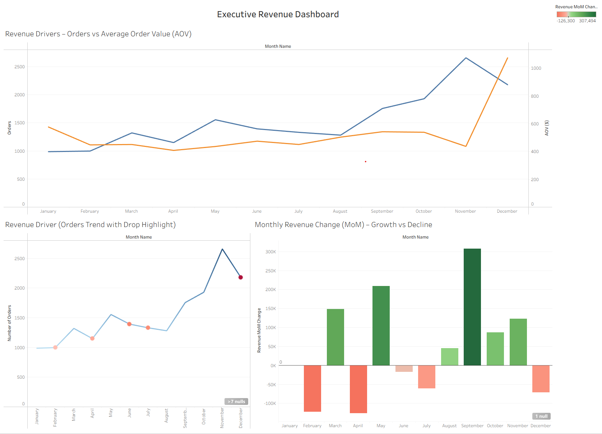
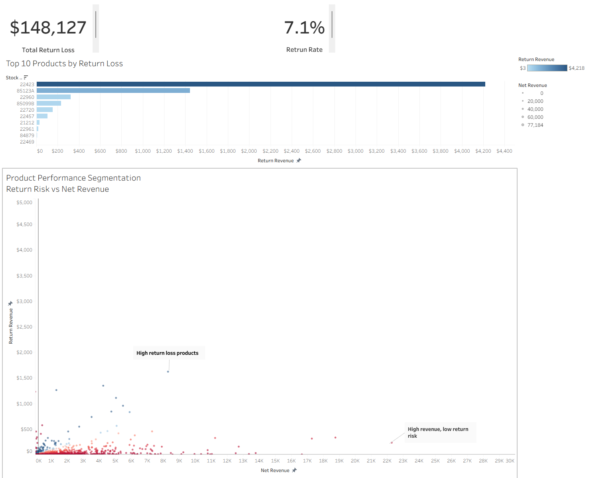
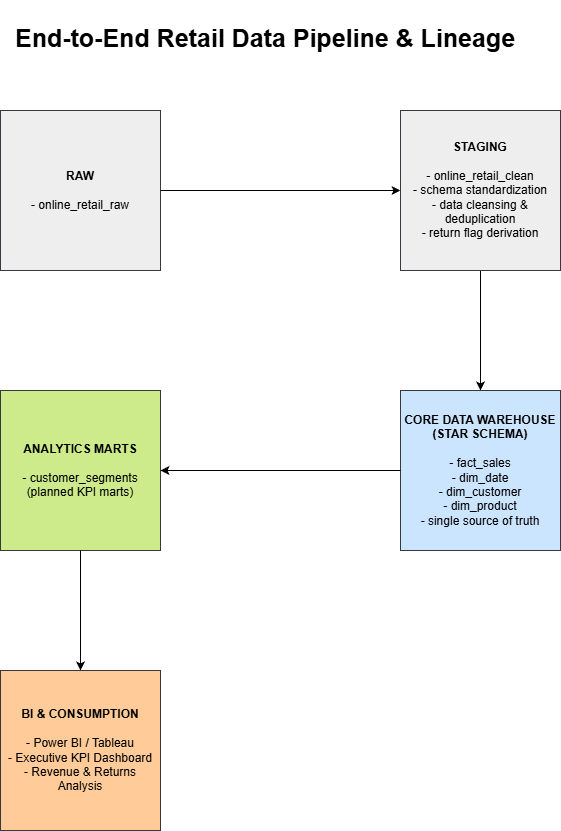

# 📊 End-To-End Retail Data Warehouse


**A full implementation of an end-to-end retail data warehouse and analytical framework.**  
This repository demonstrates the complete lifecycle of data engineering and analytics —  
from raw data ingestion to forecasting and executive-ready business insights,
all built on validated and traceable data models.

---

## Executive Summary

This project implements an end-to-end retail data platform that connects
validated data engineering foundations to decision-oriented analytics
and business recommendations.

Beyond building a warehouse, the platform emphasizes **explainable analytics** —
revealing what drives revenue performance, customer value,
product concentration, and returns impact.

Insights are translated into executive-ready recommendations
through traceable analytical reasoning,
bridging the gap between correct data and actionable decisions,
and naturally extending into forecasting and scenario-based thinking.

---

📊 Executive Dashboard

### Revenue Performance Dashboard



This dashboard analyzes key revenue drivers by breaking down revenue into:

- Order volume (Orders)
- Average order value (AOV)
- Month-over-month (MoM) performance
- Drop-point detection (operational risk signals)

---

### Return Risk & Product Performance Dashboard



This dashboard highlights return loss, return rate, and product performance segmentation.

It identifies:
- Products driving high return losses
- High-revenue products with low return risk
- Product-level return risk patterns for decision-making

---

## 🔮 Forecasting & Decision Layer

This project extends beyond traditional data warehousing by incorporating a forecasting layer.

Forecasting is used to transform historical metrics into forward-looking insights:

- Predict future order volume using time-series models
- Translate forecasts into revenue scenarios (Orders × AOV)
- Support decision-making under uncertainty (downside / upside scenarios)

This bridges the gap between data infrastructure and business strategy.

---

## 🧱 Architecture Overview

This project follows a **layered data platform architecture**,
governed by an explicit architecture and data lineage specification.

**Raw Data → Data Foundation → Data Warehouse → Analytics → Dashboard → Forecasting → Insights**

Each layer has a clear responsibility and strict separation of concerns.

| Layer | Responsibility |
|------|----------------|
| architecture | Platform architecture, data flow, and end-to-end lineage definition |
| data_foundation | Data ingestion, standardization, and quality enforcement |
| data_modeling | Dimensional modeling (facts & dimensions, analytics marts) |
| data_operations | Operational validation, integrity checks, and reconciliation |
| business_analytics | Decision-oriented analytics and KPI decomposition |
| forecasting | Predictive modeling and forward-looking analysis |
| insights | Executive-ready insights and strategic recommendations |

---

## ⚙️ SQL + Python Hybrid Approach

This project combines SQL-based analytics with Python-based modeling:

- SQL is used for data preparation, KPI design, and baseline analysis
- Python is used for forecasting, evaluation, and scenario simulation

This hybrid approach ensures:

- Transparency (SQL baseline)
- Flexibility (Python modeling)
- Business alignment (decision-focused outputs)

---

### Architecture & Data Lineage

See the end-to-end data pipeline and lineage diagram:



This diagram illustrates how **validated data flows across layers** —  
from raw ingestion through staging, dimensional modeling, analytics marts,
and finally BI consumption — with clear separation of concerns
and traceable analytical lineage.

This architecture serves as the **authoritative reference layer**
defining how data is validated, modeled, and consumed across the platform.
All downstream layers conform to the data flow and contracts defined here.

---

## 📁 Layer Descriptions

### 0. Architecture

Defines the **platform-level architecture and end-to-end data lineage**,
serving as the authoritative reference for how data flows across layers.

- Data pipeline & lineage diagram
- Layer responsibilities and system flow documentation

Path: [`architecture/`](./architecture/)  
Docs: [`architecture/README.md`](./architecture/README.md)

### 1. Data Foundation

Builds a **trusted base layer** for all downstream analytics.

- Raw data ingestion
- Standardization and cleansing
- Foundational data quality checks

Path: [`data_foundation/`](./data_foundation/)  
Docs: [`data_foundation/README.md`](./data_foundation/README.md)

---

### 2. Data Modeling

Creates **analytics-ready dimensional models** optimized for BI and analysis.

- Star schema design
- Fact and dimension table creation
- KPI-oriented analytics marts

Path: [`data_modeling/`](./data_modeling/)  
Docs: [`data_modeling/README.md`](./data_modeling/README.md)

---

### 3. Data Operations

Ensures **platform reliability, correctness, and reproducibility**.

#### `data_operations/00_admin`
- Schema creation
- Extension setup
- Idempotent environment initialization

#### `data_operations/90_tests`
- Referential integrity checks
- Fact-level sanity validation
- Cross-layer reconciliation

Path: [`data_operations/`](./data_operations/)  
Docs: [`data_operations/README.md`](./data_operations/README.md)

---

### 4. Business Analytics

This layer contains fully implemented, decision-oriented analytical modules,
progressing from performance explanation
to risk identification
and executive-level recommendations.

Implemented modules include:
- Revenue Driver Analysis
- Customer Segmentation
- Product Mix Analysis
- Returns Analysis
- Customer Lifetime Value (LTV)
- Revenue Driver × Segment Analysis
- Price Sensitivity (Discount Proxy) Analysis
- Cohort Retention Analysis
- Operational Risk Analysis
- Data Quality & Assumption Disclosure
- Metric Layer (KPI Mart)

Each module contains:
- SQL logic
- Execution result screenshots
- Business interpretation and implications

Path: [`business_analytics/`](./business_analytics/)  
Docs: [`business_analytics/README.md`](./business_analytics/README.md)

---

### 5. Forecasting

This layer extends validated historical analytics
into forward-looking predictions using a structured
end-to-end SQL + Python pipeline.

Key capabilities include:

- Time-series forecasting of order volume
- Revenue projection using Orders × AOV decomposition
- Model evaluation (MAPE, error tracking)
- Scenario analysis (baseline, upside, downside)

The forecasting system is built on top of:

- SQL-based feature engineering
- ML-ready dataset preparation
- Data validation and KPI consistency

This ensures that predictions are:

- Reproducible
- Consistent with historical analytics
- Directly applicable to business decision-making

Path: [`forecasting/`](./forecasting/)  
Docs: [`forecasting/README.md`](./forecasting/README.md)

---

### 6. Insights

This layer represents the executive-facing decision output
of the analytics stack.

Rather than existing as a separate module,
insights are embedded within the Business Analytics layer
through:

- Executive summaries
- Derived recommendations in each analytical module
- A centralized Business Recommendation Layer

All insights are directly traceable to validated analytical findings,
ensuring transparency, explainability,
and decision-level clarity.

---

## 🧠 Core Design Principles

- Layered responsibility and separation of concerns
- Validation before insight
- Explainable and auditable analytics
- Business-first thinking

Clean data enables trust.  
Trust enables decisions.

---

## 🚦 How to Run the Project

1. **Environment setup**  
   Run scripts in `data_operations/00_admin`

2. **Data ingestion & cleaning**  
   Execute `data_foundation/10_raw` → `data_foundation/20_staging`

3. **Data modeling**  
   Build dimensional models in `data_modeling/`

4. **Validation**  
   Run checks in `data_operations/90_tests`

5. **Analytics**  
   Explore modules in `business_analytics/`

---

## 📌 Visual Evidence

Each layer includes `result/` folders containing:
- SQL execution screenshots
- Validation outputs
- Analytical results

This makes the project **auditable, traceable, and reproducible**.

---

## 📈 Why This Project Matters

This repository demonstrates:

- End-to-end data platform architecture design
- Strong SQL and dimensional modeling discipline
- Data quality–first engineering mindset
- Decision-oriented analytics aligned with business impact
- A reproducible, enterprise-style analytics framework
  designed to support long-term decision-making at scale

Suitable for:
- Data Engineering and Analytics portfolios
- Technical and business-facing interviews
- Academic or NIW evidence

---

## 🗂️ Repository Structure

```

End-To-End-Retail-Data-Warehouse/
│
├── architecture/
│ ├── lineage_pipeline_diagram.png
│ └── README.md
│
├── data_foundation/
│ ├── result/
│ ├── sql/
│ └── README.md
│
├── data_modeling/
│ ├── erd/
│ │ └── dw_core_erd.png
│ ├── result/
│ ├── sql/
│ └── README.md
│
├── data_operations/
│ ├── result/
│ ├── sql/
│ └── README.md
│
├── business_analytics/
│ ├── 00_dashboards/
│ ├── 00_data_mart/
│ ├── 01_revenue_driver_analysis/
│ ├── 02_customer_segmentation/
│ ├── 03_product_mix_analysis/
│ ├── 04_returns_analysis/
│ ├── 05_ltv_analysis/
│ ├── 06_revenue_driver_x_segment/
│ ├── 07_price_sensitivity_discount_proxy_analysis/
│ ├── 08_cohort_retention/
│ ├── 09_operational_risk_analysis/
│ ├── 10_data_quality_assumptions/
│ ├── 11_metric_layer/
│ └── README.md
│
├── forecasting/
│ ├── data/
│ ├── notebooks/
│ ├── sql/
│ ├── result/
│ └── README.md
│
├── report/
│
└── README.md

```
