# Revenue Driver Analysis

**A structured revenue driver analysis that decomposes revenue changes into
clear, explainable business factors using data from the enterprise data warehouse.**

---

## Overview

This analysis investigates **what drives revenue growth and decline**
by decomposing revenue into its fundamental components and examining
changes across time, geography, and customer mix.

All analyses are built on top of validated dimensional models (`dw`, `marts`)
and are designed to support **business decision-making**, not just reporting.

---

## Analysis Framework

Revenue is analyzed using the following decomposition logic:

Revenue
= Orders × Average Order Value (AOV)
= Orders × (Basket Size × Unit Price)

The analysis proceeds step by step, isolating the impact of:
- Time-based changes
- Volume vs. price effects
- Geography
- Customer mix and growth composition
- Returns and data sanity

---

## 10. Baseline Metrics

### Purpose
Establish baseline KPIs to provide context for all downstream analysis.

### Key Metrics
- Total revenue
- Total orders
- Average order value (AOV)
- Average unit price

### Evidence
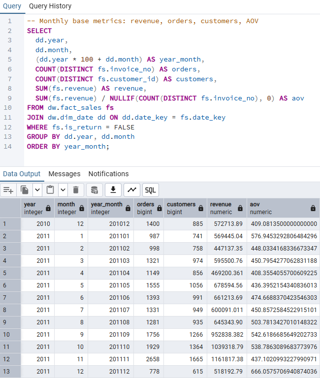

**Artifacts**
- `10_base_metrics.sql`

---

## 20. Revenue Change Over Time (MoM)

### Purpose
Measure how revenue changes month-over-month to identify growth or decline trends.

### Evidence
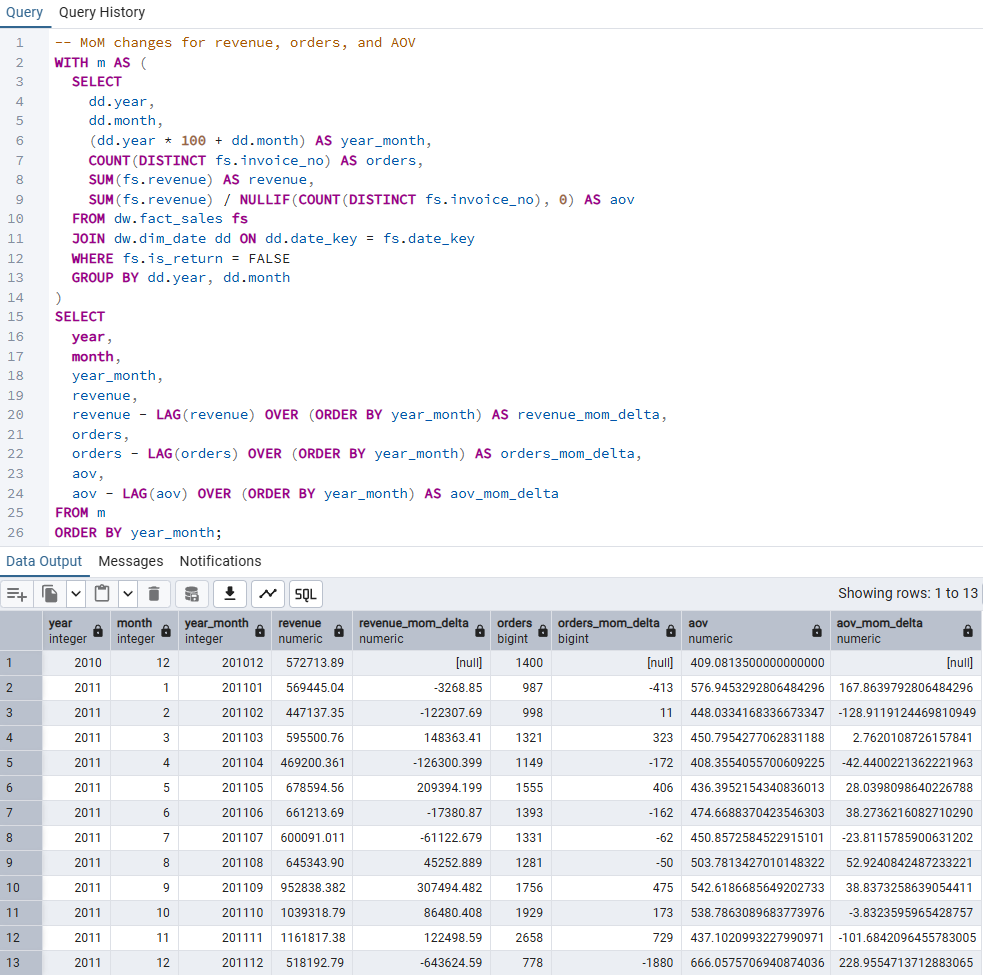

**Artifacts**
- `20_revenue_mom_change.sql`

---

## 30. Revenue Decomposition: Orders × AOV

### Purpose
Decompose revenue changes into:
- Changes driven by order volume
- Changes driven by average order value

### Evidence
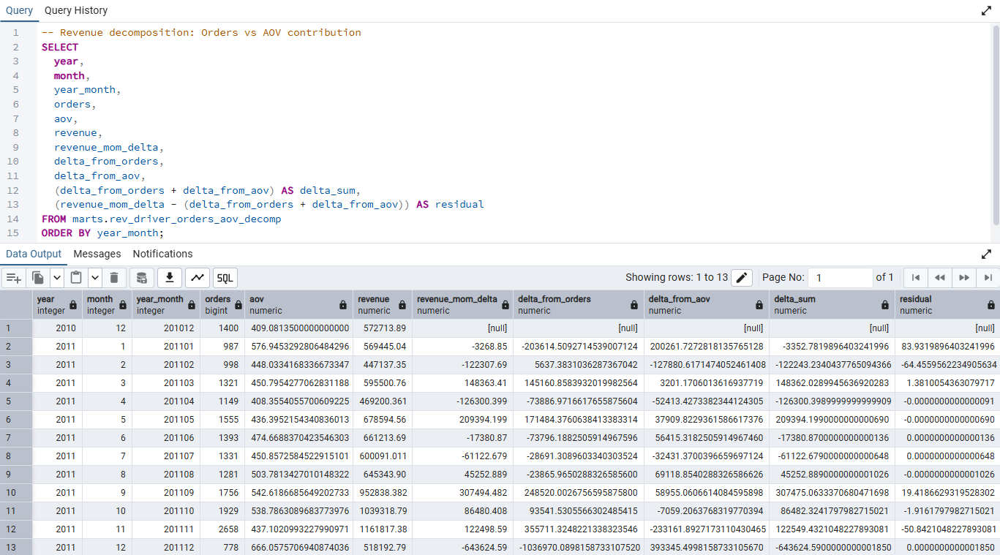

**Artifacts**
- `30_decomposition_orders_aov.sql`

---

## 31. AOV Decomposition: Basket Size vs. Price

### Purpose
Further decompose AOV to distinguish between basket size and unit price effects.

### Evidence
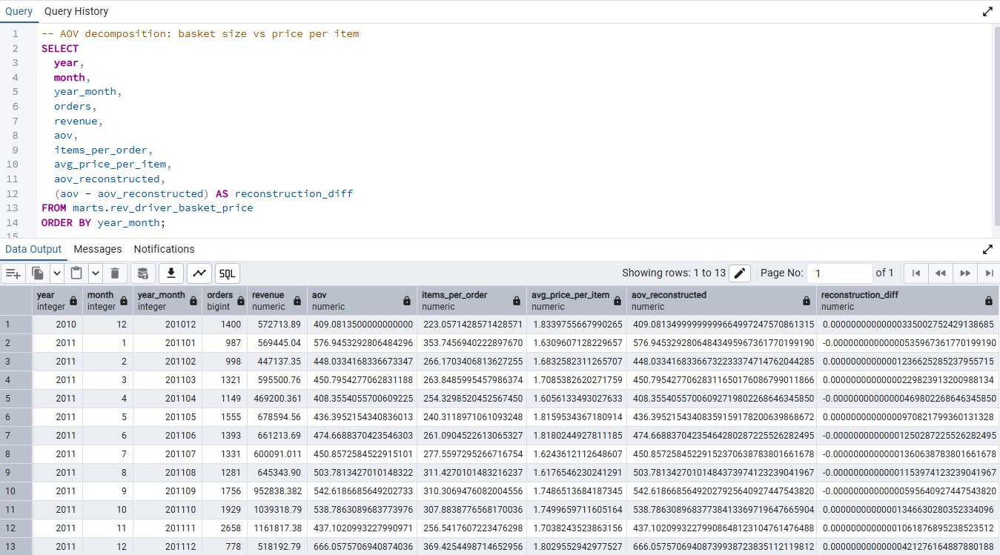

**Artifacts**
- `31_decomposition_basket_price.sql`

---

## 32. Volume vs. Price Contribution

### Purpose
Quantify the relative contribution of sales volume versus pricing
to overall revenue changes.

### Evidence
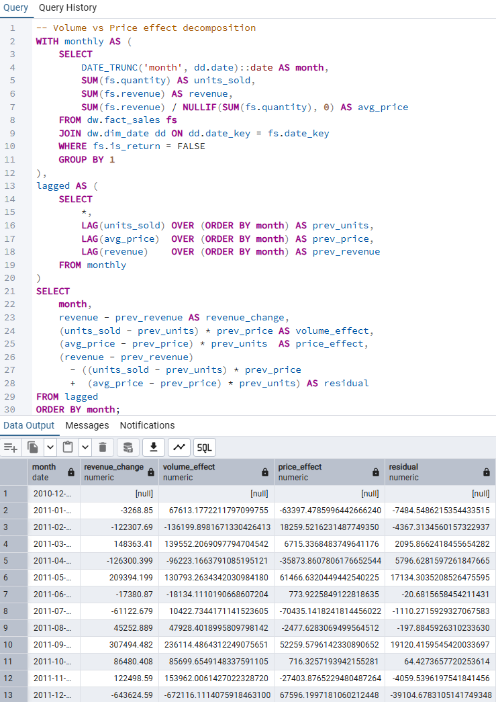

**Artifacts**
- `32_volume_vs_price_effect.sql`

---

## 40. Country-Level Revenue Drivers

### Purpose
Identify which countries contribute most to revenue
and how geographic mix influences growth.

### Evidence
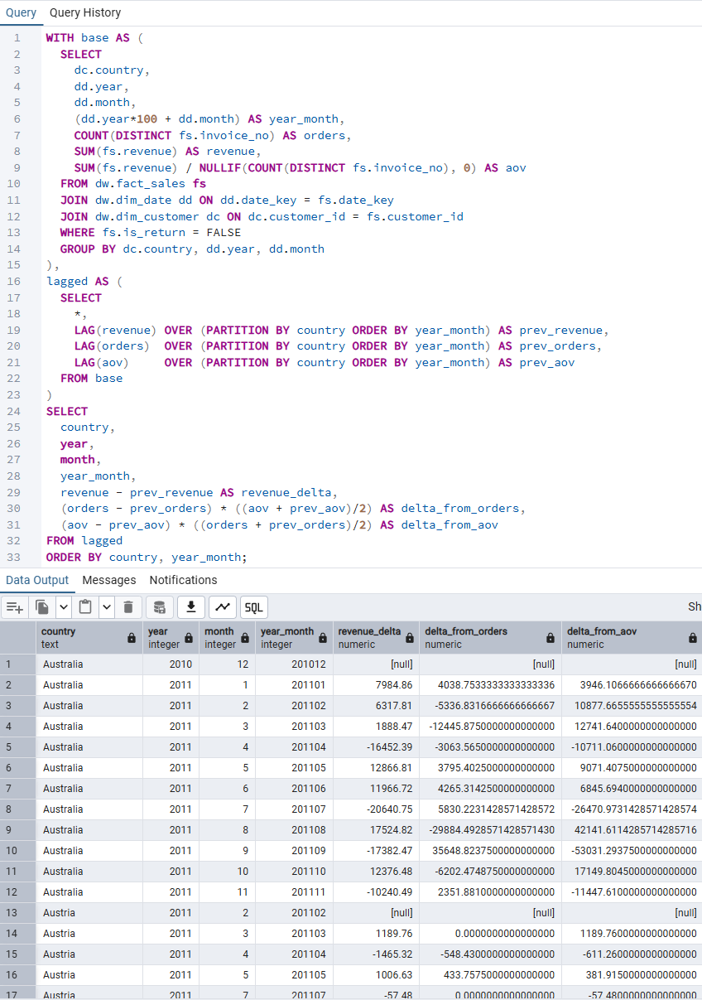

**Artifacts**
- `40_country_revenue_driver.sql`

---

## 41. Country Drivers: Orders vs. AOV

### Purpose
Determine whether country-level revenue differences
are driven by order volume or order value.

### Evidence
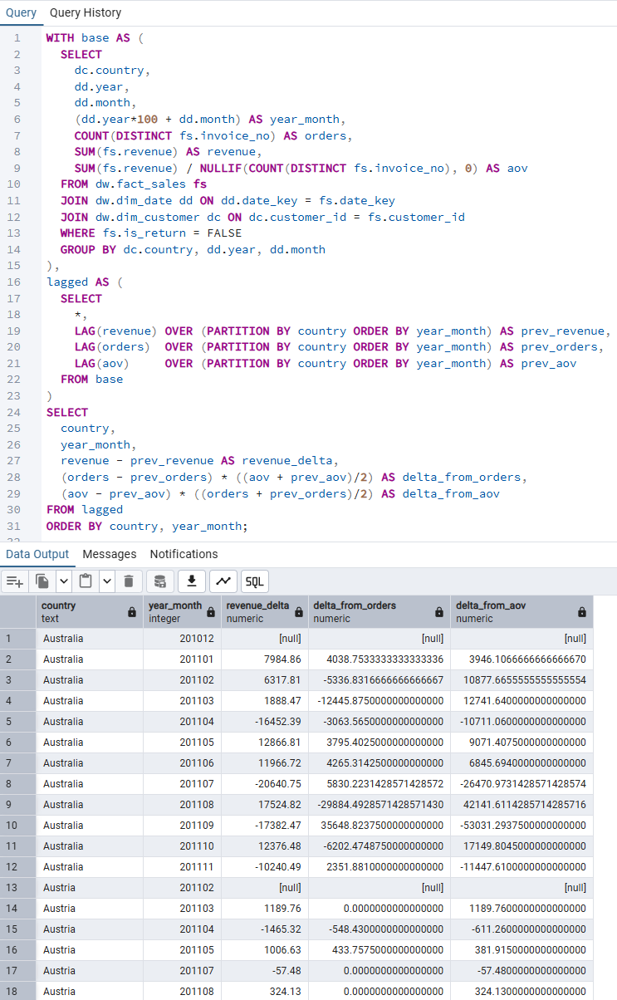

**Artifacts**
- `41_country_orders_aov_driver.sql`

---

## 50. Customer Mix Effect

### Purpose
Assess how changes in customer composition
impact overall revenue performance.

### Evidence
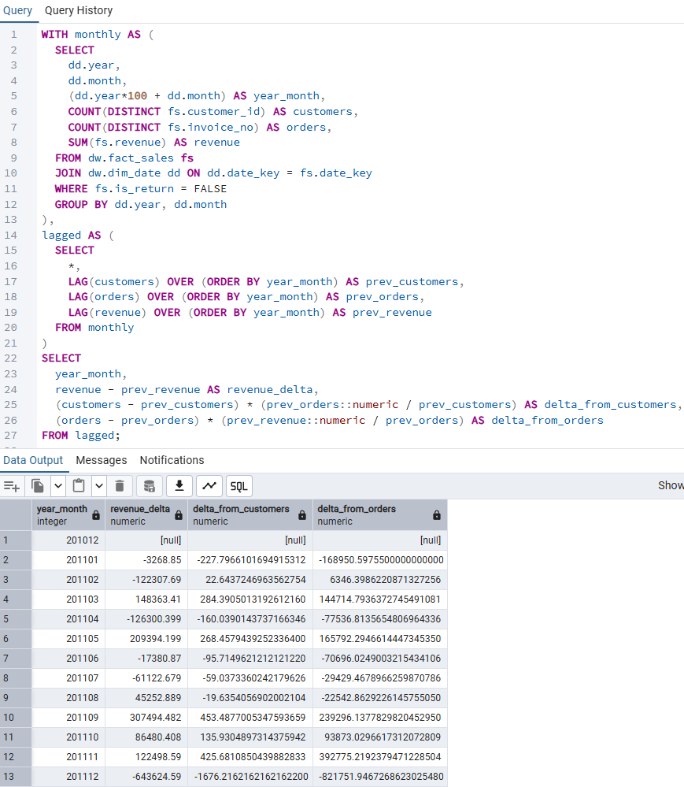

**Artifacts**
- `50_customer_mix_effect.sql`

---

## 51. Growth Attribution: New vs. Existing Customers

### Purpose
Attribute revenue growth to new versus existing customers.

### Evidence
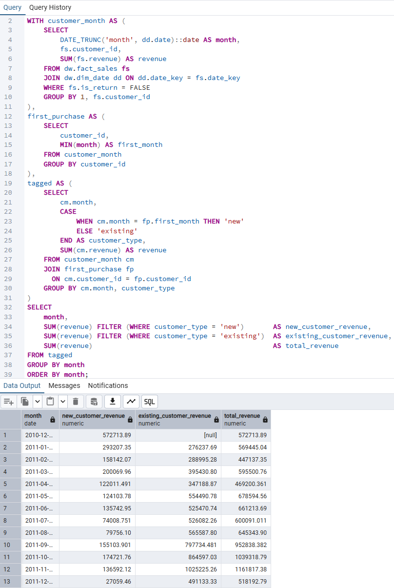

**Artifacts**
- `51_growth_attribution_new_vs_existing.sql`

---

## 52. Revenue Split: New vs. Existing Customers

### Purpose
Provide a direct comparison of revenue levels
between new and existing customers.

### Evidence
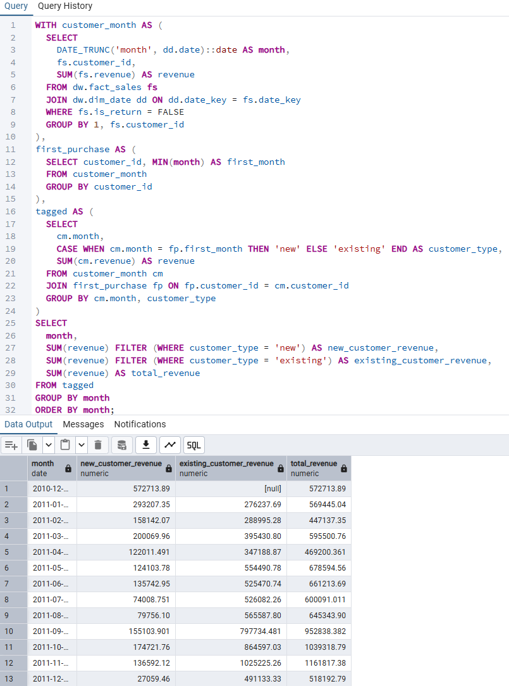

**Artifacts**
- `52_new_vs_existing_revenue.sql`

---

## 60. Returns Impact on Revenue

### Purpose
Evaluate how product returns affect net revenue
and distort gross sales trends.

### Evidence
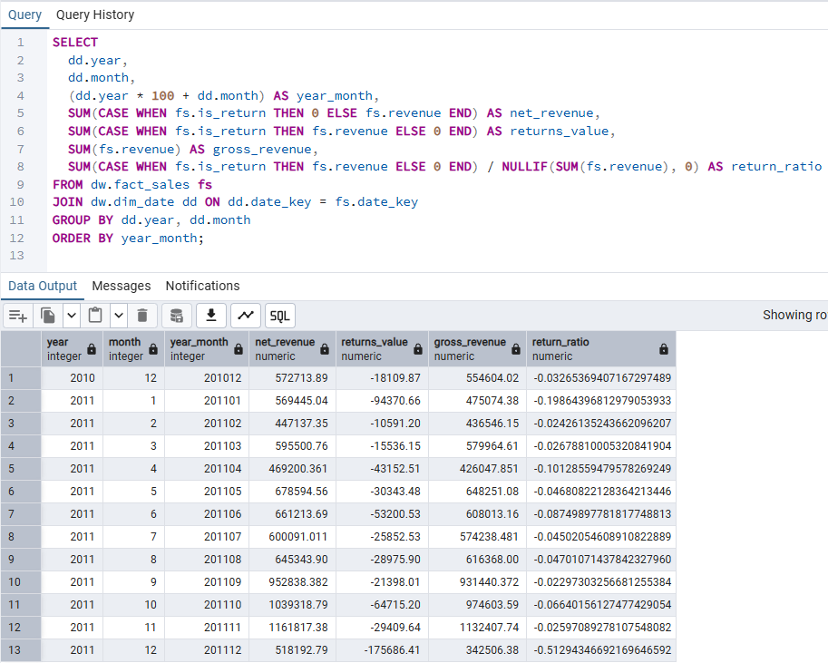

**Artifacts**
- `60_returns_impact.sql`

---

## 90. Sanity & Validation Checks

### Purpose
Ensure analytical correctness and consistency
before interpreting business results.

### Evidence
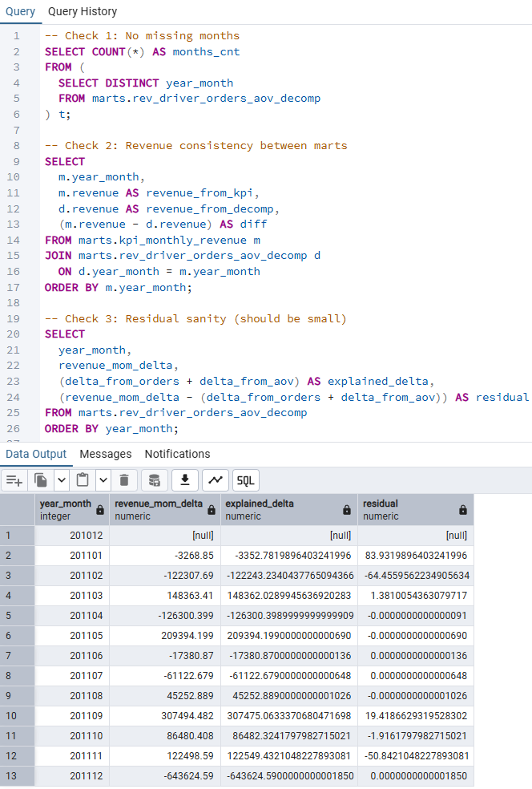

**Artifacts**
- `90_sanity_checks.sql`

---

## Key Insights (Example)

- Revenue changes are primarily driven by **order volume**, not price increases.
- A small subset of countries accounts for a disproportionate share of revenue growth.
- Existing customers contribute more to stable revenue, while new customers drive volatility.
- Returns have a non-trivial impact on net revenue and must be accounted for in KPI reporting.

---

## Why This Analysis Matters

This revenue driver analysis enables:

- Clear attribution of revenue changes
- Better pricing and inventory decisions
- More targeted geographic and customer strategies
- Data-driven executive discussions

> Revenue is not a single number — it is the result of multiple interacting drivers.

---

## Derived Recommendation
**Decision directly supported by this analysis:**

Revenue variability is driven primarily by changes in order volume rather than pricing,
suggesting demand stimulation initiatives should be prioritized over price adjustments.

---

## Dependencies

This analysis depends on:

- [Data Foundation](../../data_foundation/README.md)
- [Data Modeling](../../data_modeling/README.md)
- [Data Operations](../../data_operations/README.md)

All inputs are validated and reconciled before analysis.

---

## Next Steps

- Extend decomposition to promotion or campaign effects
- Integrate results into BI dashboards
- Apply the same framework to margin and profit analysis
