# Customer Segmentation Analysis (RFM-Based)

**A structured customer segmentation analysis using RFM methodology  
to identify high-value customers, retention opportunities, and behavioral differences  
based on validated enterprise data warehouse models.**

---

## Overview

This analysis segments customers based on **Recency, Frequency, and Monetary (RFM)** metrics  
to answer the following business questions:

- Who are our most valuable customers?
- Which segments drive the majority of revenue?
- How do customer behaviors differ across segments?
- Where should retention, marketing, and operational efforts focus?

All analyses are built on top of validated dimensional models (`dw`, `marts`)  
and are designed to support **actionable business decision-making**, not just reporting.

---

## Segmentation Framework

Customers are segmented using the RFM framework:

- **Recency**: Days since last purchase (measured against dataset end date)
- **Frequency**: Number of distinct orders
- **Monetary**: Total revenue contribution

Each metric is scored using **quintile ranking (NTILE(5))** to normalize customer behavior  
and ensure comparability across segments without manual threshold tuning.

Customers are then assigned to **business-interpretable segments** using fixed RFM rules.

---

## 10. Customer Base Metrics

### Purpose
Establish customer-level baseline metrics used for all downstream segmentation logic.

### Key Metrics
- Orders per customer  
- Revenue per customer  
- Average order value (AOV)  
- First and last purchase dates  

### Evidence
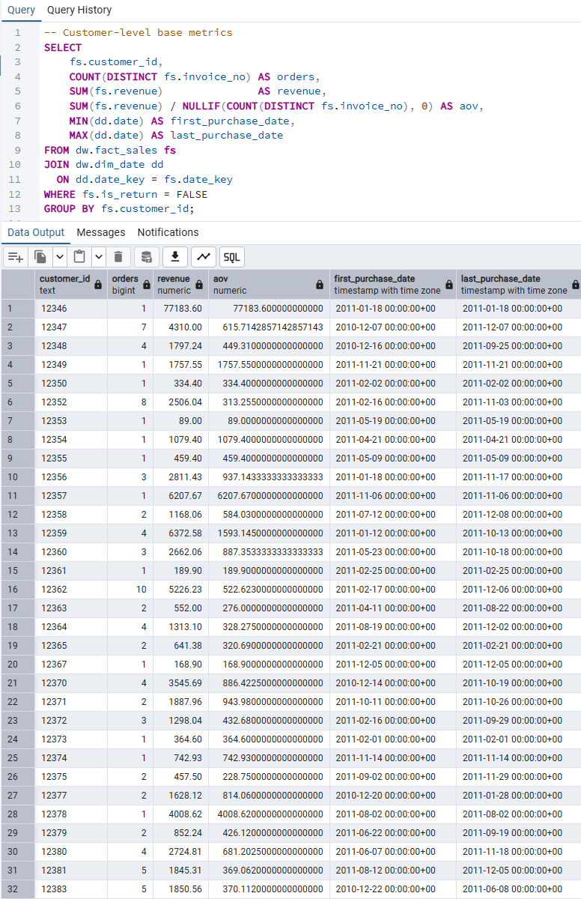

**Artifacts**
- `10_customer_base_metrics.sql`

---

## 20. RFM Scoring

### Purpose
Calculate Recency, Frequency, and Monetary values and convert them  
into standardized RFM scores using quintile-based ranking.

Quintile scoring ensures robustness against outliers  
and avoids reliance on arbitrary thresholds.

### Evidence
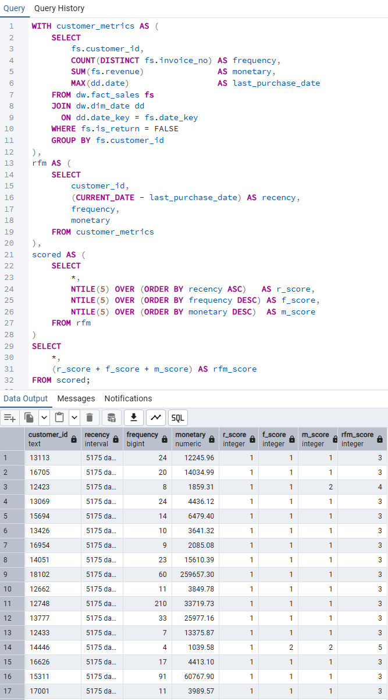

**Artifacts**
- `20_rfm_scoring.sql`

---

## 30. Segmentation Definition

### Purpose
Define customer segments using **clear and explainable RFM rules**  
instead of black-box clustering techniques.

### Segment Logic
Customers are assigned to segments using the following rules:

- **VIP**: High recency, high frequency, high monetary  
- **Loyal**: High recency and frequency  
- **Regular**: Moderate engagement  
- **Low Value**: Low frequency and low monetary  

### Evidence
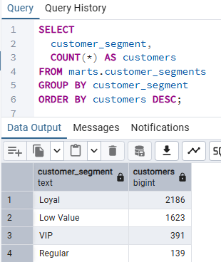

**Artifacts**
- `30_segmentation_definition.sql`

---

## 31. Segment Size Distribution

### Purpose
Understand the size and composition of each customer segment.

### Evidence
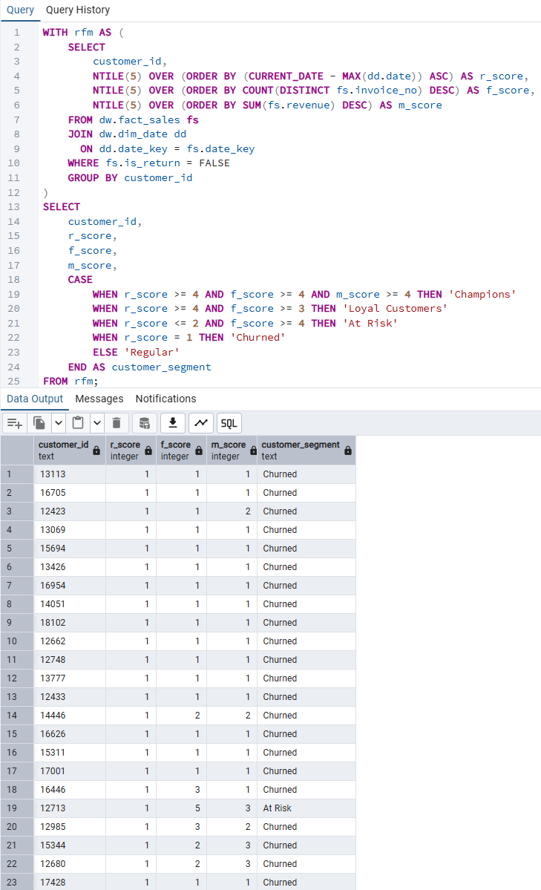

**Artifacts**
- `31_segment_size_distribution.sql`

---

## 40. Segment KPI Summary

### Purpose
Compare core performance metrics across customer segments.

### Key Metrics
- Customers per segment  
- Orders per customer  
- Average order value  
- Revenue per customer  
- Total segment revenue  

### Evidence
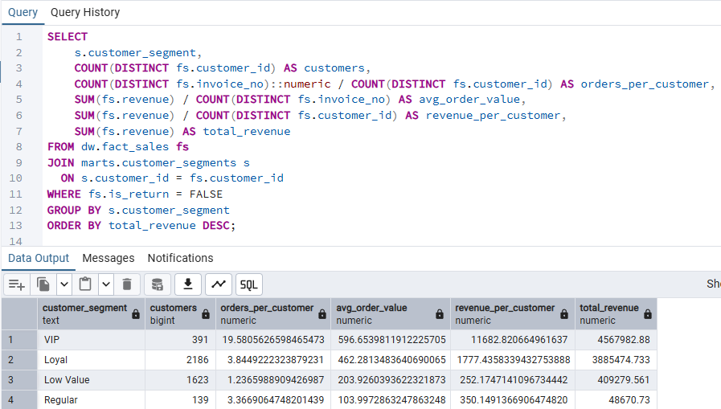

**Artifacts**
- `40_segment_kpi_summary.sql`

---

## 41. Revenue Contribution by Segment

### Purpose
Identify which customer segments contribute most to total revenue.

### Evidence
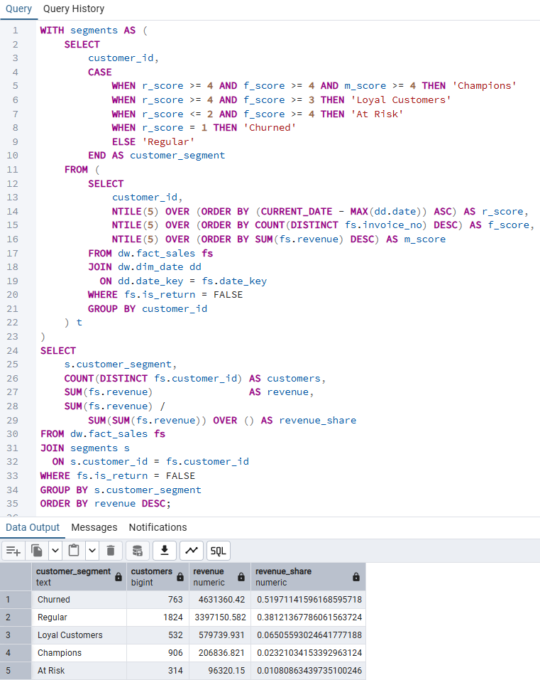

**Artifacts**
- `41_segment_revenue_contribution.sql`

---

## 42. Returns Impact by Segment

### Purpose
Evaluate how return behavior differs across customer segments  
and how it impacts revenue quality.

High-value segments generate more revenue  
but also exhibit higher return rates, highlighting a trade-off  
between revenue contribution and operational cost.

### Evidence
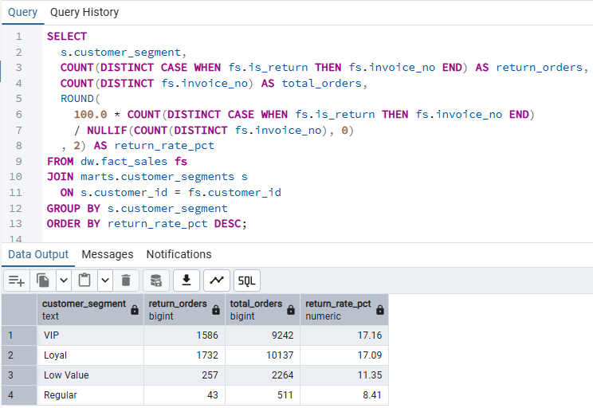

**Artifacts**
- `42_segment_return_impact.sql`

---

## 43. Recency Validation

### Purpose
Validate recency behavior using the dataset end date  
to avoid distortion from current-date calculations.

This ensures that recency scores reflect **relative customer freshness**  
within the observed business period.

### Evidence
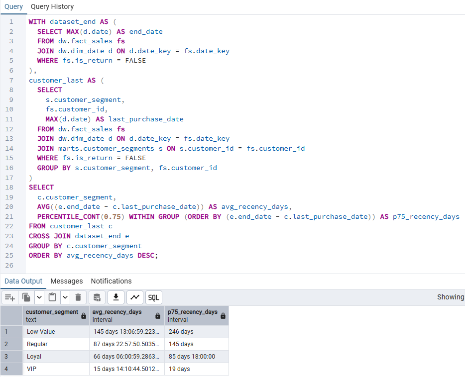

**Artifacts**
- `43_segment_recency_validation.sql`

---

## 50. Top Products by Segment

### Purpose
Identify top-performing products within each customer segment  
to support targeted merchandising and cross-sell strategies.

### Evidence
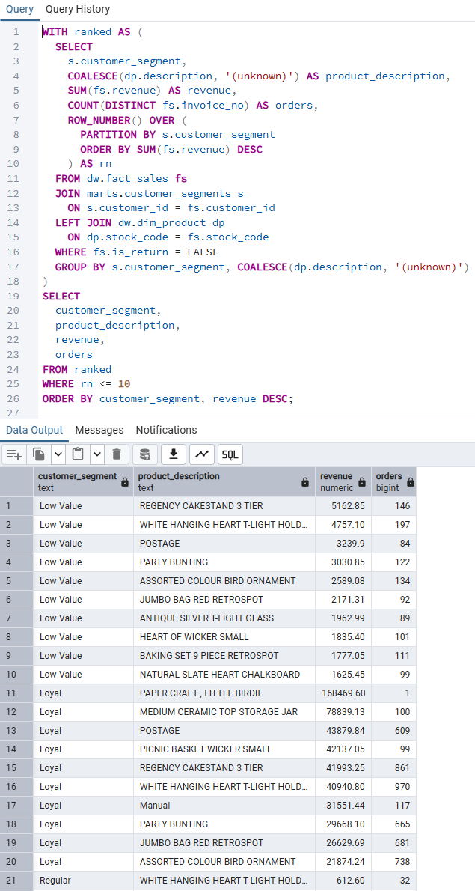

**Artifacts**
- `50_segment_top_products.sql`

---

## 60. Repeat Purchase Rate by Segment

### Purpose
Measure customer retention strength using repeat purchase rates.

Repeat customers are defined as customers  
with **two or more distinct orders**.

### Evidence

**Artifacts**
- `60_segment_repeat_rate.sql`

---

## 70. Product Affinity by Segment

### Purpose
Analyze product affinity patterns within customer segments  
to identify bundling and upsell opportunities.

### Evidence
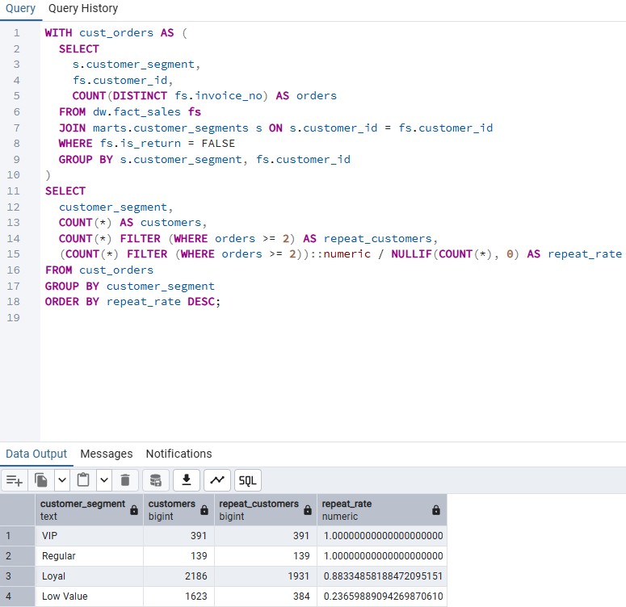

**Artifacts**
- `70_segment_product_affinity.sql`

---

## 80. Segment Performance Over Time

### Purpose
Analyze how revenue, order volume, and active customers
evolve over time for each customer segment.

This analysis treats customer segments as **behavioral cohorts**
and examines whether their contribution is stable or changing.

### Metrics
- Monthly revenue
- Monthly order count
- Active customers per segment

### Evidence
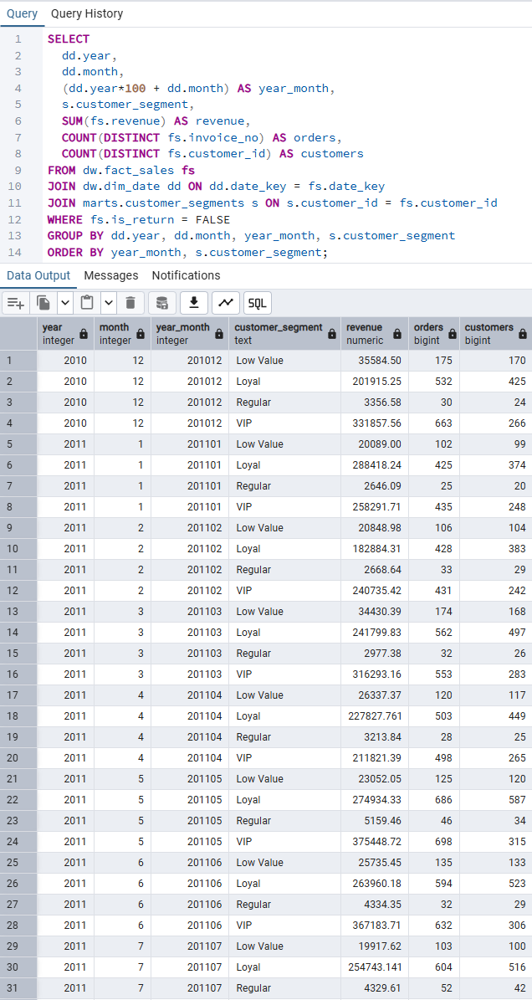

**Artifacts**
- `80_segment_trend_over_time.sql`

---

## 90. Sanity & Validation Checks

### Purpose
Ensure segmentation completeness and revenue consistency  
before interpreting business results.

### Checks Performed
- Customer coverage validation  
- Revenue reconciliation across segments  

### Evidence
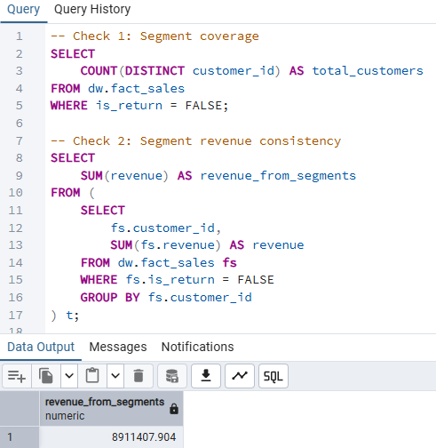

**Artifacts**
- `90_sanity_checks.sql`

---

## Key Insights

- **VIP and Loyal customers** represent a smaller portion of the customer base but contribute a disproportionate share of revenue → prioritize retention and loyalty programs.
- High-value segments exhibit **higher return rates**, highlighting operational cost considerations → optimize return policies and post-purchase communication.
- **Low Value customers** show low repeat purchase rates → targeted reactivation or churn-prevention strategies are recommended.
- Recency validation confirms clear behavioral separation across segments.

---

## Why This Analysis Matters

This customer segmentation enables:

- Targeted retention and loyalty strategies  
- Smarter marketing spend allocation  
- Product and bundle optimization  
- Executive-level customer performance reporting  

> Customers are not equal — value, behavior, and risk vary by segment.

---

## Derived Recommendation

A small number of customer segments contribute disproportionately to total revenue,
indicating that targeted retention strategies are likely to deliver higher ROI
than broad-based acquisition efforts.

---

## Dependencies

This analysis depends on:

- [Data Foundation](../../data_foundation/README.md)
- [Data Modeling](../../data_modeling/README.md)
- [Data Operations](../../data_operations/README.md)

All inputs are validated and reconciled before analysis.

---

## Next Steps

- Track segment migration over time  
- Integrate segments into campaign analysis  
- Extend segmentation to margin and profitability analysis  

---

## SQL Artifacts Overview

This analysis includes SQL scripts covering:

- Customer base metrics & RFM feature engineering  
- Segmentation rule definition  
- Segment-level KPI aggregation  
- Revenue, return, recency, and retention analysis  
- Sanity and reconciliation checks  
