# Product Mix Analysis

**A structured product mix analysis designed to understand revenue concentration,
product performance stability, and portfolio risk using warehouse-level data.**

**Category:** Product Strategy · Assortment Optimization · Risk Analysis

---

## Overview

This module analyzes **how revenue is distributed across products**
and identifies concentration risks, long-tail efficiency, and
product-level behavioral patterns.

All analyses are built on top of validated dimensional models
and are intended to support **assortment strategy, pricing decisions,
and portfolio optimization**.

---

## Analysis Framework

The product mix is evaluated across multiple dimensions:

- Revenue concentration (Pareto / top-N products)
- Product stability over time
- Return behavior and product risk
- Price vs. volume sensitivity
- Segment-level product preferences
- Lifecycle and dependency risk

This framework is designed to answer questions such as:
- Which products truly drive sustainable revenue?
- Where does product concentration create operational or revenue risk?
- Which SKUs should be expanded, optimized, or sunset?

Each step progressively deepens understanding
from descriptive metrics to strategic insights.

---

## 10. Product Base Metrics

### Purpose
Establish baseline product-level KPIs to anchor all downstream analysis.

### Key Metrics
- Revenue by product
- Order count
- Quantity sold
- Average selling price

### Artifacts
- `10_product_base_metrics.sql`

### Evidence
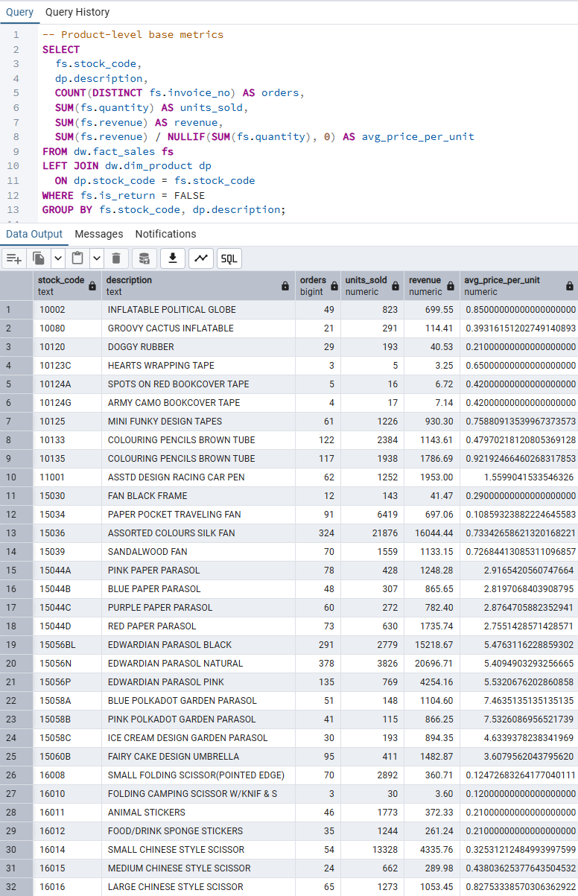

---

## 20. Top Products by Revenue

### Purpose
Identify top-performing products and understand
how much revenue is driven by a small subset of SKUs.

### Key Metrics
- Revenue ranking
- Cumulative revenue contribution

### Artifacts
- `20_top_products_by_revenue.sql`

### Evidence
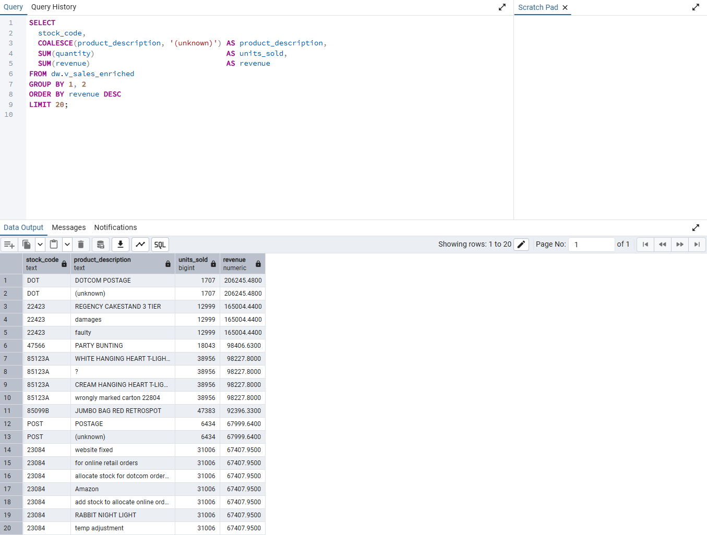

---

## 30. Revenue Concentration (Pareto Analysis)

### Purpose
Measure revenue concentration and validate the Pareto principle
within the product portfolio.

### Key Metrics
- Cumulative revenue percentage
- Product concentration curve

### Artifacts
- `30_product_concentration_pareto.sql`

### Evidence
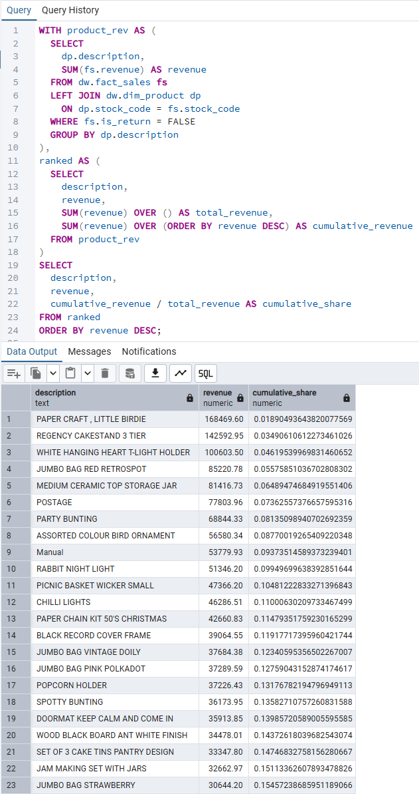

---

## 40. Segment-Level Product Preference

### Purpose
Understand how different customer segments
exhibit distinct product preferences.

### Key Metrics
- Revenue share by segment and product
- Segment-specific top products

### Artifacts
- `40_segment_product_preference.sql`

### Evidence
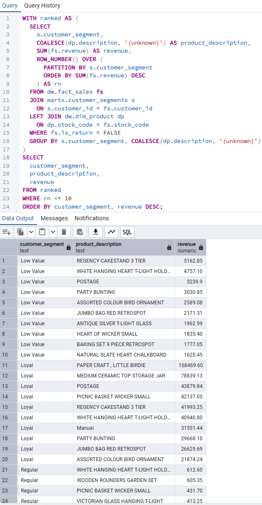

---

## 50. Product Return Rate Analysis

### Purpose
Identify products with disproportionately high return rates
that may signal quality, pricing, or expectation mismatch issues.

### Key Metrics
- Return rate by product
- Revenue impact of returns

### Artifacts
- `50_product_return_rate.sql`

### Evidence
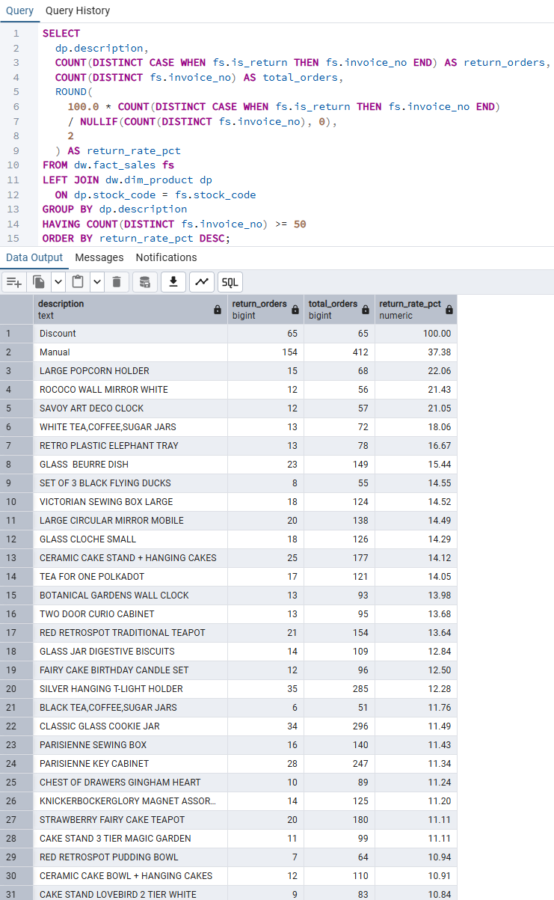

---

## 60. Product Sales Stability

### Purpose
Assess how stable product performance is over time
to distinguish core products from volatile ones.

### Key Metrics
- Revenue variance
- Sales volatility indicators

### Artifacts
- `60_product_sales_stability.sql`

### Evidence
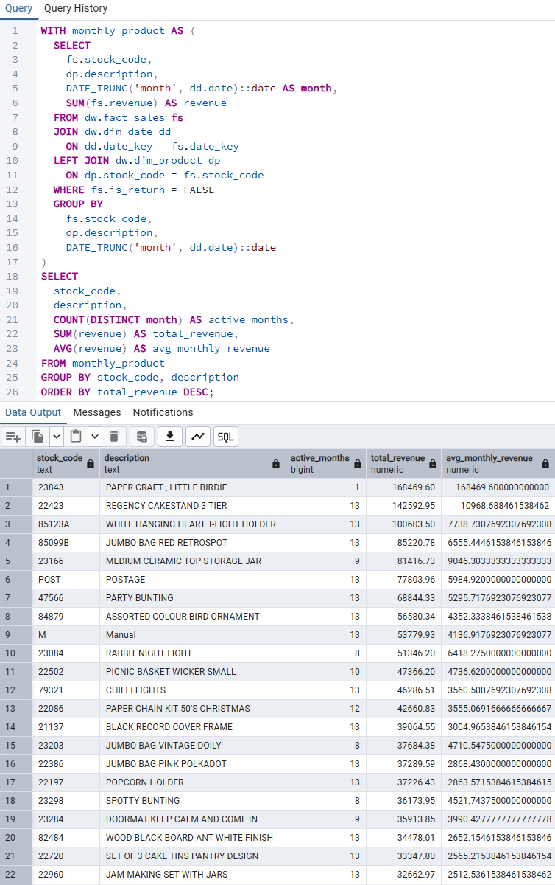

---

## 70. Price vs. Volume Effect

### Purpose
Determine whether product revenue is driven more by
pricing power or sales volume.

### Key Metrics
- Price sensitivity proxy
- Volume-driven vs. price-driven products

### Artifacts
- `70_product_price_vs_volume_effect.sql`

### Evidence
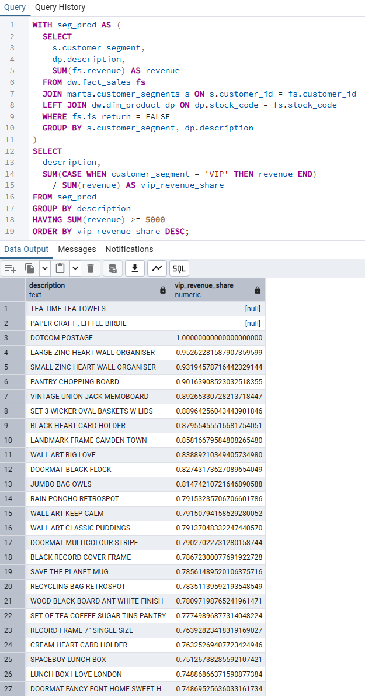

---

## 80. Segment-Level Product Concentration

### Purpose
Evaluate whether revenue concentration risk
differs by customer segment.

### Key Metrics
- Segment-level concentration ratios
- Dependency on top products by segment

### Artifacts
- `80_segment_product_concentration.sql`

### Evidence
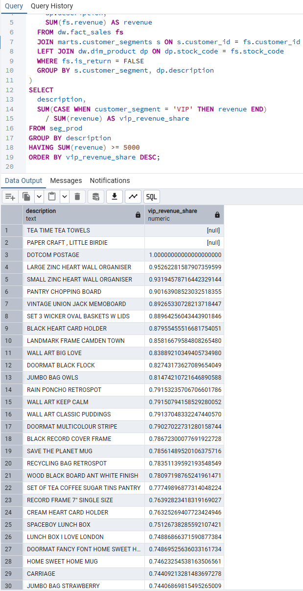

---

## 85. SKU Portfolio Classification

### Purpose
Classify products into strategic portfolio buckets
(e.g., core, niche, risky, opportunistic).

### Artifacts
- `85_sku_portfolio_classification.sql`

### Evidence
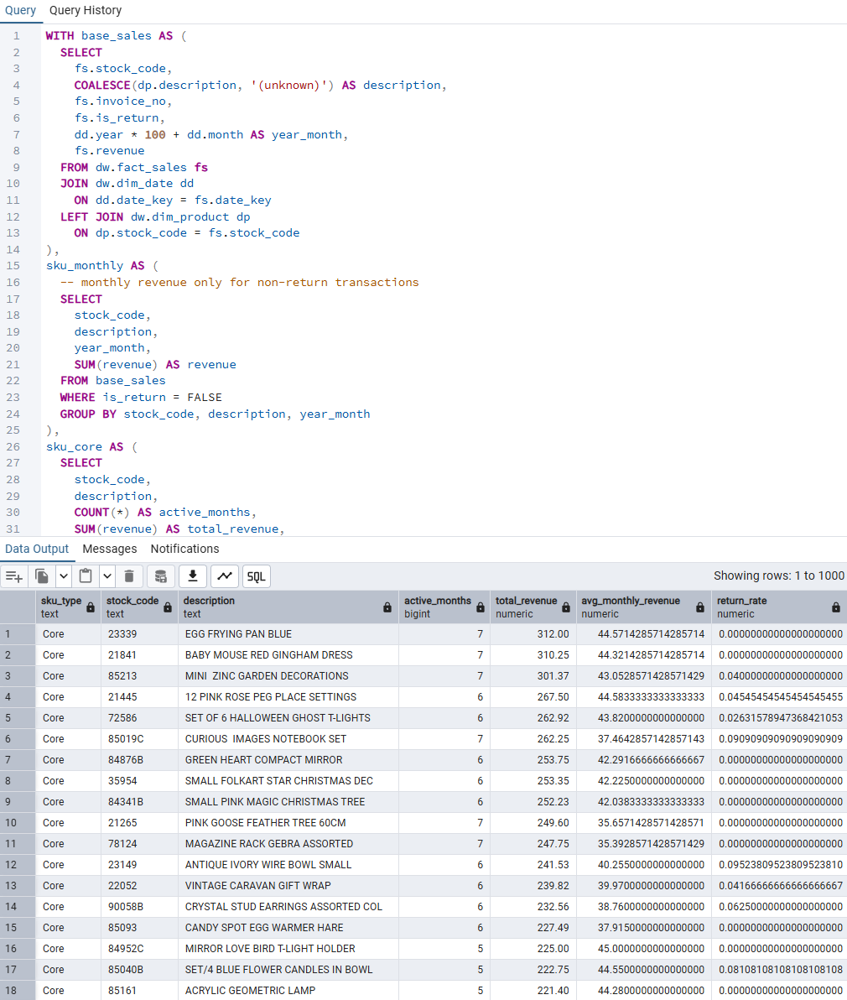

---

## 86. Long-Tail Product Efficiency

### Purpose
Assess whether long-tail products collectively
contribute meaningful revenue relative to operational overhead.

### Artifacts
- `86_long_tail_product_efficiency.sql`

### Evidence
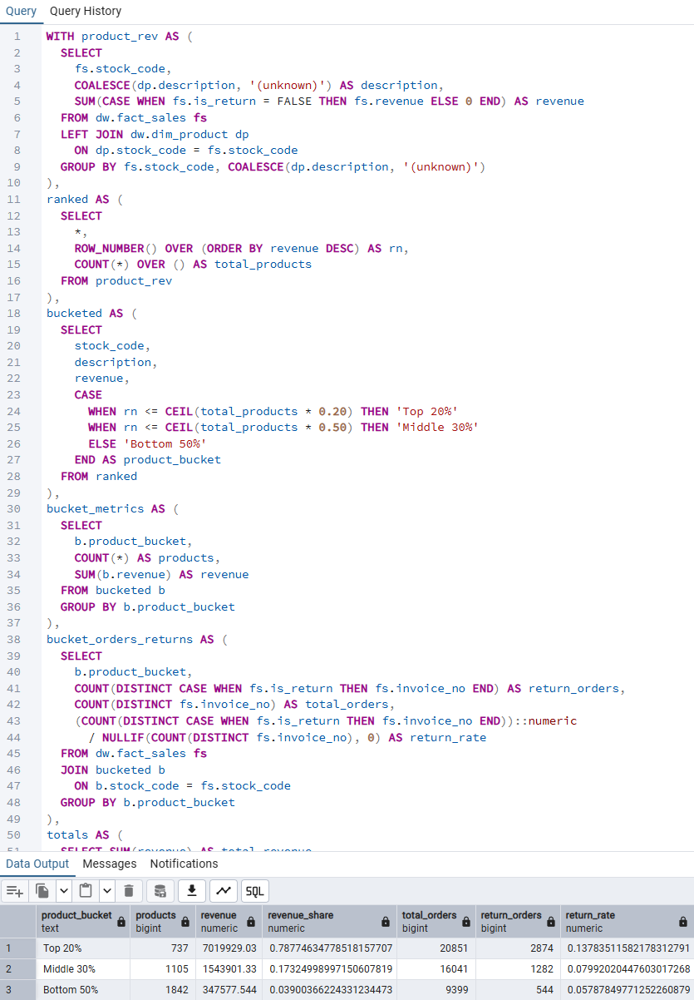

---

## 88. Product Lifecycle Stage Analysis

### Purpose
Analyze products across lifecycle stages
(introduction, growth, maturity, decline).

### Artifacts
- `88_product_lifecycle_stage_analysis.sql`

### Evidence
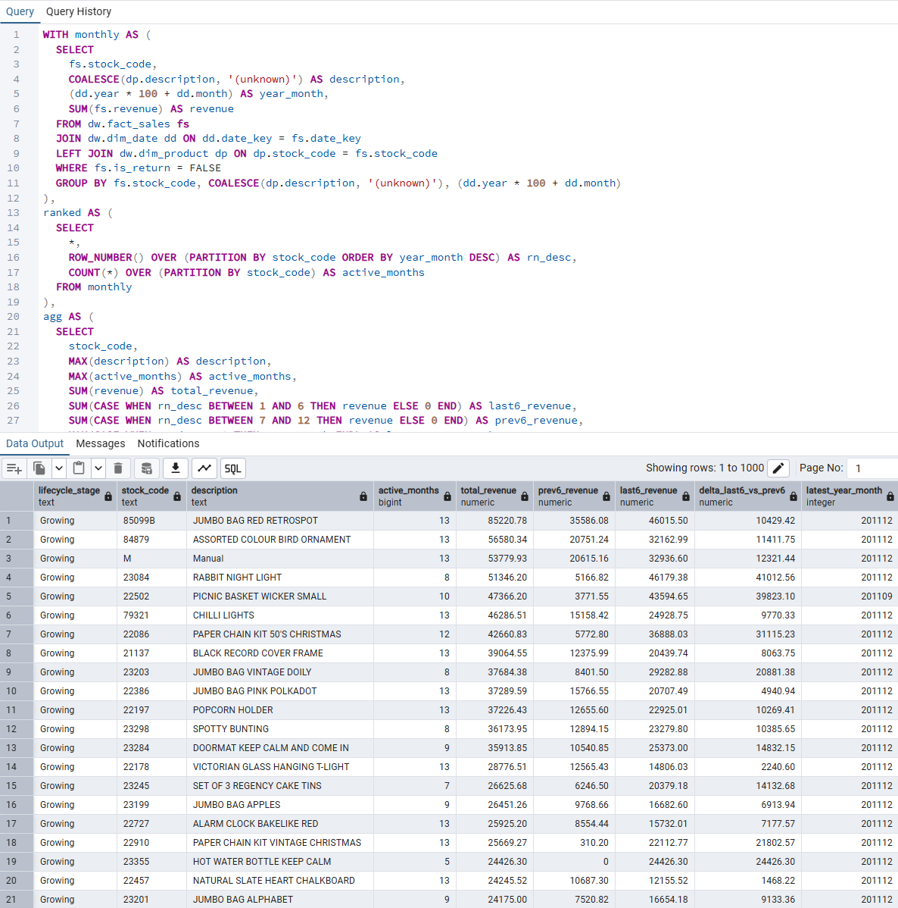

---

## 89. Price Sensitivity Proxy Analysis

### Purpose
Approximate product-level price sensitivity
using observed revenue and volume patterns.

### Artifacts
- `89_price_sensitivity_proxy_analysis.sql`

### Evidence
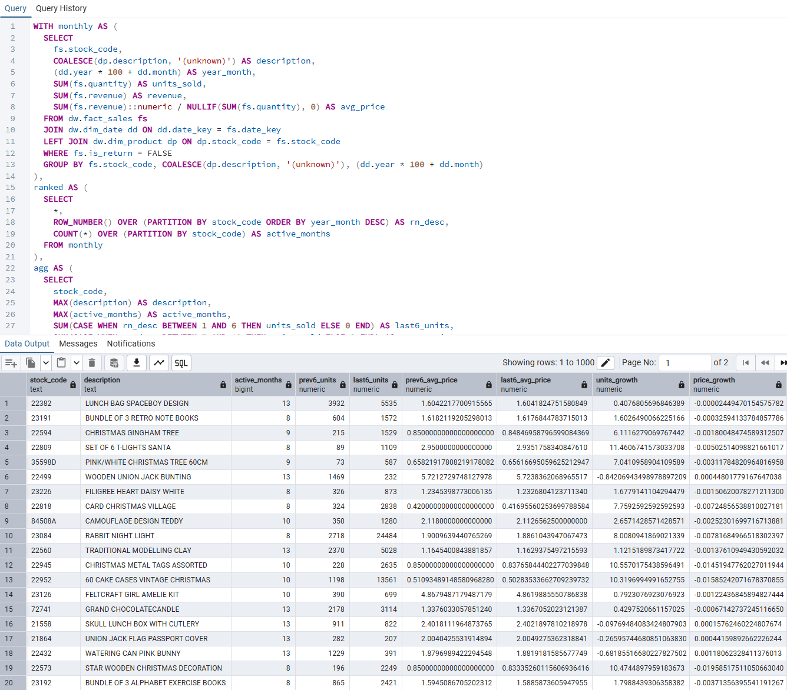

---

## 90. Sanity & Validation Checks

### Purpose
Ensure analytical correctness and consistency
before interpreting business results.

### Validation Areas
- Revenue consistency
- Negative or zero-value anomalies
- Reconciliation with warehouse facts

### Artifacts
- `90_sanity_checks.sql`

### Evidence
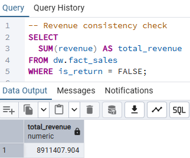

---

## Key Insights (Example)

- When revenue concentration exceeds a small percentage of SKUs,
  portfolio risk increases disproportionately.
- Products with high return rates but stable sales volume
  often indicate pricing or expectation mismatches.
- Core products demonstrate greater price resilience
  compared to long-tail or opportunistic SKUs.

---

## Why Product Mix Analysis Matters

This analysis supports:

- Assortment optimization
- Inventory and SKU rationalization
- Pricing and promotion strategy
- Revenue concentration risk management

> Revenue growth is not only about selling more —
> it is about selling the *right* products.

---

## Dependencies

This module depends on:

- [Data Foundation](../../data_foundation/README.md)
- [Data Modeling](../../data_modeling/README.md)
- [Data Operations](../../data_operations/README.md)

All inputs are validated prior to analysis.

---

## Execution Order

1. Validate warehouse models and marts
2. Run base product metrics and rankings
3. Evaluate concentration and stability
4. Assess risk, lifecycle, and sensitivity
5. Confirm results with sanity checks

---

## Next Steps

- Integrate margin and cost data
- Add promotion and seasonality effects
- Connect insights to BI dashboards
