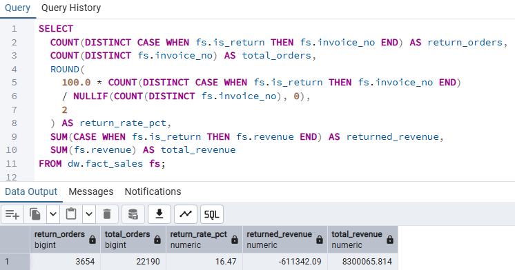
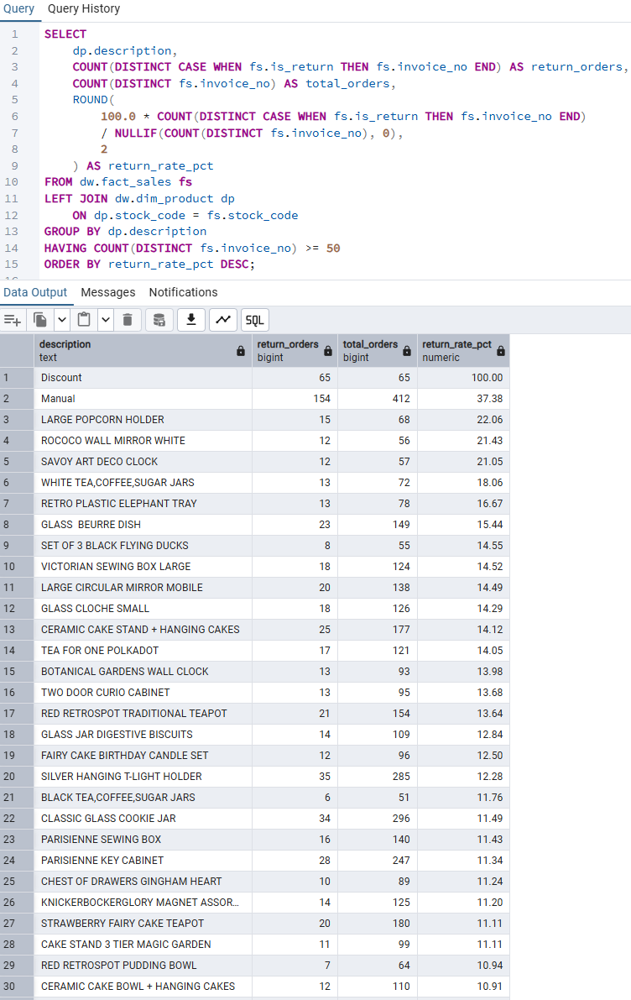
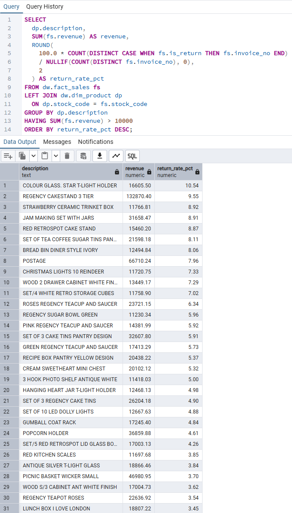
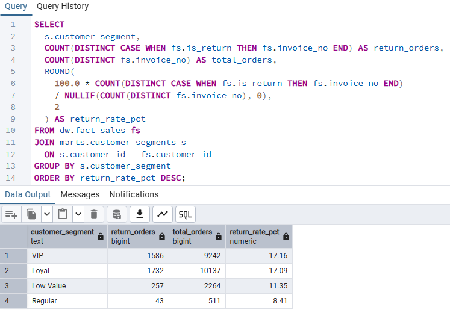
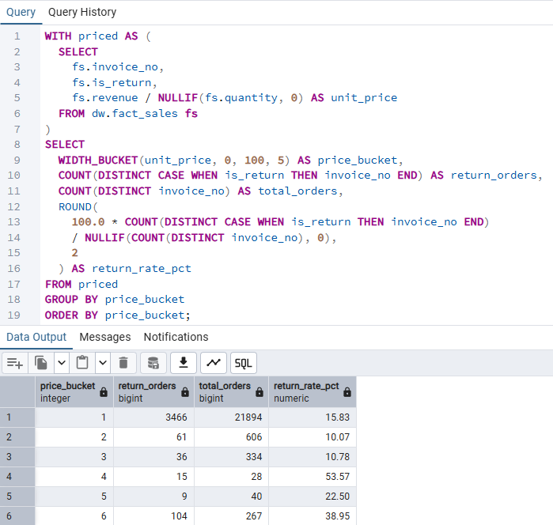
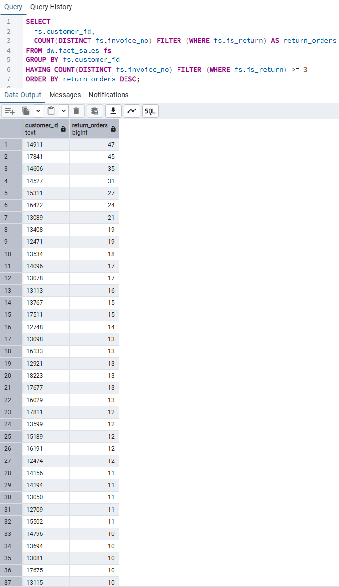
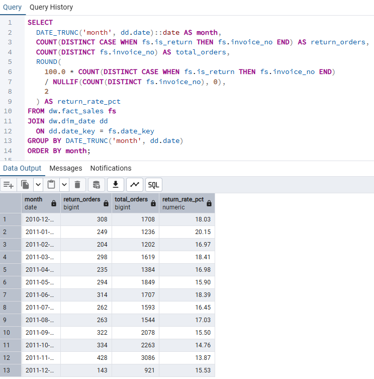
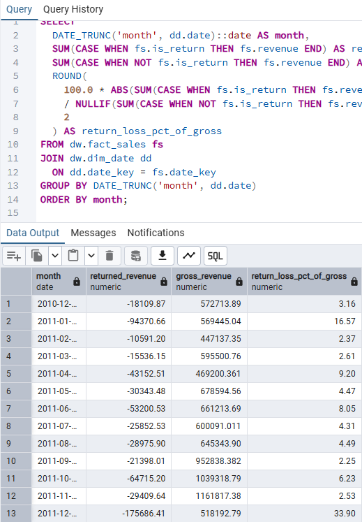
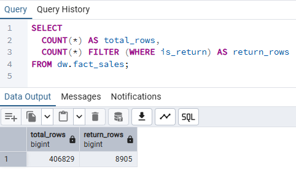

# Returns Analysis

A structured returns analysis designed to understand return behavior,
revenue impact, and operational risk across products, customers, and segments
using warehouse-level data.

Category: Returns Management · Revenue Leakage · Risk and Quality Analysis

---

## Overview

This module analyzes why returns occur, where they concentrate,
and how they impact revenue and customer behavior.

All analyses are built on top of validated dimensional models
and are designed to support pricing decisions, product quality control,
and return policy optimization.

---

## Analysis Framework

The returns analysis is structured to answer:

- Where do returns concentrate most?
- Which products generate high revenue and high return risk?
- How do return patterns differ by customer segment?
- What is the revenue impact of returns over time?

The framework progresses from high-level overview
to granular risk and impact analysis.

---

## 10. Returns Overview

### Purpose

Provide a high-level snapshot of overall return behavior
across the business.

### Key Metrics

- Total return volume
- Overall return rate
- Return-related revenue loss

### Evidence

Artifacts:
- 10_return_overview.sql

---

## 20. Product Return Rate

### Purpose

Identify products with disproportionately high return rates
that may indicate quality, pricing, or expectation mismatch issues.

### Key Metrics

- Return rate by product
- Returned revenue by SKU

### Evidence

Artifacts:
- 20_product_return_rate.sql

---

## 30. High Revenue and High Return Products

### Purpose

Detect high-risk products that contribute meaningfully to revenue
while also generating excessive returns.

### Key Metrics

- Revenue versus return rate matrix
- High-impact product identification

### Evidence

Artifacts:
- 30_high_revenue_high_return_products.sql

---

## 40. Segment-Level Return Rate

### Purpose

Understand how return behavior varies across
different customer segments.

### Key Metrics

- Return rate by customer segment
- Segment-level return contribution

### Evidence

Artifacts:
- 40_segment_return_rate.sql

---

## 50. Price Bucket Return Rate

### Purpose

Analyze whether return behavior is influenced by
product price levels.

### Key Metrics

- Return rate by price bucket
- Revenue loss by price range

### Evidence

Artifacts:
- 50_price_bucket_return_rate.sql

---

## 60. Repeat Return Customers

### Purpose

Identify customers who repeatedly return products,
which may indicate abuse, dissatisfaction, or poor product fit.

### Key Metrics

- Repeat return customer count
- Return frequency distribution

### Evidence

Artifacts:
- 60_repeat_return_customers.sql

---

## 80. Monthly Return Trend

### Purpose

Track how return behavior evolves over time
to detect seasonality or policy-driven changes.

### Key Metrics

- Monthly return volume
- Return rate trend

### Evidence

Artifacts:
- 80_monthly_return_trend.sql

---

## 81. Monthly Return Revenue Impact

### Purpose

Quantify the direct revenue impact of returns
on a monthly basis.

### Key Metrics

- Returned revenue over time
- Net revenue erosion

### Evidence

Artifacts:
- 81_monthly_return_revenue_impact.sql

---

## 90. Sanity and Validation Checks

### Purpose

Ensure analytical correctness before interpreting results.

### Validation Areas

- Return versus sales reconciliation
- Negative or inconsistent values
- Alignment with warehouse facts

### Evidence

Artifacts:
- 90_sanity_checks.sql

---

## Key Insights

- A small subset of products often accounts for a
  disproportionate share of return-related revenue loss.
- High-revenue products with high return rates represent
  critical portfolio and operational risks.
- Repeat return behavior is frequently concentrated
  among a limited group of customers.
- Returns introduce both direct revenue leakage
  and indirect operational cost pressure.

---

## Why Returns Analysis Matters

Returns directly impact:

- Revenue and margin leakage
- Operational and logistics costs
- Customer satisfaction and trust
- Product and pricing strategy

Revenue earned is not final until returns are understood and controlled.

---

## Derived Recommendation

Returns are unevenly distributed across products and customers,
indicating that targeted quality, fulfillment, or policy interventions
are likely to be more effective than system-wide return reduction efforts.

---

## Dependencies

This module depends on:

- ../../data_foundation/README.md
- ../../data_modeling/README.md
- ../../data_operations/README.md

All inputs are validated prior to analysis.

---

## Execution Order

1. Validate warehouse facts and return flags
2. Review overall return behavior
3. Identify high-risk products and segments
4. Quantify revenue impact over time
5. Confirm results with sanity checks

---

## Next Steps

- Integrate return reason codes if available
- Combine margin data to assess profit impact
- Feed insights into return policy optimization
- Link results to BI dashboards or alerting systems
