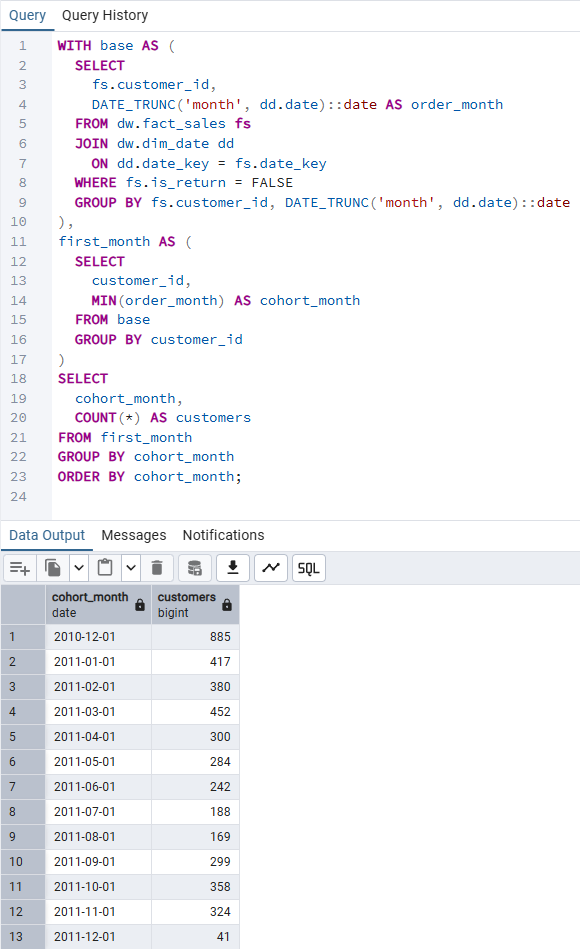
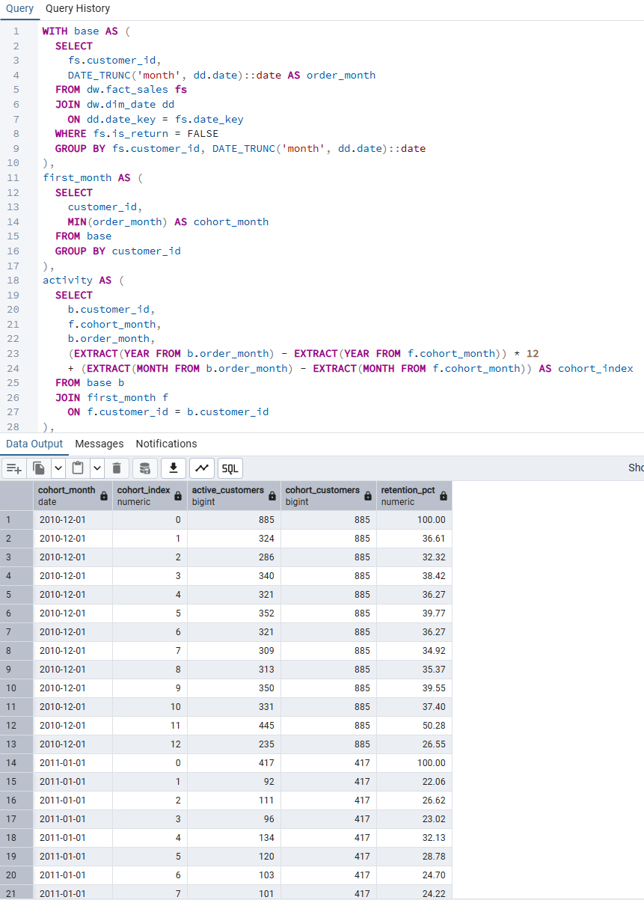
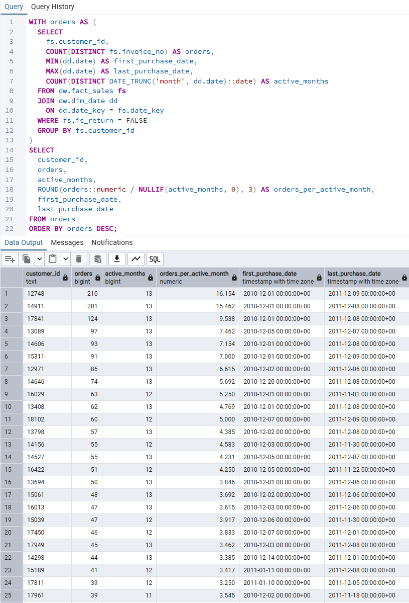
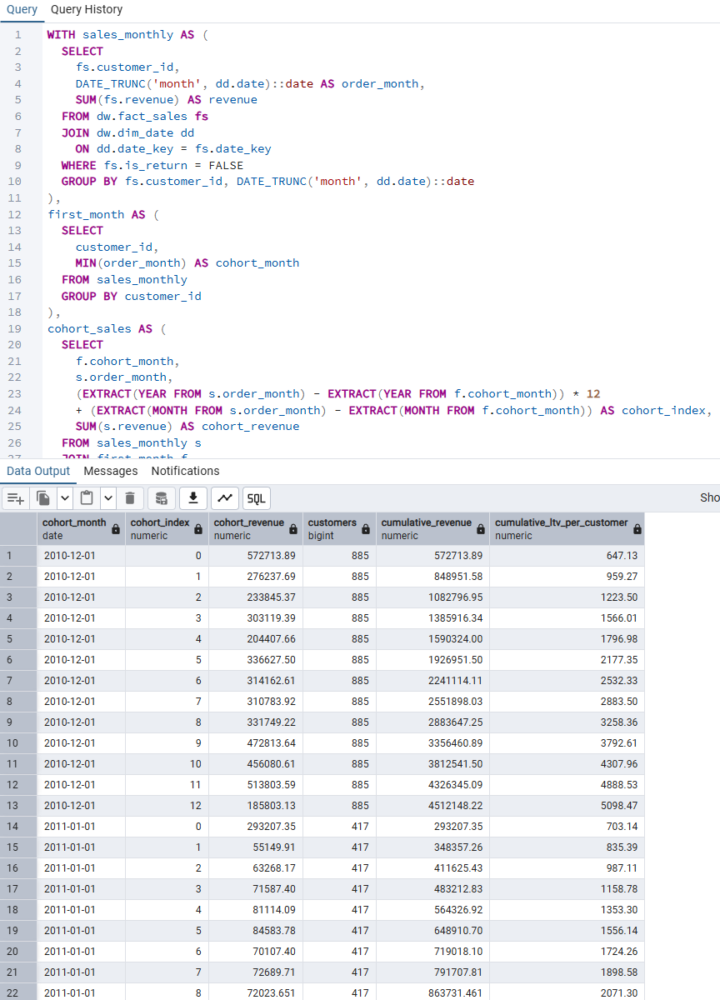
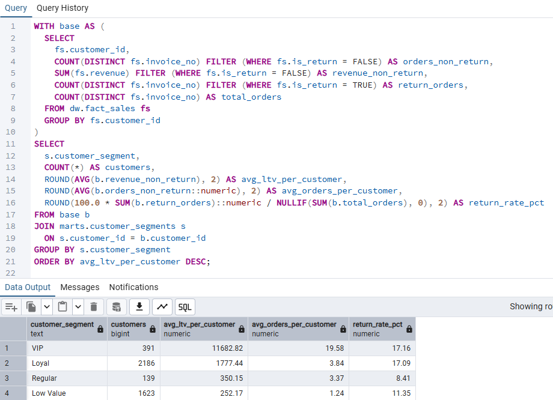
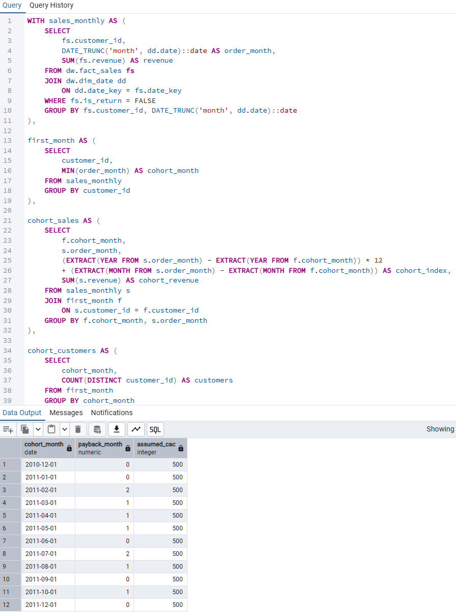
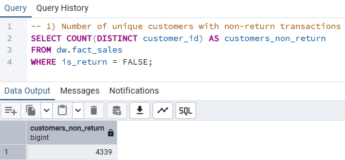
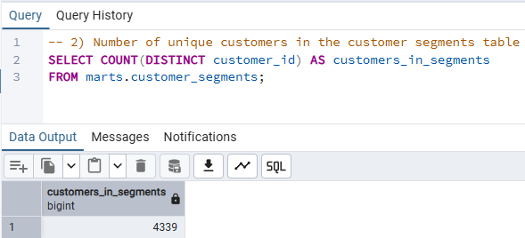
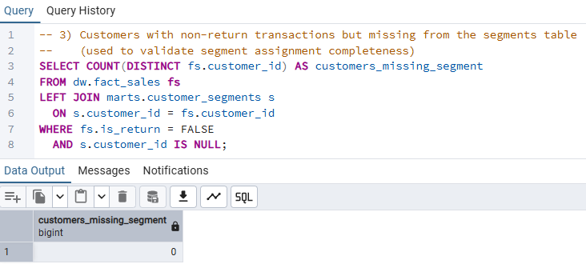

# Customer Lifetime Value (LTV) Analysis

**A structured customer lifetime value (LTV) analysis designed to understand
customer retention, long-term revenue contribution, and payback dynamics
using warehouse-level data.**

**Category:** Customer Analytics · Retention Strategy · Growth Economics

---

## Overview

This module analyzes **how customer value evolves over time**
by measuring retention, purchase frequency, lifetime revenue,
and payback period across cohorts and customer segments.

All analyses are built on top of validated dimensional models
and are intended to support **customer acquisition strategy,
retention investment decisions, and long-term growth planning**.

---

## Analysis Framework

Customer lifetime value is evaluated through a cohort-based framework:

- Customer cohort definition (first purchase month)
- Retention behavior over time
- Purchase frequency and repeat behavior
- Lifetime revenue accumulation
- Segment-level LTV comparison
- Payback period estimation
- Data sanity and coverage validation

This framework is designed to answer questions such as:
- Which customer cohorts generate the highest long-term value?
- How quickly do customers repay acquisition cost assumptions?
- Which segments are worth prioritizing for retention investments?

Each step progressively deepens understanding
from behavioral metrics to economic insights.

---

## 10. Cohort Definition

### Purpose
Define customer cohorts based on first purchase timing
to enable longitudinal LTV analysis.

### Artifacts
- `10_cohort_definition.sql`

### Evidence

---

## 20. Cohort Retention Analysis

### Purpose
Measure customer retention behavior over time
to understand decay patterns and cohort quality.

### Key Metrics
- Retention rate by cohort
- Active customer count by period

### Artifacts
- `20_cohort_retention.sql`

### Evidence

---

## 30. Purchase Frequency Analysis

### Purpose
Analyze how frequently customers purchase
to distinguish habitual customers from one-time buyers.

### Key Metrics
- Average purchase frequency
- Repeat purchase distribution

### Artifacts
- `30_purchase_frequency.sql`

### Evidence

---

## 40. LTV by Cohort

### Purpose
Measure cumulative revenue contribution
of each customer cohort over time.

### Key Metrics
- Cumulative revenue per cohort
- LTV growth curves

### Artifacts
- `40_ltv_by_cohort.sql`

### Evidence

---

## 50. LTV by Customer Segment

### Purpose
Compare lifetime value across customer segments
to identify high-value and low-value groups.

### Key Metrics
- Average LTV by segment
- Segment-level revenue concentration

### Artifacts
- `50_ltv_by_segment.sql`

### Evidence

---

## 60. Payback Period by Cohort

### Purpose
Estimate how long it takes for customer cohorts
to generate sufficient revenue to offset acquisition costs.

### Key Metrics
- Payback period (months)
- Cumulative revenue thresholds

### Artifacts
- `60_payback_period_by_cohort.sql`

### Evidence

---

## 90. Sanity & Coverage Checks

### Purpose
Ensure analytical correctness and data completeness
before interpreting LTV results.

### Validation Areas
- Customer base completeness
- Segment assignment coverage
- Missing or orphan customer records

### Artifacts
- `90_1_customer_base_count.sql`
- `90_2_segment_customer_count.sql`
- `90_3_missing_segment_customers.sql`

### Evidence

---

## Key Insights (Example)

- Early cohorts often exhibit higher long-term value,
  indicating improving retention quality over time.
- A small subset of customer segments contributes
  disproportionately to total lifetime revenue.
- Payback periods vary significantly by cohort,
  highlighting the importance of acquisition timing and quality.

---

## Why LTV Analysis Matters

This analysis supports:

- Customer acquisition budget optimization
- Retention and loyalty investment decisions
- Segment-level prioritization
- Long-term revenue forecasting

> Growth is not just about acquiring more customers —
> it is about acquiring the *right* customers.

---

## Dependencies

This module depends on:

- [Data Foundation](../../data_foundation/README.md)
- [Data Modeling](../../data_modeling/README.md)
- [Data Operations](../../data_operations/README.md)

All inputs are validated prior to analysis.

---

## Execution Order

1. Validate warehouse models and customer dimensions
2. Define cohorts and retention structure
3. Analyze frequency and lifetime value
4. Estimate payback periods
5. Confirm results with sanity checks

---

## Next Steps

- Incorporate acquisition cost (CAC) assumptions
- Extend LTV modeling with predictive techniques
- Connect cohort LTV results to BI dashboards
