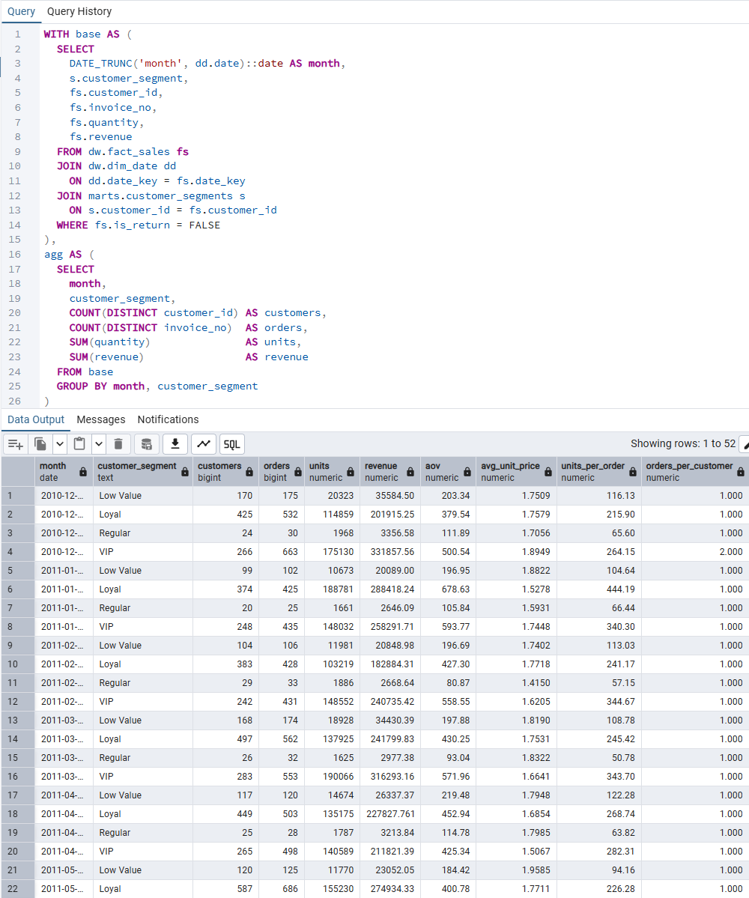
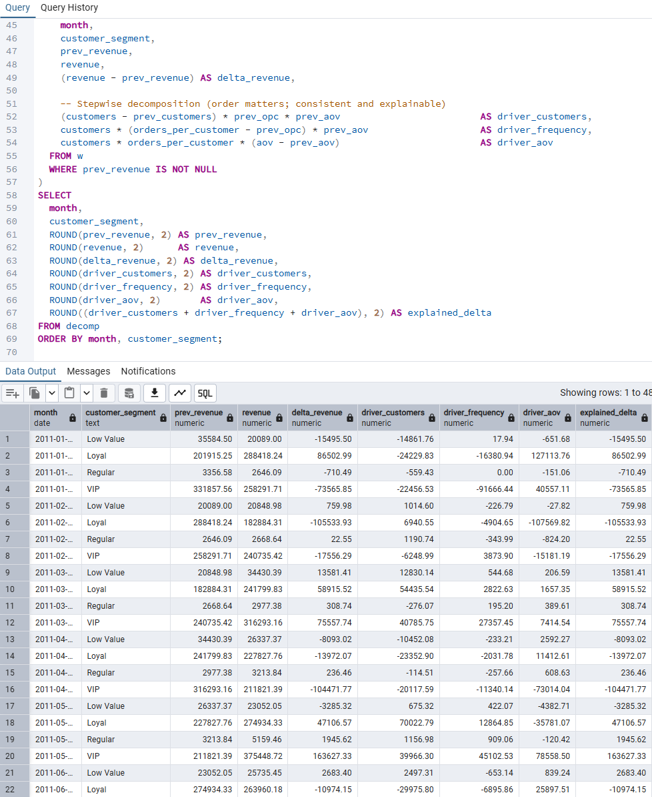
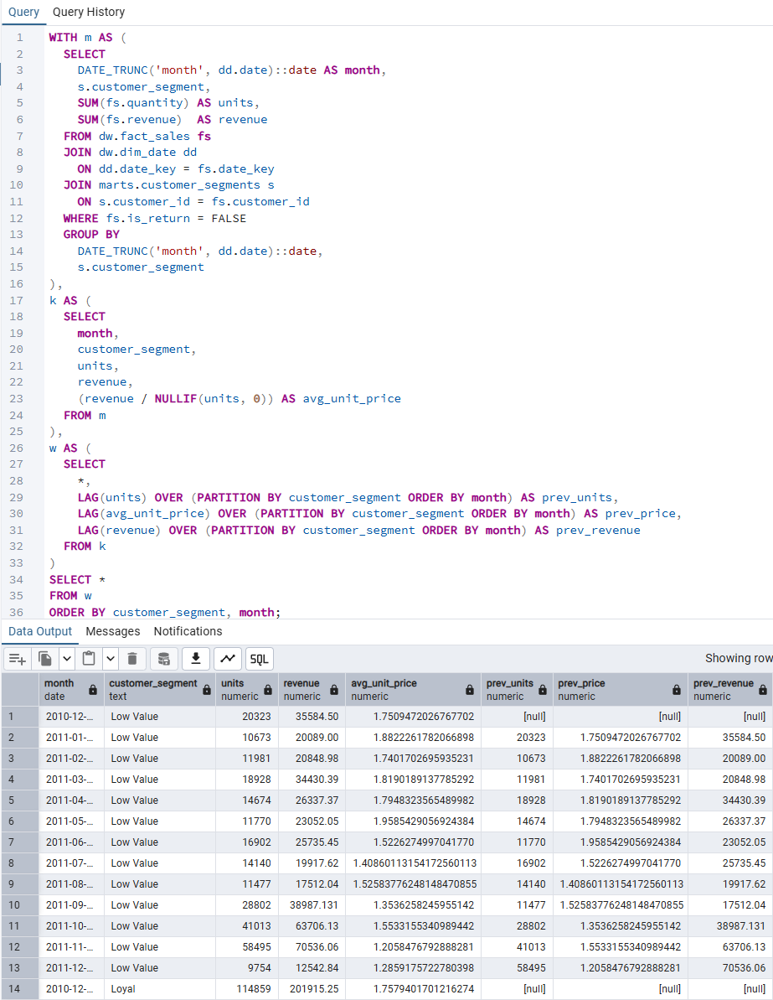
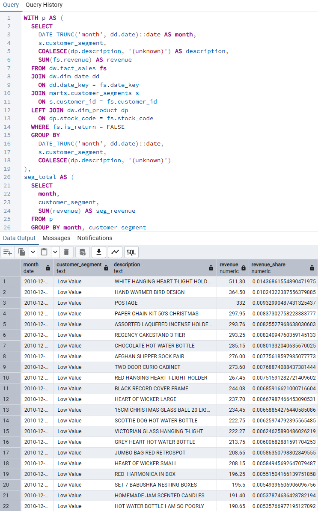
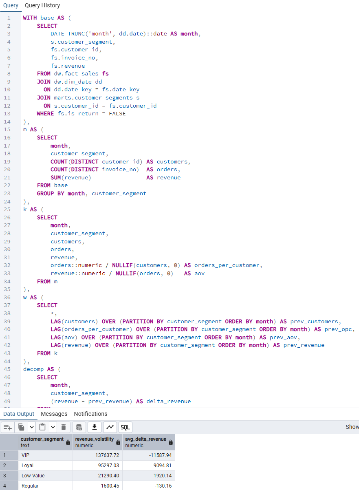
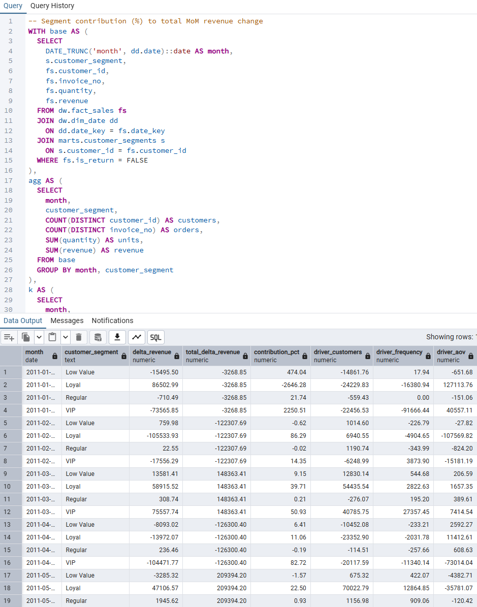
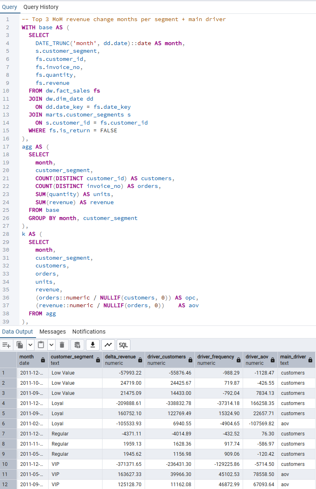
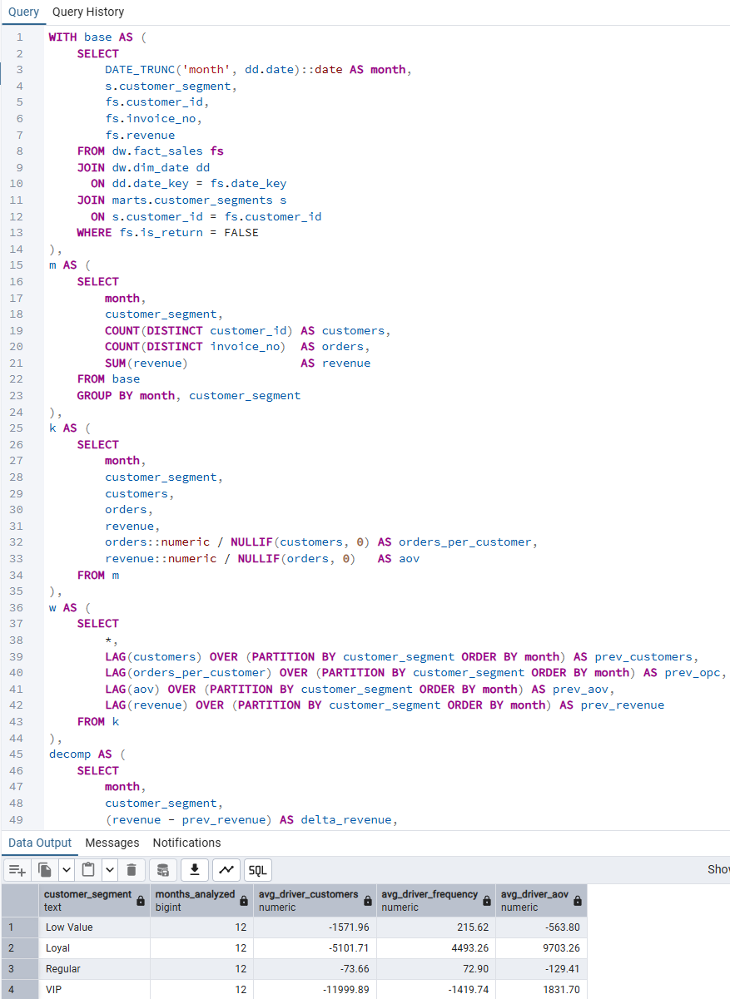
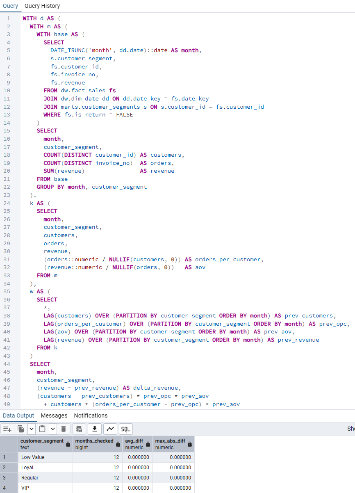

# Revenue Driver × Segment Analysis

**Decomposing monthly revenue changes by customer segment to uncover
the true drivers behind growth, decline, and volatility.**

**Category:** Revenue Analytics · Segmentation Strategy · Growth Diagnostics

---

## Overview

This module analyzes **why revenue changes over time**
by decomposing month-over-month (MoM) revenue movements
into **price, volume, and mix effects**, segmented by customer group.

Rather than simply observing revenue trends, this analysis
identifies **which segments drive growth**, **which introduce volatility**,
and **where strategic interventions are most effective**.

Understanding revenue drivers by segment enables more precise decisions
around pricing, promotions, product assortment, and customer investment.

---

## Analysis Framework

Revenue is analyzed through the following lenses:

- Segment-level revenue baselines
- Month-over-month revenue decomposition
- Price vs. volume contribution analysis
- Product mix shifts by segment
- Revenue volatility assessment
- Contribution to total revenue change
- Sanity checks and mathematical validation

This framework answers questions such as:
- Which customer segments drive revenue growth or decline?
- Are changes driven by customer activity (volume) or pricing?
- Which segments introduce the most revenue volatility?
- Where should pricing, promotion, or retention efforts focus?

Each step progresses from **measurement → decomposition → interpretation → validation**.

---

## 10. Segment Monthly Revenue Base

### Purpose
Establish baseline revenue trends by customer segment
to provide context for all downstream driver analyses.

### Key Metrics
- Total monthly revenue by segment
- Segment-level revenue trend patterns

### Artifacts
- `10_segment_monthly_revenue_driver_base.sql`

### Evidence
  
*Baseline monthly revenue trends for each customer segment*

---

## 20. MoM Revenue Driver Decomposition

### Purpose
Decompose month-over-month revenue changes
to understand **what caused the change**, not just how large it was.

### Key Metrics
- Absolute and relative MoM revenue change
- Contribution of price, volume, and mix effects

### Artifacts
- `20_segment_mom_driver_decomposition.sql`

### Evidence
  
*Revenue change decomposition by segment*

This view highlights whether revenue fluctuations stem from
changes in customer activity, pricing behavior, or product mix.

---

## 30. Price × Volume Mix Analysis

### Purpose
Identify whether revenue changes are primarily driven by
price effects or volume effects within each segment.

### Key Metrics
- Price effect contribution
- Volume effect contribution
- Relative dominance of each driver

### Artifacts
- `30_segment_mom_price_volume_mix.sql`

### Evidence
  
*Relative price vs. volume impact on revenue changes*

Across most segments, **volume effects dominate price effects**,
indicating that shifts in customer engagement levels
matter more than pricing adjustments.

---

## 40. Segment Product Mix Shift

### Purpose
Analyze how changes in product composition within segments
affect revenue performance over time.

### Key Metrics
- Revenue impact of product mix shifts
- Segment-level assortment stability

### Artifacts
- `40_segment_product_mix_shift.sql`

### Evidence
  
*Product mix impact by segment*

Product mix deterioration or improvement explains
why some segments underperform despite stable volume.

---

## 50. Revenue Volatility by Segment

### Purpose
Quantify revenue stability across segments
to identify sources of operational and forecasting risk.

### Key Metrics
- Revenue volatility index
- Variance of MoM revenue change

### Artifacts
- `50_segment_revenue_volatility.sql`

### Evidence
  
*Revenue volatility distribution by segment*

A small subset of segments accounts for
a disproportionate share of revenue volatility.

---

## 60. Segment Contribution to Total MoM Revenue

### Purpose
Assess how much each segment contributes
to overall revenue change in each period.

### Key Metrics
- Segment share of total MoM change
- Positive vs. negative contribution balance

### Artifacts
- `60_segment_contribution_to_total_mom.sql`

### Evidence
  
*Segment-level contribution to overall revenue change*

This view highlights which segments deserve
priority attention in growth or mitigation strategies.

---

## 70. Top Change Months per Segment

### Purpose
Identify months with extreme revenue movements
to support root-cause investigation.

### Key Metrics
- Largest positive and negative MoM changes
- Segment-specific shock periods

### Artifacts
- `70_top_change_months_per_segment.sql`

### Evidence
  
*Largest revenue swings by segment*

---

## 80. Segment Revenue Driver Summary

### Purpose
Summarize revenue driver patterns by segment
to enable strategic interpretation.

### Key Metrics
- Dominant revenue drivers per segment
- Stability vs. growth orientation

### Artifacts
- `80_segment_driver_summary.sql`

### Evidence

---

## 90. Sanity & Validation Checks

### Purpose
Ensure mathematical correctness and analytical consistency
across all revenue decomposition outputs.

### Validation Areas
- MoM change reconciliation
- Price + volume + mix = total revenue change
- Segment aggregation consistency

### Artifacts
- `90_sanity_check_driver_math.sql`

### Evidence

---

## Key Insights

- Revenue dynamics vary substantially by customer segment,
  indicating that **uniform pricing or promotion strategies are ineffective**.

- Growth-oriented segments are primarily driven by **volume expansion**,
  suggesting targeted acquisition and upsell initiatives.

- Declining segments often exhibit **mix deterioration or price sensitivity**,
  highlighting the need for assortment and pricing review.

- A small number of segments contribute most of the revenue volatility,
  representing key focus areas for risk mitigation.

---

## Why This Analysis Matters

This analysis enables:

- Segment-specific pricing and promotion strategies
- More accurate revenue forecasting
- Targeted investment in high-impact customer segments
- Early detection of revenue instability risks

> Revenue trends show *what happened* —  
> **revenue drivers explain why it happened**.

---

## Dependencies

This module depends on:

- Dimensional warehouse models (`fact_sales`, `dim_date`, `dim_customer`)
- Customer segmentation outputs from LTV analysis
- Validated revenue aggregation logic

All inputs are validated prior to analysis.

---

## Execution Order

1. Validate revenue and customer dimensional models
2. Build segment-level revenue baselines
3. Decompose MoM revenue changes
4. Analyze price, volume, and mix effects
5. Assess volatility and contribution
6. Confirm results through sanity checks

---

## Next Steps

- Integrate promotional and campaign metadata
- Combine revenue drivers with retention and LTV metrics
- Feed outputs into BI dashboards for executive reporting
- Extend analysis into segment-level revenue forecasting
