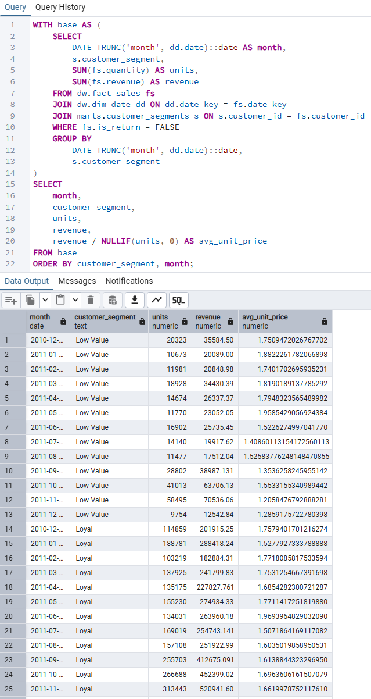
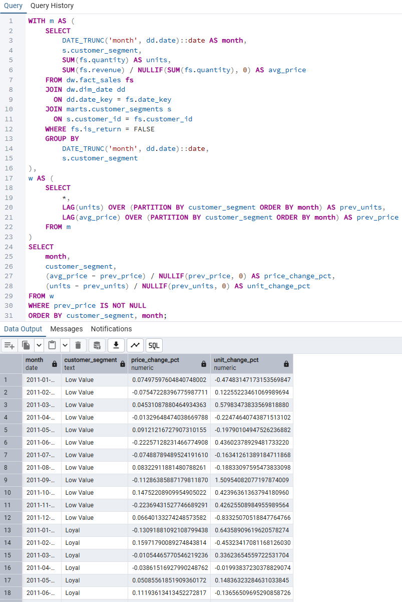
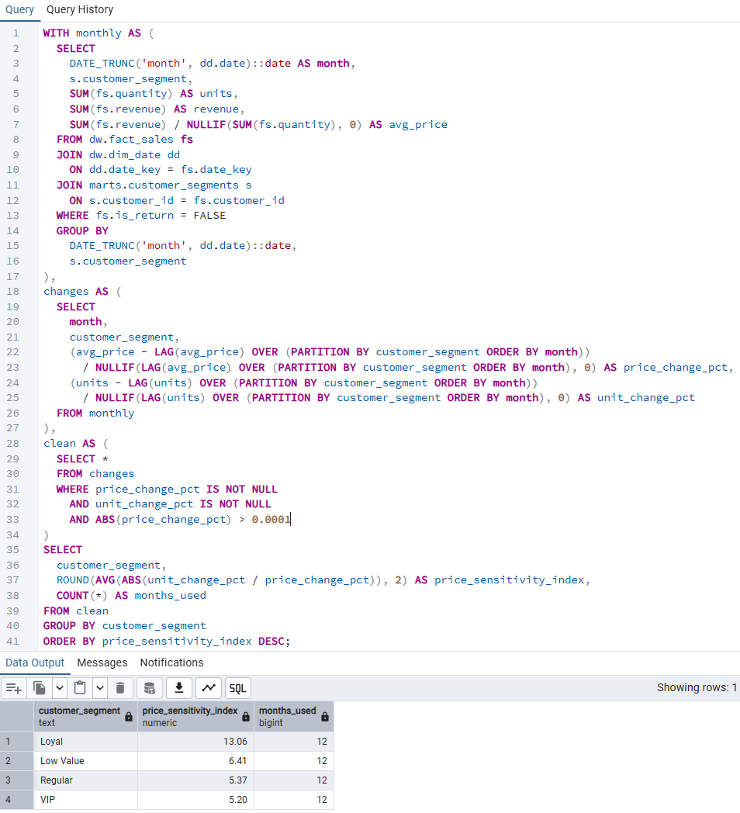
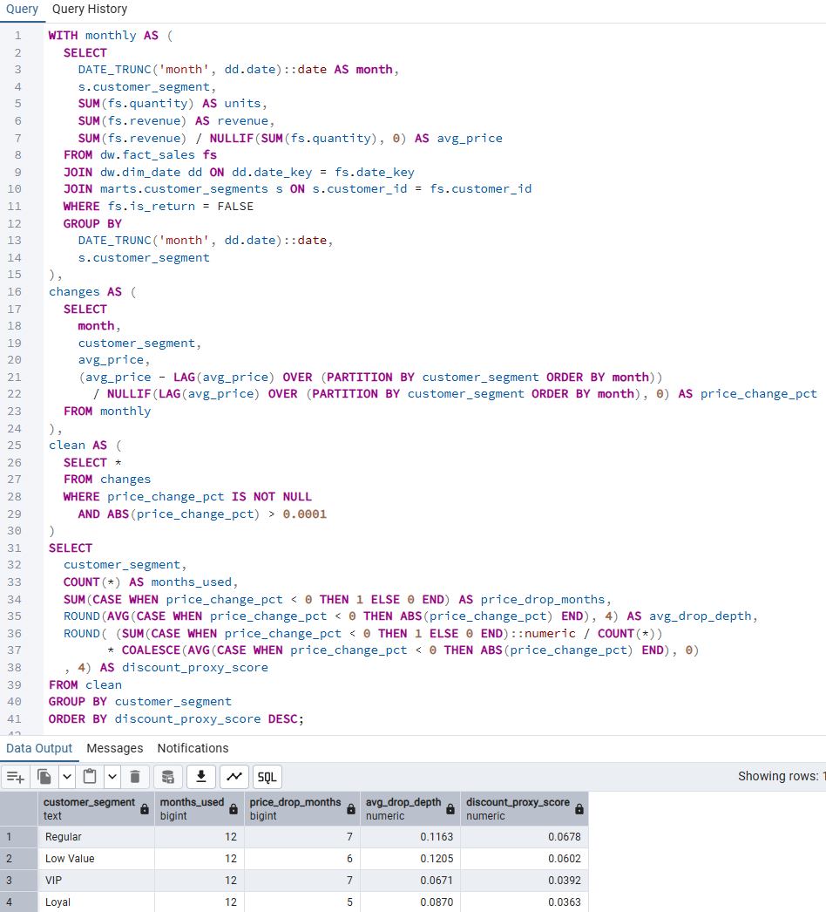
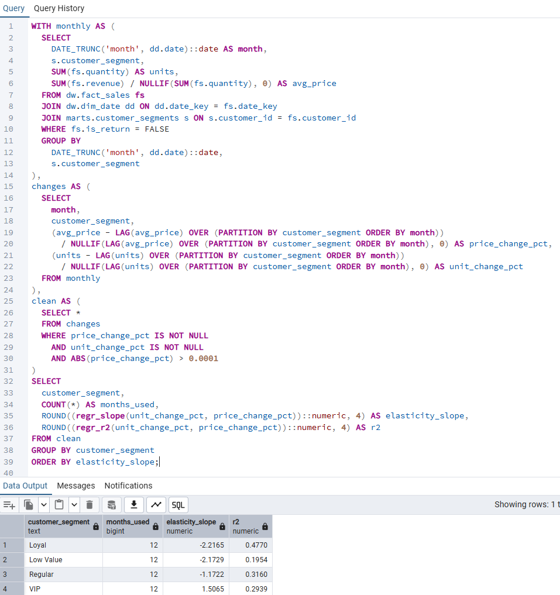
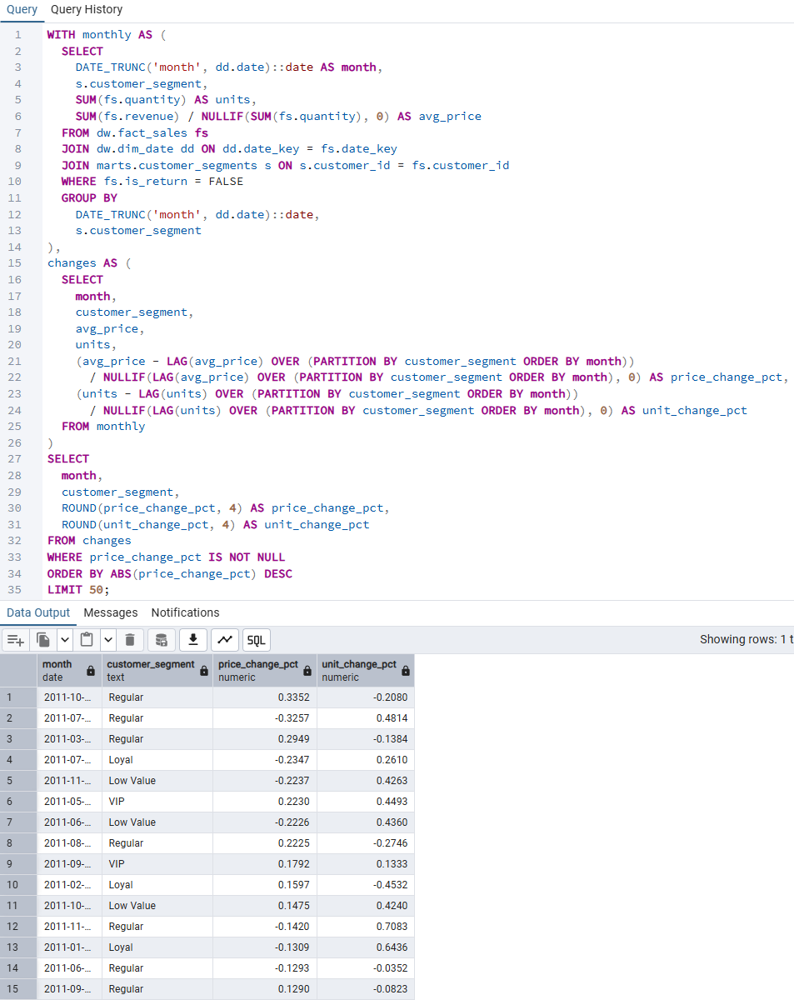
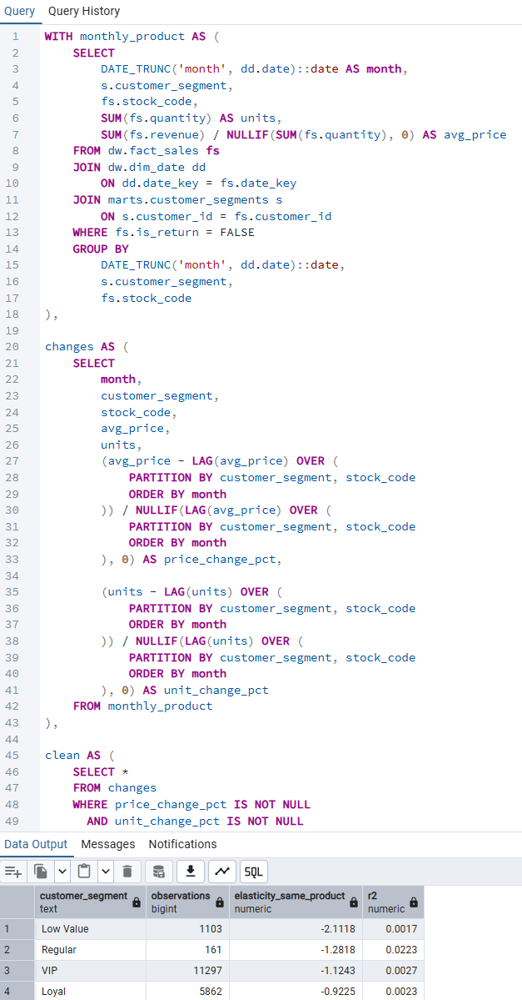
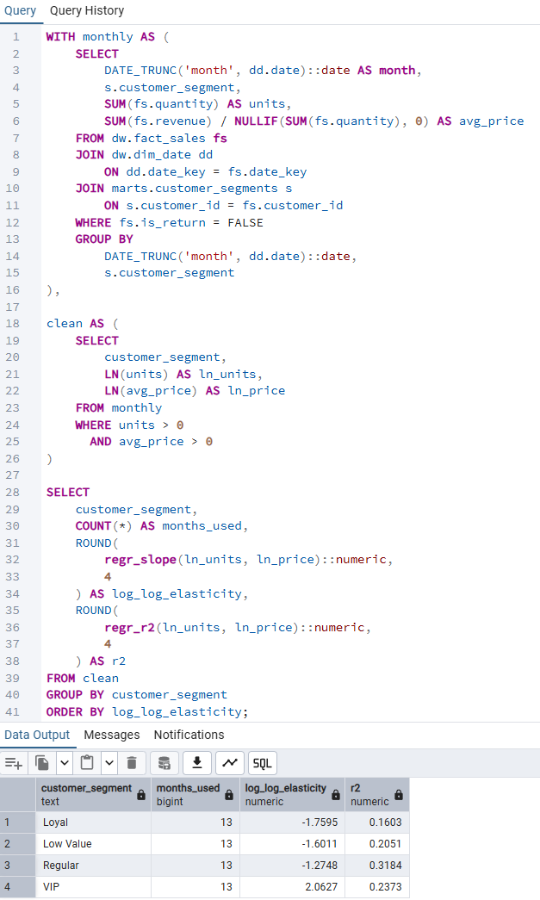

# Price Sensitivity & Discount Proxy Analysis

**A structured price sensitivity analysis designed to understand
how different customer segments respond to price changes and discount-like signals
using observational proxies when controlled experiments are unavailable.**

**Category:** Pricing Analytics · Revenue Optimization · Customer Segmentation

---

## Overview

This module analyzes **segment-level price sensitivity**
by decomposing the relationship between price movements, quantity response,
and revenue volatility.

Rather than relying on controlled A/B pricing experiments,
this analysis uses **behavioral and statistical proxies**
to infer how different customer segments react to price changes and discounts.

Understanding these dynamics enables **smarter pricing and promotion decisions**
that balance revenue growth with margin preservation.

---

## Why This Analysis Matters

- Prevent margin erosion from undifferentiated discounting
- Identify segments that respond strongly to price or discount signals
- Design segment-specific pricing and promotion strategies
- Improve revenue forecasting with behavior-driven price elasticity insights

> Pricing power is not uniform —  
> **segment-level sensitivity determines whether price changes drive growth or risk.**

---

## Analysis Framework

Price sensitivity is analyzed through the following lenses:

- Baseline price and quantity trends by segment
- Price vs. quantity change relationships
- Discount proxy indicators derived from price volatility
- Regression-based elasticity estimation
- Product-level control checks
- Sanity and mathematical validation

Each step progresses from **observation → proxy → inference → validation**.

---

## 10. Segment Monthly Average Price

### Purpose
Establish baseline pricing behavior by segment
to understand structural differences in price levels and trends.

### Key Metrics
- Average unit price by segment
- Price trend consistency over time

### Artifacts
- `10_segment_monthly_avg_price.sql`

### Evidence
  
*Shows that average selling price trends differ across segments, indicating distinct baseline pricing behavior.*

---

## 20. Price vs Quantity Change Analysis

### Purpose
Evaluate whether price changes are associated
with observable quantity response at the segment level.

### Key Metrics
- Month-over-month price change
- Month-over-month quantity change
- Directional response patterns

### Artifacts
- `20_segment_price_quantity_change.sql`

### Evidence
  
*Illustrates how quantity responds to price movements differently across segments.*

---

## 30. Price Sensitivity Index

### Purpose
Construct a comparative price sensitivity index
using normalized price and quantity change behavior.

### Key Metrics
- Price sensitivity index (relative)
- Segment ranking by sensitivity

### Artifacts
- `30_segment_price_sensitivity_index.sql`

### Evidence
  
*Higher index values indicate stronger quantity response to price changes.*

> **Interpretation Note:**  
> This index is a relative comparison metric and should not be interpreted as absolute elasticity.

---

## 40. Discount Proxy Score

### Purpose
Approximate discount-driven behavior
by identifying price volatility patterns commonly associated with promotions.

### Key Metrics
- Price volatility score
- Frequency of large price drops
- Segment-level discount proxy ranking

### Artifacts
- `40_segment_discount_proxy_score.sql`

### Evidence
  
*Segments with higher scores exhibit behavior consistent with discount-driven purchasing.*

---

## 50. Price Elasticity Regression

### Purpose
Estimate statistical price elasticity
to validate proxy-based sensitivity signals.

### Key Metrics
- Elasticity coefficient
- Direction and magnitude of response
- Model fit indicators

### Artifacts
- `50_segment_price_elasticity_regression.sql`

### Evidence
  
*Confirms that segments differ significantly in elasticity magnitude.*

---

## 60. Top Price Movement Months

### Purpose
Identify months with extreme price movements
to contextualize elasticity and discount behavior.

### Key Metrics
- Largest price increase/decrease months
- Segment exposure to price shocks

### Artifacts
- `60_segment_top_price_move_months.sql`

### Evidence
  
*Extreme price movements help explain volatility-driven sensitivity.*

---

## 70. Same-Product Price Elasticity Control

### Purpose
Control for product-mix effects
by analyzing elasticity within identical products.

### Key Metrics
- Same-product price elasticity
- Cross-segment comparison

### Artifacts
- `70_segment_price_elasticity_same_product.sql`

### Evidence
  
*Ensures observed sensitivity is not driven solely by product substitution.*

---

## 80. Log-Log Elasticity Validation

### Purpose
Validate elasticity estimates
using log-log regression for robustness.

### Key Metrics
- Log-log elasticity coefficient
- Consistency with linear model results

### Artifacts
- `80_segment_price_elasticity_loglog.sql`

### Evidence
  
*Confirms elasticity direction and relative magnitude stability.*

---

## 90. Sanity & Validation Checks

### Purpose
Ensure mathematical correctness
and analytical consistency across all derived metrics.

### Validation Areas
- Price decomposition accuracy
- Aggregation consistency
- Elasticity sign validation

### Artifacts
- `90_sanity_check_driver_math.sql`

### Evidence

---

## Key Insights (Example)

- Price sensitivity varies significantly by customer segment
- High-sensitivity segments respond better to targeted promotions than permanent price cuts
- Low-sensitivity segments tolerate price increases with limited volume loss
- Discount-driven segments exhibit higher revenue volatility
- Elasticity estimates are directionally consistent across proxy and regression methods

---

## Dependencies

This module depends on:

- `dw.fact_sales` (transaction-level pricing and quantity)
- `dw.dim_date` (calendar reference)
- `dw.dim_customer` (segment attribution)
- Upstream revenue and pricing aggregation logic

All inputs are validated prior to analysis.

---

## Execution Order

1. Validate pricing and quantity aggregates
2. Establish baseline price behavior
3. Measure price-quantity response
4. Construct sensitivity and discount proxies
5. Estimate regression-based elasticity
6. Perform product-level controls
7. Run sanity and validation checks

---

## Next Steps

- Integrate promotion and campaign metadata
- Combine price sensitivity with margin analysis
- Feed elasticity outputs into pricing simulations
- Apply findings to dynamic pricing or offer optimization
