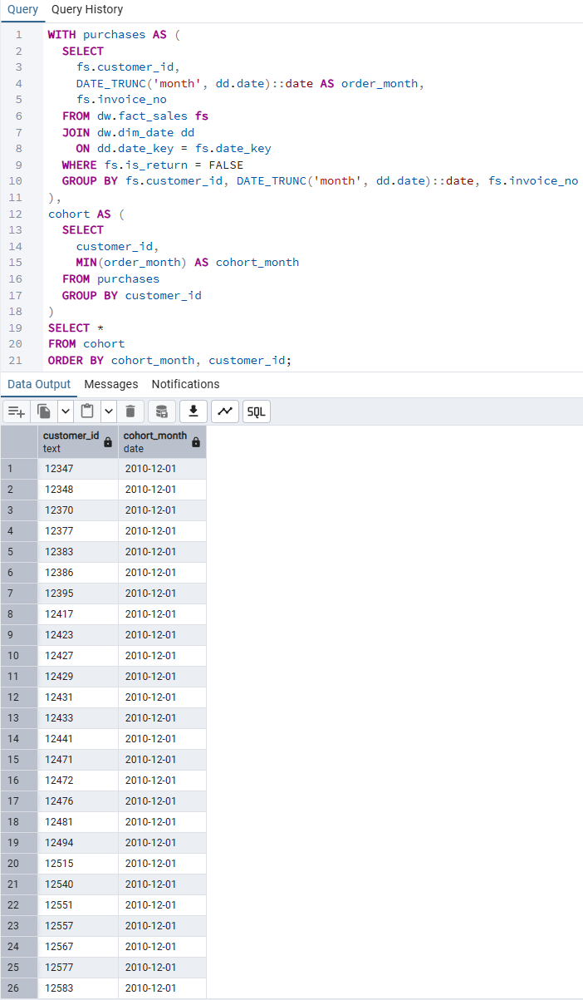
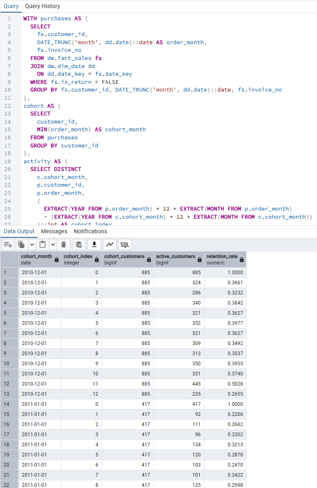
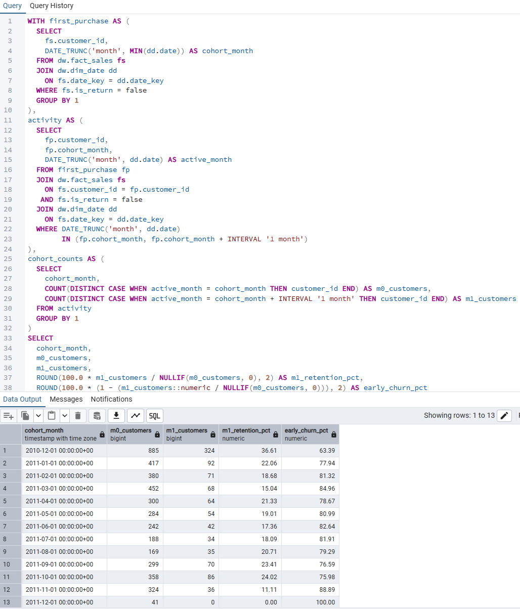
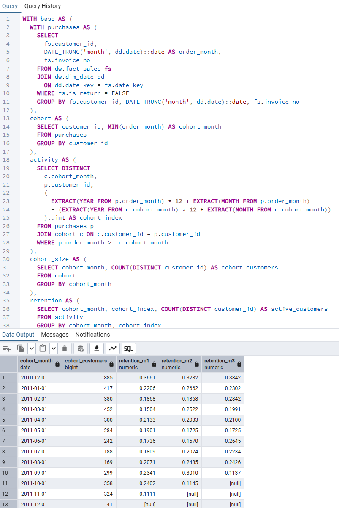
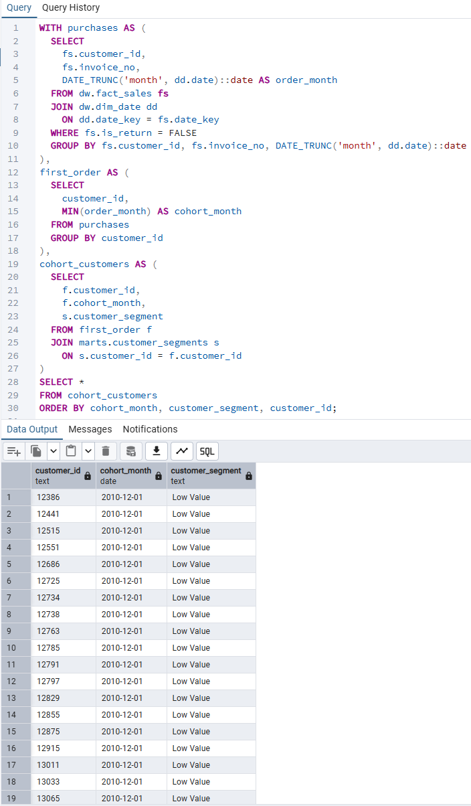
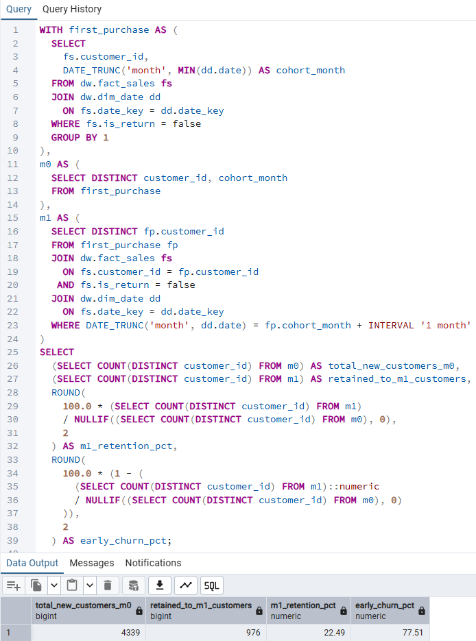
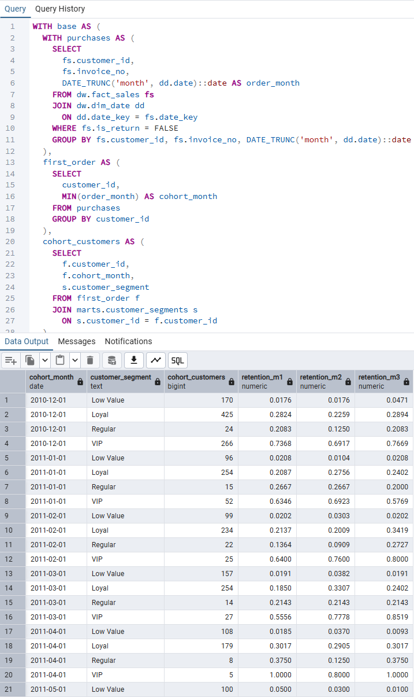

# Customer Cohort Retention Analysis

Quantifying early churn and long-term engagement patterns
across customer cohorts and value segments.

Category: Customer Analytics · Retention Strategy · Lifecycle Analysis

---

## Overview

This module analyzes how long customers remain active after their first purchase
by tracking retention behavior across time-based cohorts and customer value segments.

The analysis places special emphasis on early lifecycle churn,
which is the dominant driver of long-term customer value
and revenue sustainability.

Retention patterns directly shape lifetime value,
making first-month engagement a critical lever
for sustainable growth.

All metrics are derived from validated dimensional warehouse models
and are intended to support retention prioritization,
onboarding strategy design, and customer portfolio optimization.

---

## Analysis Framework

Cohort retention is analyzed through the following lenses:

- Cohort definition based on first purchase month
- Retention curves across monthly lifecycle stages
- Early churn concentration from M0 to M1
- Segment-level retention asymmetry
- Sanity checks on customer base consistency

This framework answers questions such as:

- How quickly do new customers churn?
- Which cohorts retain longer over time?
- How concentrated is churn in the first month?
- How does retention differ across customer segments?

Each step progresses from baseline
to behavior
to segmentation
to validation.

---

## 10. Cohort Definition

### Purpose

Define customer cohorts based on first purchase timing
to enable consistent longitudinal retention analysis.

### Evidence

Artifacts:
- 10_cohort_first_purchase.sql

---

## 20. Cohort Retention Matrix

### Purpose

Measure how customer cohorts retain over time
and identify structural drop-off patterns.

### Key Metrics

- Active customers by cohort and lifecycle month
- Retention rate by cohort index (M0, M1, M2, ...)

### Evidence

Artifacts:
- 20_cohort_retention_matrix.sql

Rows represent cohort month and columns represent
months since first purchase.
Values indicate the proportion of customers
still active at each lifecycle stage.

---

## 25. Early Retention Focus (M1)

### Purpose

Isolate first-month retention behavior
to quantify early lifecycle engagement quality.

### Key Metrics

- M1 retention rate
- One-month post-acquisition survival rate

### Evidence

Artifacts:
- 25_cohort_m1_retention.sql

---

## 30. Early Churn Summary

### Purpose

Quantify how many new customers fail to return
after their first purchase.

### Key Metrics

- M0 customer count
- M1 retained customers
- Early churn rate (1 minus M1 retention)

### Evidence

Artifacts:
- 30_cohort_early_churn_summary.sql

---

## 40. Segment-Level Cohort Base

### Purpose

Understand the composition of each cohort
by customer value segment at acquisition.

### Key Metrics

- Cohort size by segment
- Segment distribution across cohorts

### Evidence

Artifacts:
- 40_segment_cohort_customer_base.sql

---

## 50. Segment by Cohort Retention Matrix

### Purpose

Compare retention behavior across customer segments
to identify asymmetric lifecycle value patterns.

### Key Metrics

- Segment-level retention curves
- Retention gap between high-value and low-value segments

### Evidence

Artifacts:
- 50_segment_cohort_retention_matrix.sql

---

## 60. Segment Early Retention Summary

### Purpose

Highlight early churn concentration by segment
to inform retention investment prioritization.

### Key Metrics

- M1 retention rate by segment
- Early churn severity across segments

### Evidence

Artifacts:
- 60_segment_cohort_early_retention_summary.sql

---

## Key Insights

- Customer churn is heavily concentrated
  in the first month after acquisition.
- Only 15 to 36 percent of new customers
  return within one month across cohorts.
- Retention curves remain structurally low
  after early drop-off, indicating limited natural recovery.
- High-value and VIP segments retain
  three to five times longer than low-value segments,
  while low-value customers churn almost immediately.

---

## Why Cohort Retention Analysis Matters

This analysis supports:

- Early lifecycle intervention strategy design
- Retention budget prioritization
- Identification of high-potential customer segments
- Improved downstream LTV and revenue forecasting accuracy

Acquisition drives growth,
but retention determines sustainability.

---

## Derived Recommendation

Severe early churn observed across cohorts indicates that
first-month customer experience and onboarding effectiveness
are the most critical levers for improving long-term value.

Retention investments should prioritize
early engagement for high-potential segments
rather than broad, late-stage reactivation efforts.

---

## Dependencies

This module depends on:

- ../../data_foundation/README.md
- ../../data_modeling/README.md

All inputs are validated prior to analysis.

---

## Execution Order

1. Define customer cohorts
2. Compute cohort retention curves
3. Quantify early churn concentration
4. Segment customers by value
5. Compare segment-level retention behavior
6. Validate customer base consistency

---

## Summary

Early churn dominates customer lifecycle outcomes,
and retention performance differs dramatically by segment.
Focusing retention efforts on early engagement
and high-value cohorts yields disproportionate
long-term revenue benefits.

---

## Next Steps

- Link early retention patterns to cohort-level LTV outcomes
- Integrate acquisition cost (CAC) for full unit economics
- Feed retention metrics into BI dashboards and forecasting models
