# Operational Risk Analysis (Returns × Revenue Impact)

Reframing return behavior into an operational risk perspective  
by combining return frequency and revenue impact.

Category: Operations Analytics · Risk Assessment · Revenue Protection · Product Quality Analysis

---

## Overview

This module reframes return analysis from descriptive metrics  
into an **operational risk framework** by quantifying  
how returns impact revenue sustainability at the product level.

Rather than treating returns as isolated events,  
this analysis evaluates **both how often returns occur**  
and **how costly they are when they occur**.

The objective is to identify products that pose  
disproportionate operational and revenue risk,  
enabling prioritization of quality improvement,  
process intervention, or active monitoring.

All metrics are derived from validated warehouse views  
and are designed to support operational decision-making  
rather than purely analytical reporting.

---

## Analysis Framework

Operational risk is evaluated through the following lenses:

- Absolute return-related revenue loss
- Return frequency relative to sales volume
- Revenue impact normalized by gross sales
- Risk classification via a two-dimensional matrix
- Risk concentration across products and time
- Noise reduction through volume-adjusted filtering

This framework answers questions such as:

- Which products cause the largest revenue loss due to returns?
- Which products are both popular and operationally risky?
- How concentrated is operational risk across SKUs?
- Does risk originate from a few products or broad quality issues?
- Are return-related risks stable or time-dependent?

Each step progresses from  
loss identification  
to risk interaction  
to prioritization  
to validation.

---

## 10. Return Loss by Product

### Purpose

Identify products that cause the largest absolute revenue loss  
due to returns.

### Evidence

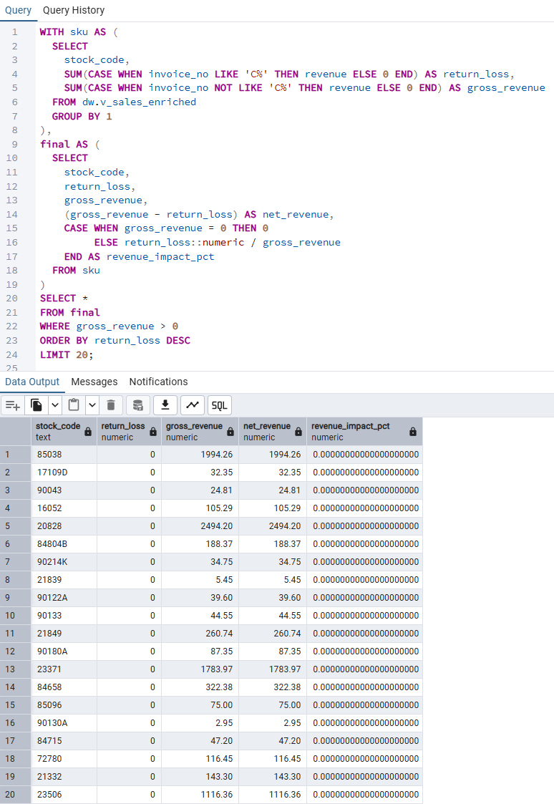

Artifacts:
- 10_return_loss_top_products.sql

---

## 20. High Sales × High Returns

### Purpose

Detect products that sell well  
but also experience frequent returns.

### Evidence

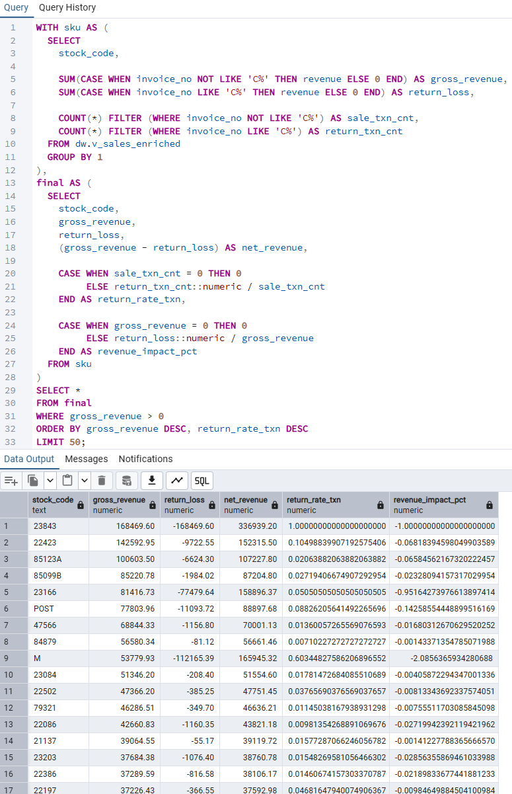

Artifacts:
- 20_high_sales_high_returns.sql

---

## 30. Operational Risk Matrix

### Purpose

Classify products into operational risk categories  
by jointly evaluating return frequency and revenue impact.

### Risk Buckets

- **High Risk**: High return frequency × High revenue impact  
- **Return-Heavy**: High frequency × Low impact  
- **Impact-Heavy**: Low frequency × High impact  
- **Low Risk**: Low frequency × Low impact  

### Evidence

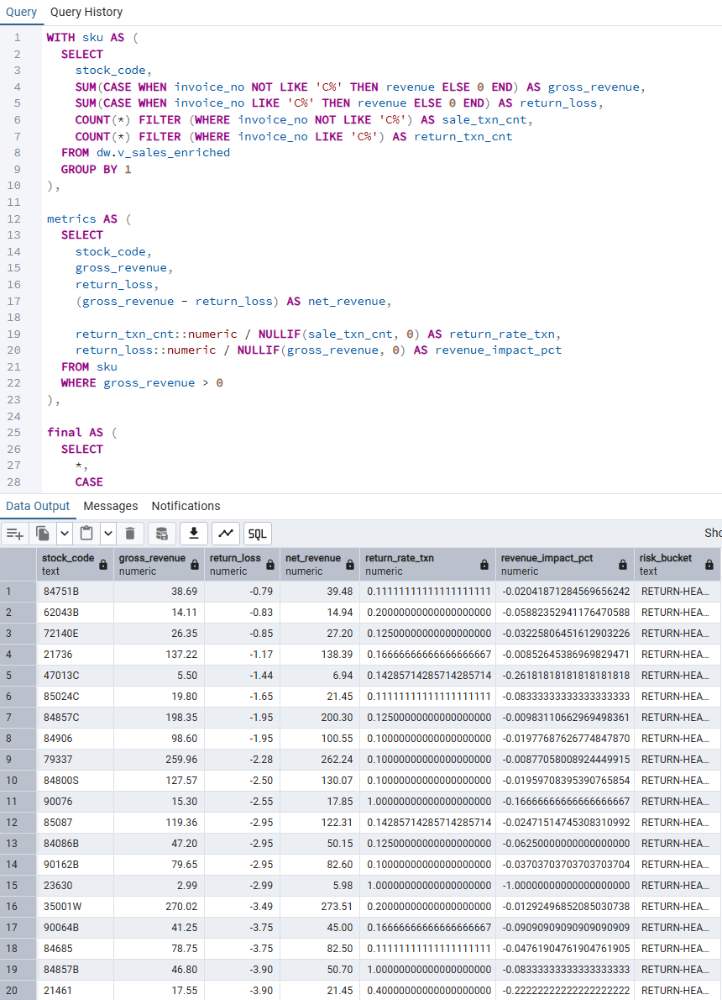

Artifacts:
- 30_operational_risk_matrix.sql

---

## 40. High-Risk SKU Concentration

### Purpose

Quantify how concentrated operational risk is  
across the product portfolio.

### Evidence

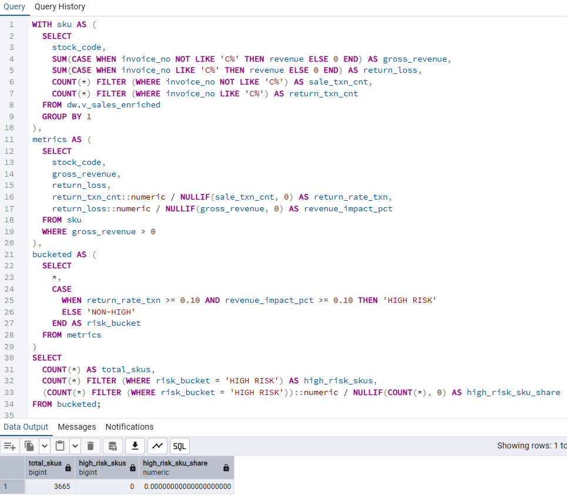

Artifacts:
- 40_total_vs_high_risk_sku_count.sql

---

## 41. Revenue Exposure to High-Risk Products

### Purpose

Measure how much total revenue  
is exposed to operationally risky products.

### Evidence

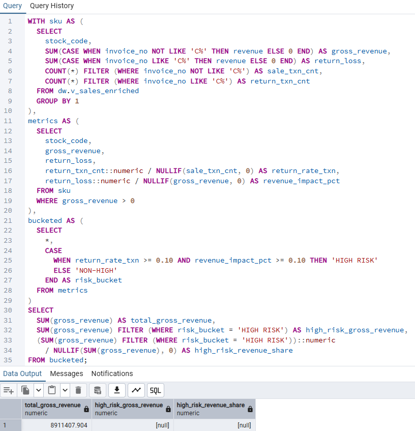

Artifacts:
- 41_high_risk_revenue_share.sql

---

## 42. Return Loss Concentration

### Purpose

Assess whether return-related revenue loss  
is driven by a small subset of high-risk products.

### Evidence

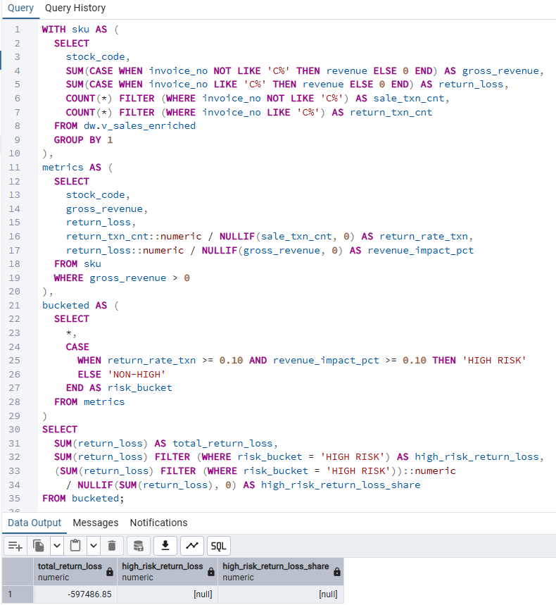

Artifacts:
- 42_high_risk_return_loss_share.sql

---

## 43. Top High-Risk Products

### Purpose

Identify the most operationally damaging products  
for targeted intervention.

### Evidence

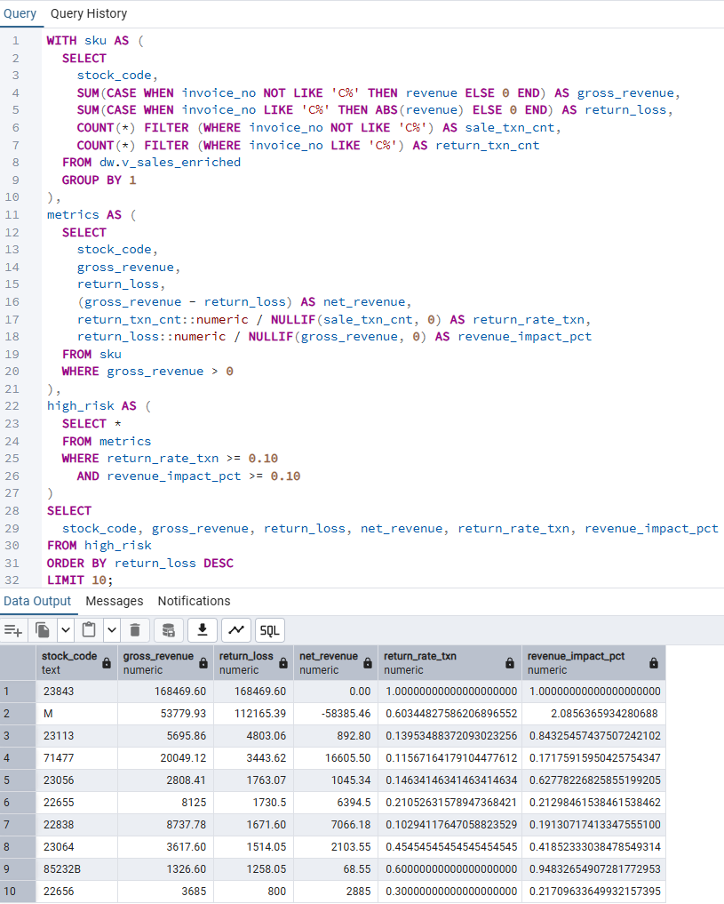

Artifacts:
- 43_high_risk_top10_products.sql

---

## 44. Volume-Adjusted Risk Filtering

### Purpose

Reduce noise caused by low-volume products  
that can artificially inflate return rates.

### Evidence

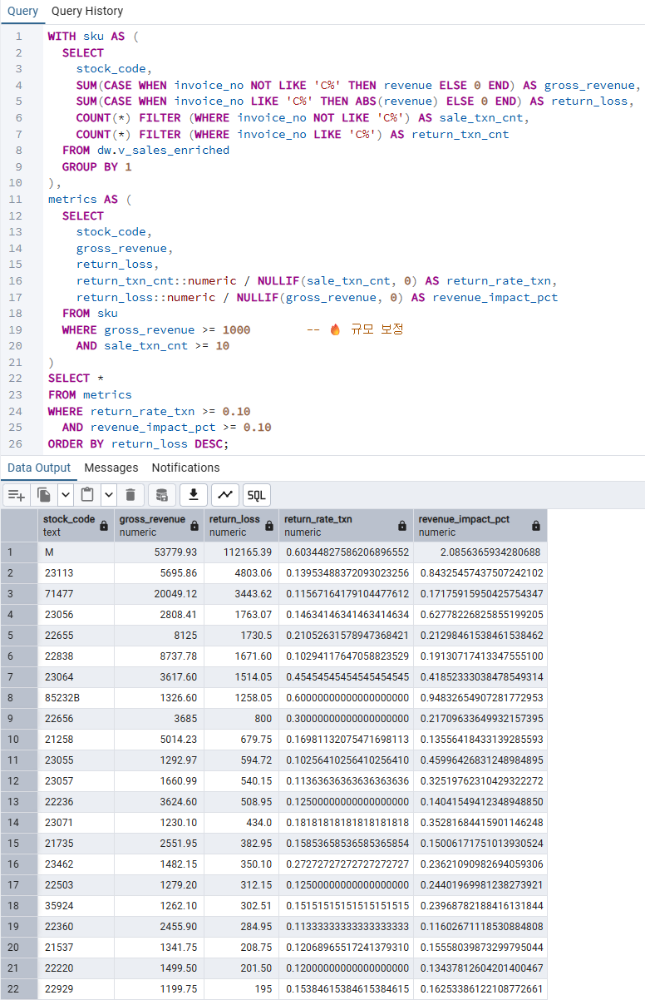

Artifacts:
- 44_volume_adjusted_high_risk_products.sql

---

## 45. Time-Based Operational Risk Patterns

### Purpose

Evaluate whether operational risk  
is persistent or concentrated in specific periods.

### Evidence

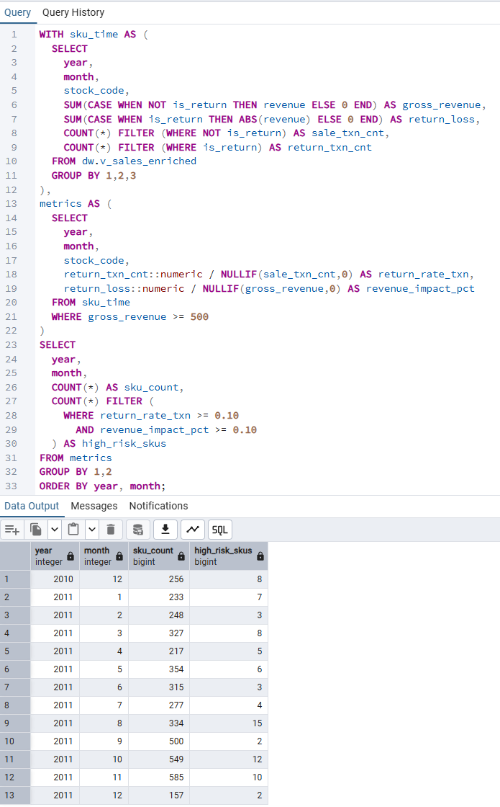

Artifacts:
- 45_time_based_operational_risk.sql

---

## 46. Pareto Analysis of Return Loss

### Purpose

Quantify how concentrated return-related losses are  
across the product portfolio.

### Evidence

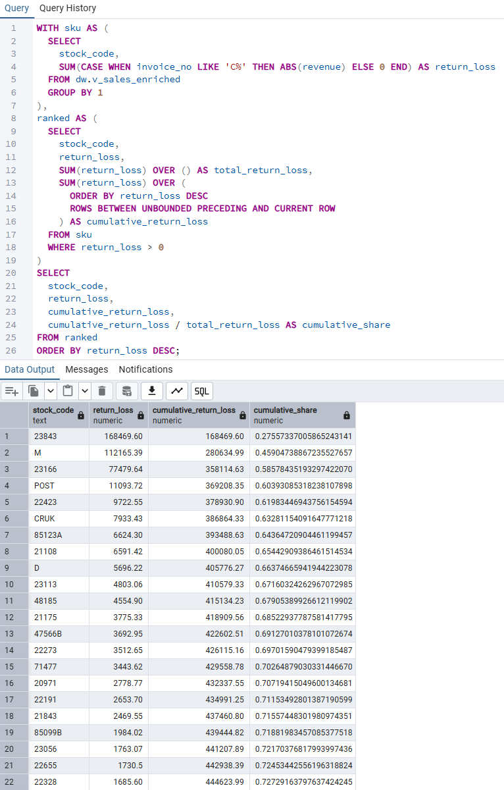

Artifacts:
- 46_high_risk_pareto_contribution.sql

---

## 47. Return Frequency vs Value Mismatch

### Purpose

Identify products where return frequency and revenue impact  
are misaligned (high frequency but low impact, or vice versa).

This helps separate operational noise  
from financially critical risk.

### Evidence

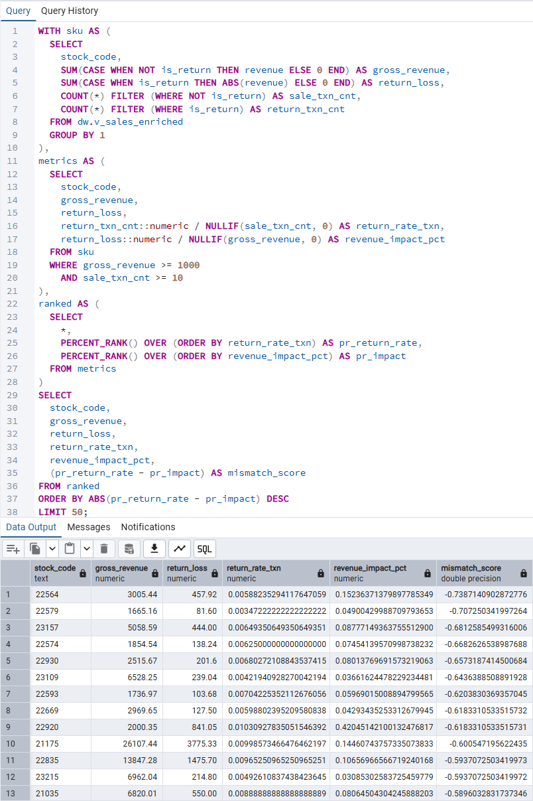

Artifacts:
- 47_return_frequency_vs_value_mismatch.sql

---

## 48. Monthly Return Loss Concentration

### Purpose

Track return-loss concentration over time  
to distinguish persistent risk  
from period-driven spikes.

### Evidence

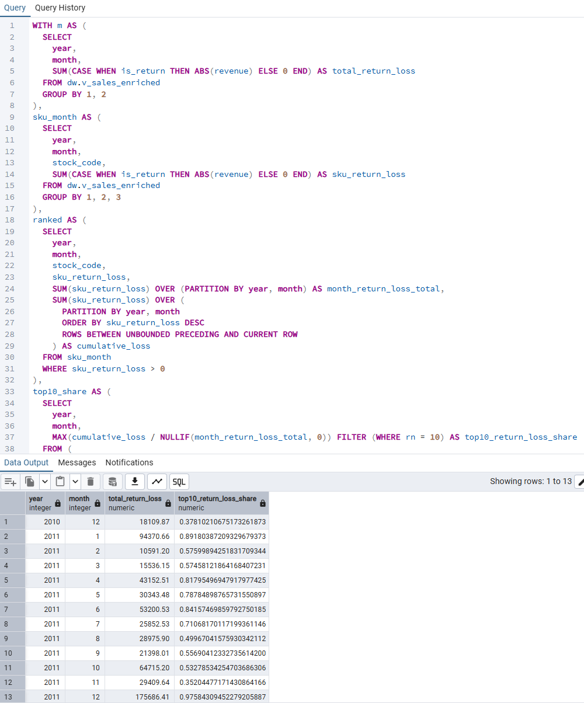

Artifacts:
- 48_monthly_return_loss_concentration.sql

---

## Key Insights

- Operational risk is highly concentrated in a small subset of products.
- A limited number of SKUs account for the majority of return-related revenue loss.
- High sales amplify operational risk when return frequency is elevated.
- Volume-adjusted filtering improves risk prioritization clarity.
- Temporal patterns suggest some risk spikes are event-driven rather than persistent.
- A Pareto-style distribution explains a disproportionate share of return-related losses.

---

## Why Operational Risk Analysis Matters

This analysis enables:

- Product quality and design prioritization
- Targeted operational intervention
- Return policy optimization
- Revenue risk mitigation
- Improved forecasting and planning accuracy

Returns are not just a customer issue —  
they are an operational and **revenue protection** signal.

---

## Derived Recommendations

Operational resources should focus on:

- Immediate investigation of high-risk products
- Quality or packaging improvements for high-impact SKUs
- Active monitoring of volume-adjusted risk signals
- Distinguishing persistent product issues from temporary anomalies

Addressing a small number of high-risk products  
can yield disproportionate improvements  
in operational stability and revenue protection outcomes.

---

## Dependencies

This module depends on:

- ../../data_foundation/README.md
- ../../data_modeling/README.md

All inputs are validated prior to analysis.

---

## Execution Order

1. Quantify return-related revenue loss  
2. Measure return frequency and impact  
3. Construct operational risk matrix  
4. Identify high-risk product concentration  
5. Apply volume-adjusted filtering  
6. Validate temporal risk patterns  
7. Assess Pareto concentration  
8. Evaluate frequency vs value mismatch  
9. Monitor monthly risk concentration  

---

## Summary

Return behavior, when viewed through an operational risk lens,  
reveals that revenue exposure is driven by a small number of products.

By prioritizing intervention on high-risk SKUs  
rather than broad return reduction efforts,  
organizations can achieve materially better  
operational stability and revenue protection outcomes.

---

## Next Steps

- Link high-risk SKUs to product attributes or categories
- Integrate operational risk metrics into BI dashboards
- Incorporate return risk into revenue forecasting scenarios
- Translate risk signals into automated monitoring alerts
