# Metric Layer and KPI Mart Design

A production-style metric layer designed to define,
standardize, and expose business KPIs for BI consumption
using SQL-based marts and semantic definitions.

Category: BI Analytics · Metric Engineering · Revenue and Operations

This metric layer acts as the single source of truth (SSOT)
for executive dashboards, operational reporting,
and downstream analytical use cases.

---

## Overview

This module defines the canonical business metrics
used consistently across dashboards, reporting,
and downstream analytical workflows.

All KPIs are computed at the database layer using SQL views,
ensuring metric consistency, reusability,
and governance across BI tools such as Power BI and Tableau.

Rather than embedding logic inside visualization tools,
this layer centralizes metric definitions
and exposes clean, consumption-ready KPI marts.

---

## Why This Layer Matters

- Eliminate metric discrepancies across dashboards
- Ensure consistent KPI definitions across teams
- Reduce BI-layer calculation complexity
- Enable scalable analytics and experimentation
- Support executive, operational, and analytical use cases

Metrics are organizational contracts.
They must be defined once and trusted everywhere.

---

## Metric Layer Architecture

The metric layer is composed of the following components:

- Base Fact View  
  Canonical sales representation with standardized revenue,
  return flags, and date attributes

- Core KPI Marts  
  Monthly revenue, order, and customer KPIs
  used for executive reporting

- Derived Trend Marts  
  Precomputed MoM and QoQ deltas
  to ensure consistent trend interpretation

- Segment and Operational Marts  
  Customer segmentation and product-level return risk metrics

- Validation Queries  
  Explicit sanity checks to verify metric accuracy
  and internal consistency

This layer sits between the warehouse fact tables
and all BI or analytical consumption layers,
ensuring consistent KPI semantics across the organization.

---

## Who Uses This Metric Layer

- Executives  
  KPI cards, revenue trends, MoM and QoQ performance tracking

- BI Analysts  
  Dashboard development without redefining metric logic

- Operations Teams  
  Return risk and product-level monitoring

- Data Scientists  
  Reliable, production-grade feature inputs
  for forecasting and modeling

---

## Metric Marts

---

## 10. Base Sales View

### Purpose

Provide a standardized, analytics-ready sales fact view
that serves as the foundation
for all downstream KPI marts.

### Evidence

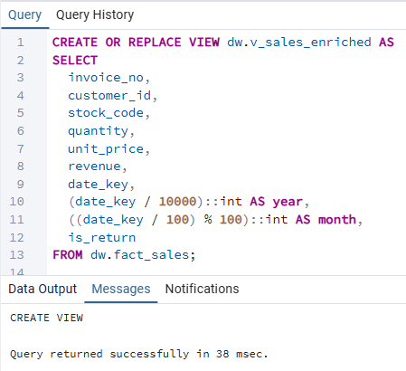

Artifacts:
- 10_v_sales_enriched.sql

---

## 20. Core Monthly KPI Mart

### Purpose

Expose executive-level monthly KPIs
used across revenue and performance dashboards.

### Key Metrics

- Orders
- Customers
- Revenue
- Average Order Value (AOV)

### Evidence

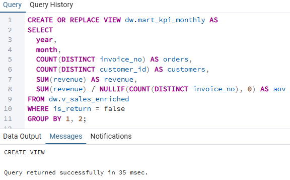

Artifacts:
- 20_mart_kpi_monthly.sql

---

## 21. Monthly KPI by Country

### Purpose

Enable geographic performance analysis
by extending core KPIs with country-level segmentation.

### Evidence

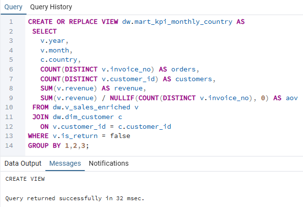

Artifacts:
- 21_mart_kpi_monthly_country.sql

---

## 22. Monthly KPI MoM Trends

### Purpose

Precompute month-over-month KPI changes
to support executive trend analysis
without BI-side calculations.

### Evidence

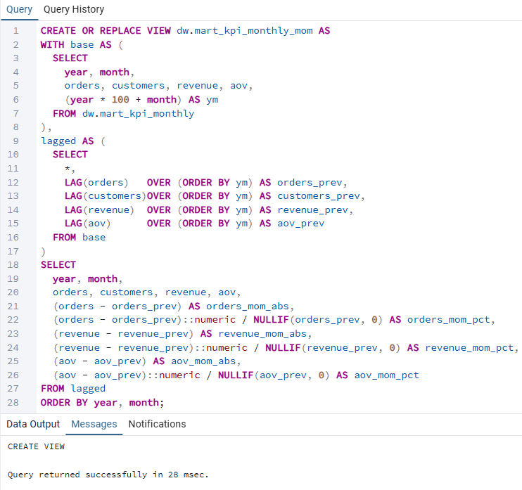

Artifacts:
- 22_mart_kpi_monthly_mom.sql

---

## 30. Returns and Revenue Impact Mart

### Purpose

Quantify the operational and financial impact
of returns at the monthly level.

### Evidence

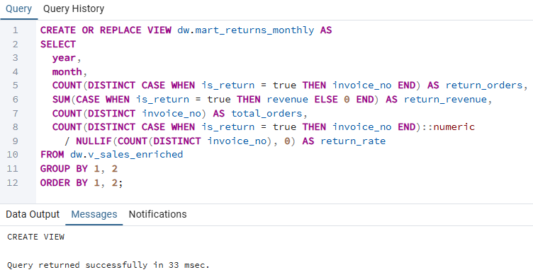

Artifacts:
- 30_mart_return_risk_monthly.sql

---

## 40. MoM and QoQ Trend KPI Mart

### Purpose

Provide both MoM and QoQ trend metrics
for higher-level performance evaluation.

### Evidence

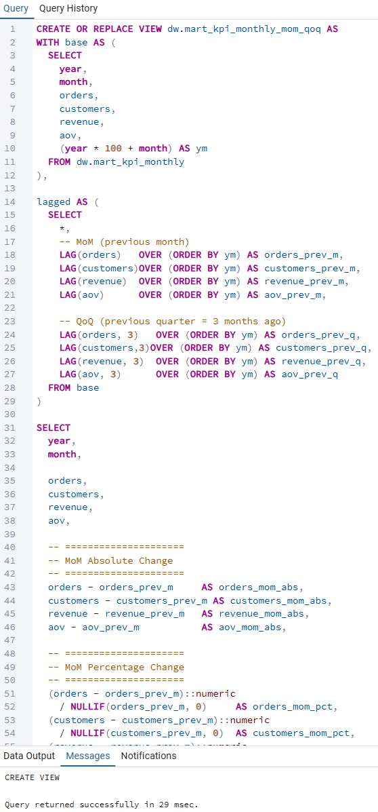

Artifacts:
- 40_mart_kpi_monthly_mom_qoq.sql

---

## 50. New vs Returning Customer Mart

### Purpose

Decompose customer growth into acquisition and retention
by classifying customers
based on their first purchase month.

### Evidence

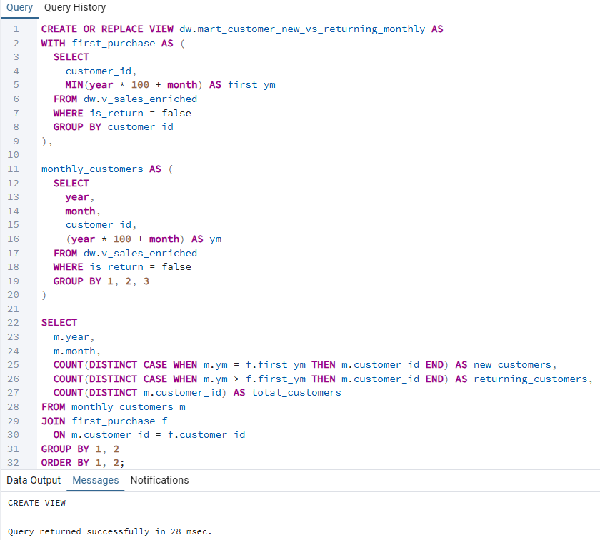

Artifacts:
- 50_mart_customer_new_vs_returning_monthly.sql

---

## 60. Product Return Risk Mart

### Purpose

Identify products with the highest operational
and financial risk due to return behavior.

### Evidence

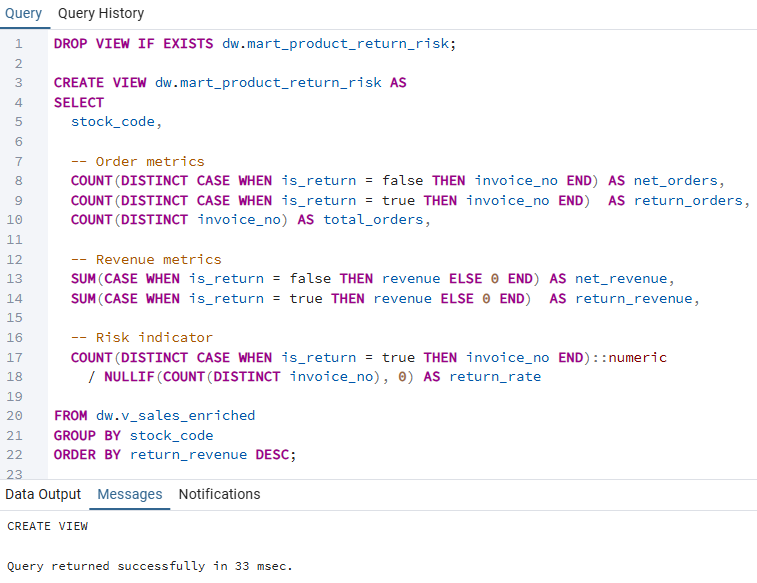

Artifacts:
- 60_mart_product_return_risk.sql

---

## Metric Dictionary

### Global Conventions

- Returns  
  Transactions flagged with is_return = true

- Net Metrics  
  Exclude returns unless explicitly stated

- Date Grain  
  Monthly, derived from date_key (YYYYMMDD)

---

### Core KPI Mart — dw.mart_kpi_monthly

| Metric     | Definition |
|-----------|------------|
| Orders    | Distinct invoices excluding returns |
| Customers | Distinct customers excluding returns |
| Revenue  | Sum of revenue (returns recorded as negative) |
| AOV      | Revenue divided by Orders |

---

### Returns Mart — dw.mart_return_risk_monthly

| Metric          | Definition |
|----------------|------------|
| Return Orders  | Distinct return invoices |
| Return Revenue | Sum of return revenue (negative) |
| Return Rate    | Return Orders divided by Total Orders |

---

### Product Return Risk Mart — dw.mart_product_return_risk

| Metric        | Definition |
|---------------|------------|
| Net Orders    | Orders excluding returns |
| Return Orders | Orders with returns |
| Return Rate   | Return Orders divided by Total Orders |
| Return Loss  | Absolute value of return revenue |

Metric definitions are enforced at the SQL layer
and are not recalculated in BI tools.

---

## Validation and Sanity Checks

### Purpose

Ensure metric accuracy and analytical consistency
before BI and downstream consumption.

### Evidence

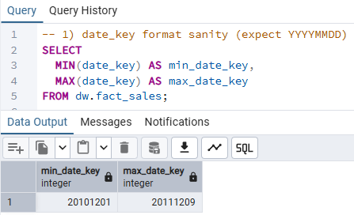
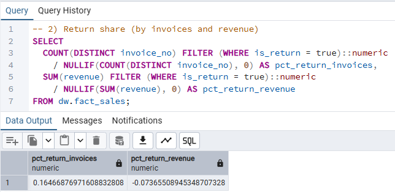
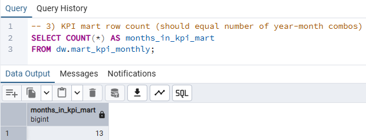
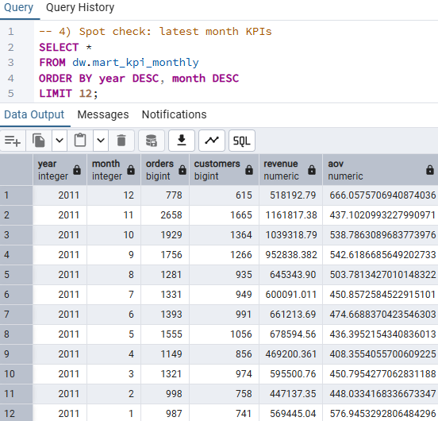
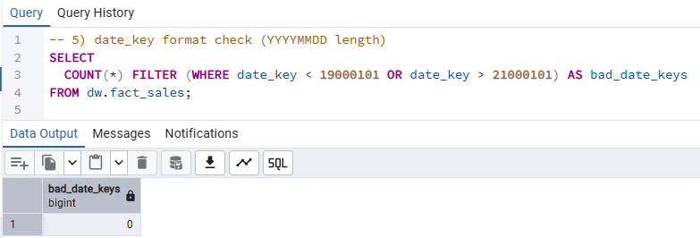
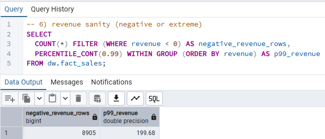
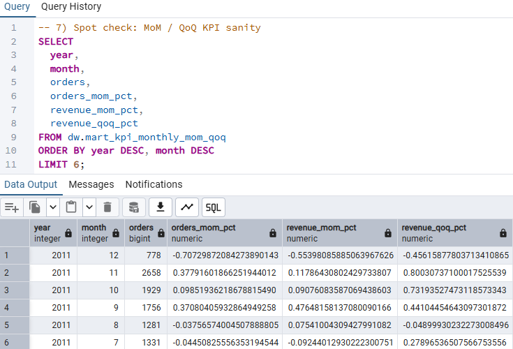
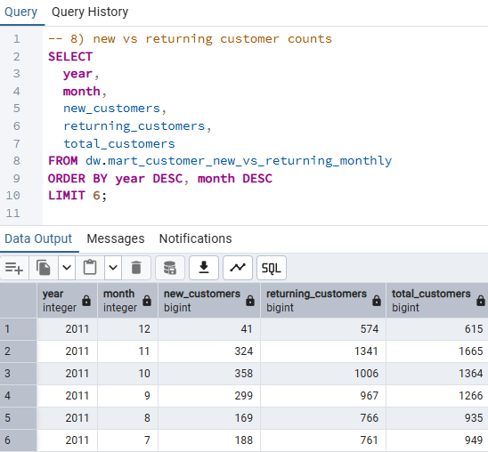
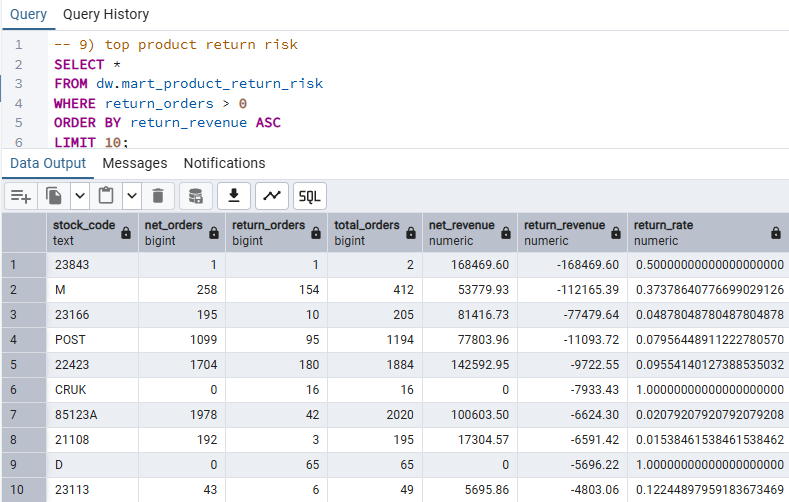

All validation checks passed,
confirming internal consistency and BI readiness.

---

## 📊 Consumption Layer (Power BI)

This dashboard demonstrates that the metric layer is production-ready.

All KPIs are directly consumed from precomputed metric marts,
without additional transformation or logic inside the BI tool.

It highlights how business metrics can be standardized at the data layer
and seamlessly visualized for decision-making.

### Key Metrics

- Revenue: 8.91M  
- Orders: 19K  
- Customers: 13K  
- AOV: 6.34K  
- Revenue MoM: -55.4%  
- Orders MoM: -70.7%

### Dashboard Preview

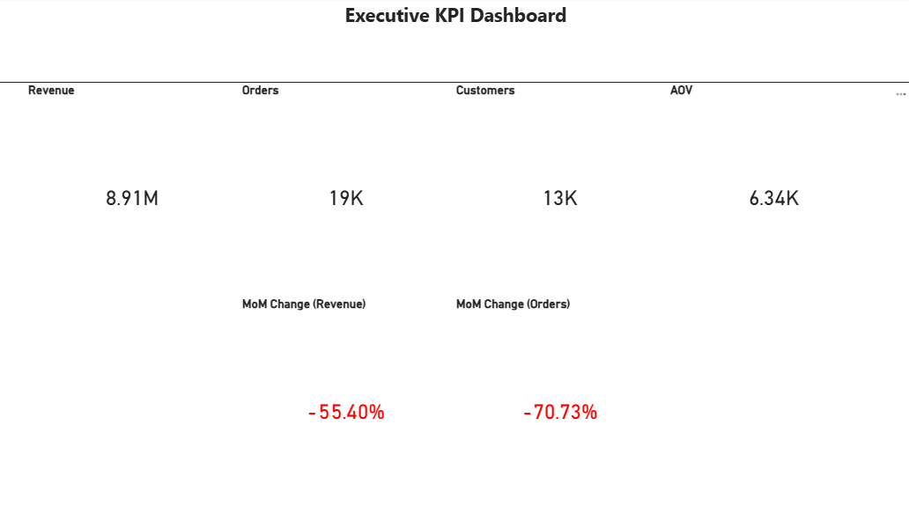
---

## Derived Recommendation

Standardizing KPI definitions in a reusable metric layer
reduces metric drift,
improves analytical trust,
and enables scalable BI and analytics across teams.

---

## Design Decisions

- KPIs are precomputed in SQL to prevent metric drift in BI tools
- Views are recreated using DROP and CREATE when definitions change
- Validation queries are intentionally separated from metric definitions

---

## Usage

- BI tools connect directly to dw.mart_* views
- No KPI calculations are performed in the visualization layer
- All dashboards reference a single source of metric truth

---

## Execution Order

1. Create base sales view
2. Build core KPI marts
3. Derive trend, customer, and product marts
4. Run validation queries
5. Connect BI tools to finalized marts
