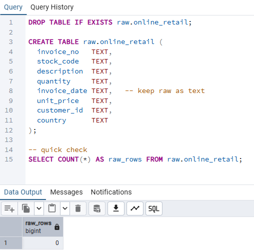
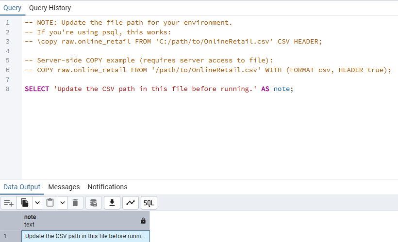
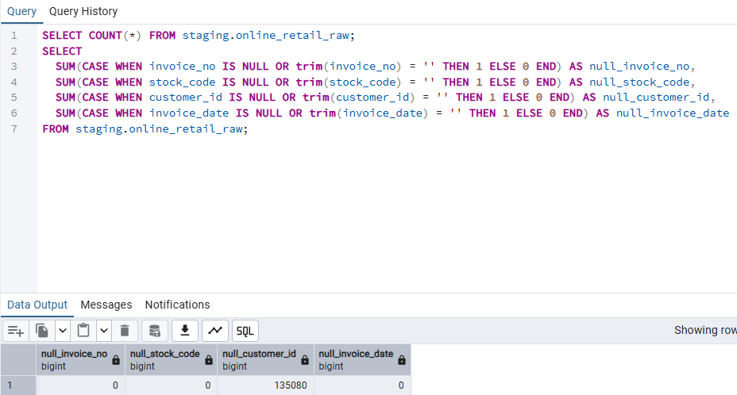
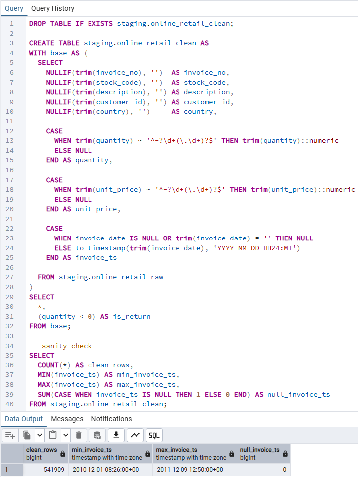

# Data Foundation

**A documented implementation of the raw ingestion and staging layers of the retail data warehouse, including execution evidence and data quality validation.**

## Overview

The Data Foundation layer is responsible for ingesting, standardizing,
and validating source data before any analytical modeling occurs.

This layer ensures data reliability, reproducibility, and auditability,
forming a trusted base for downstream data modeling and analytics.

---

## Architecture Scope

This layer consists of two core sublayers:

- **Raw Layer (`10_raw`)** — Ingest source data as-is with no transformation  
- **Staging Layer (`20_staging`)** — Standardize, clean, and validate data

---

## 1. Raw Layer (10_raw)

### Purpose
- Preserve source data with zero transformation
- Enable reprocessing and traceability
- Avoid premature assumptions about data quality

### Design Principles
- All columns stored as `TEXT`
- Schema mirrors the source file
- No filtering, casting, or business logic applied

### Evidence – Raw Execution Results

The following outputs confirm that the source data
was ingested into the raw layer without transformation or data loss.

**Raw table creation**

> Raw table created successfully with source-aligned schema.

**CSV load instruction and result**

> CSV ingestion executed using COPY command.

**Raw row count verification**

> Row count: **541,909** — no rows lost during ingestion.

---

## 2. Staging Layer (20_staging)

### Purpose
- Convert raw data into an analysis-ready format
- Apply essential validation rules
- Standardize data types and formats

### Key Transformations
- Trim and normalize string fields
- Convert numeric columns using regex-based validation
- Parse `invoice_date` into timestamp
- Handle invalid or missing values explicitly
- Flag return transactions (`quantity < 0`)

### Evidence – Staging Execution Result

After standardization, core data quality checks were performed
to validate critical fields, data types, and date ranges.

**Staging clean table creation and sanity checks**

> Clean rows: **541,909**  
> Invoice date range validated with no NULL timestamps.

---

## Why Data Foundation Matters

This layer intentionally separates **data correctness** from
**business logic and analytics**, ensuring that:

- Errors are caught early
- Downstream models remain simple and trustworthy
- Data modeling focuses on insights, not cleanup

> Clean data is not assumed — it is engineered.

---

## Downstream Dependency

All tables in the following layers depend exclusively on this foundation:

- `30_dw` — Data Warehouse (facts and dimensions)
- `40_marts` — Analytics and KPI marts

---

## Related Documentation

- [10_raw layer documentation](10_raw/)
- [20_staging layer documentation](20_staging/)

---

## Next Steps

- Document the `30_dw` core warehouse layer
- Define fact and dimension models
- Build analytics marts (`40_marts`) for business KPIs
