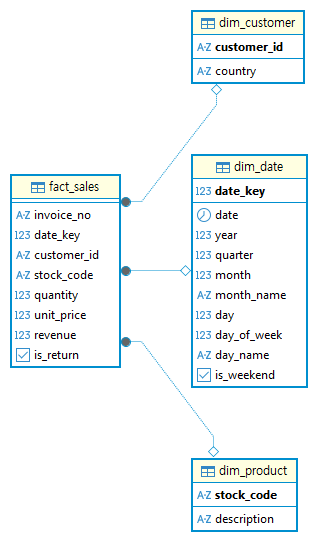
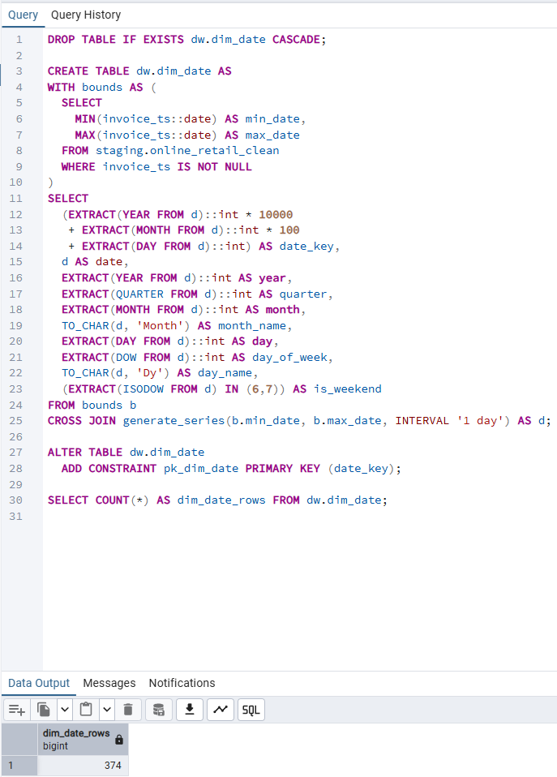
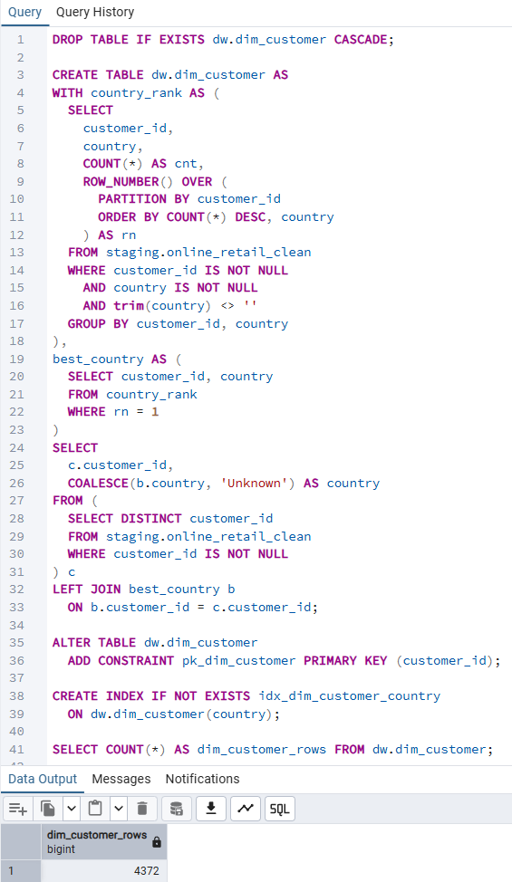
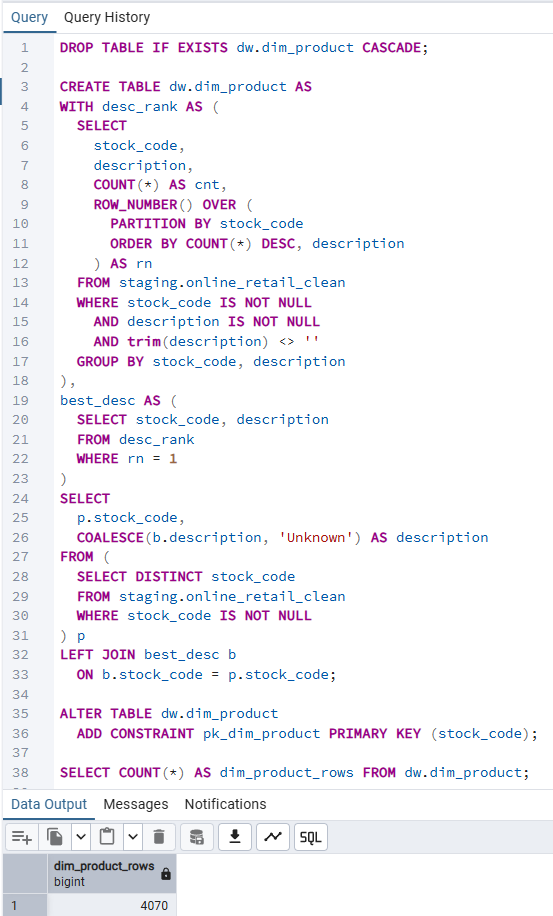
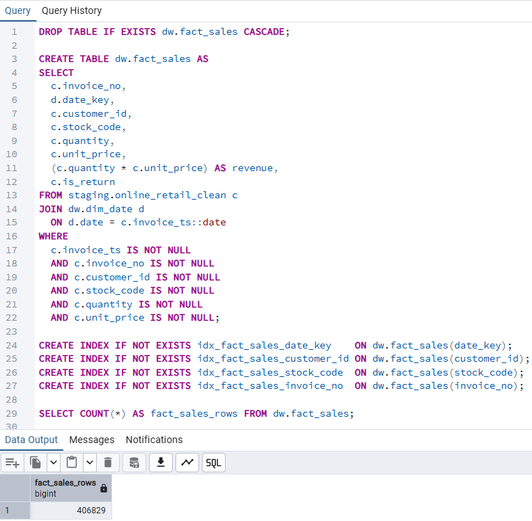
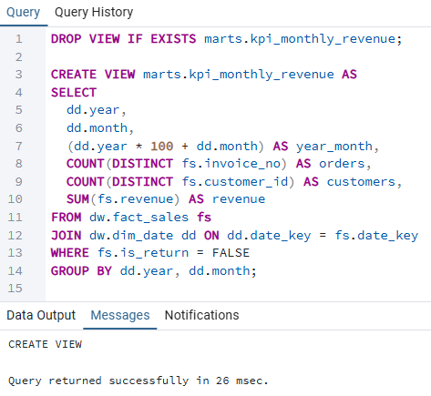
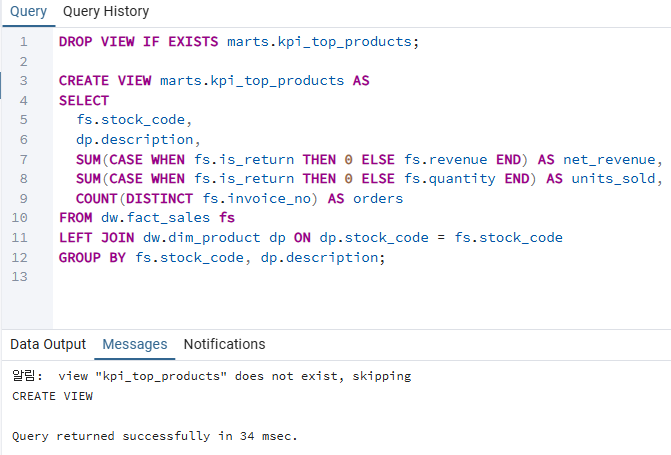
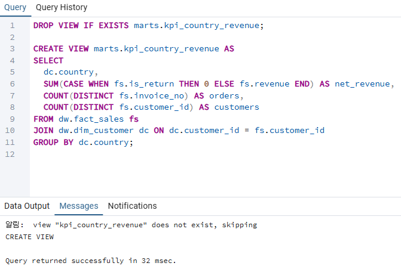
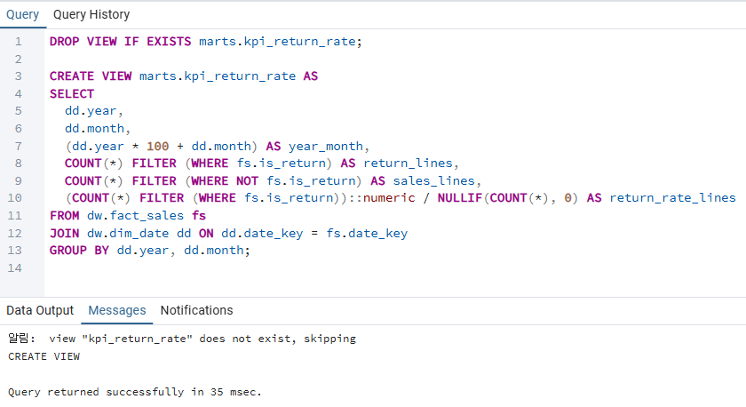
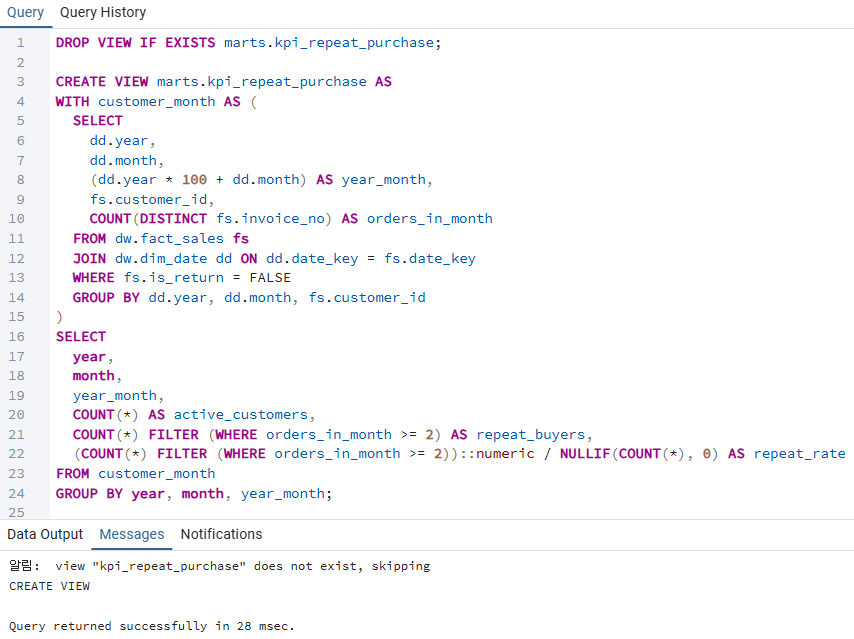

# Data Modeling

**A documented implementation of dimensional data models and analytics marts,
transforming standardized retail data into analytics-ready datasets with execution evidence.**

## Overview

The Data Modeling layer transforms validated outputs from the Data Foundation
into structured fact and dimension tables, followed by KPI-focused analytics marts.

This layer focuses on **business logic, dimensional modeling, and analytical usability**,
bridging clean data preparation and business-facing insights.

This layer builds directly on the validated outputs of the Data Foundation,
ensuring that all models are derived from standardized and quality-checked data.

---

## Architecture Scope

This layer consists of two core sublayers:

- **Core Warehouse (`30_dw`)** — Fact and dimension tables with defined grain and relationships  
- **Analytics Marts (`40_marts`)** — KPI-focused tables optimized for reporting and analysis  

20_staging
↓
30_dw (facts & dimensions)
↓
40_marts (analytics marts)

---

## 1. Core Warehouse Layer (30_dw)

### Purpose
- Model business processes using fact and dimension tables
- Define consistent join keys and table grain
- Establish a reliable analytical backbone

### Dimension Tables
- **dim_date** — Calendar and time attributes
- **dim_customer** — Customer identity and geographic attributes
- **dim_product** — Product catalog and descriptions

### Fact Table
- **fact_sales** — Transaction-level sales facts

---

### Core Warehouse Data Model (ER Diagram)

The core warehouse follows a **star schema design**,
with a central sales fact table and conformed dimensions.

This ER diagram illustrates the logical relationships
between fact and dimension tables that form the analytical backbone
for all downstream KPI marts and dashboards.

Foreign key relationships are defined **logically at the model level**
and enforced through transformation logic rather than physical constraints,
which is a common practice in analytical data warehouses.

📌 **ER Diagram (DW Core)**  

---

### Evidence – Core Warehouse Execution Results

The following outputs demonstrate the successful creation
of dimension and fact tables derived from validated upstream data.

**Date dimension creation**

**Customer dimension creation**

**Product dimension creation**

**Fact table creation**

---

## 2. Analytics Marts Layer (40_marts)

### Purpose
- Provide business-ready datasets for KPI reporting
- Centralize metric definitions
- Simplify analytical queries for end users

### Key KPIs Implemented
- Monthly revenue trends
- Top-selling products
- Revenue by country
- Return rate
- Repeat purchase behavior

These KPIs represent common executive-level and operational metrics
used to evaluate revenue performance, customer behavior, and product efficiency.

---

### Evidence – Analytics Marts Results

The following outputs show KPI queries built on top of the dimensional model.

**Monthly revenue KPI**

**Top products KPI**

**Revenue by country KPI**

**Return rate KPI**

**Repeat purchase KPI**

---

## Modeling Principles

- **Dimensional modeling (star schema)** for analytical efficiency
- **Single source of truth** in the core warehouse
- **Clear separation of concerns** between data preparation and modeling
- **Reusability** of dimensions across multiple analytics marts

---

## Why Data Modeling Matters

A well-designed data model:

- Ensures consistent KPI definitions
- Simplifies analytical queries
- Improves performance and scalability
- Enables trustworthy business insights

> Analytics is only as reliable as the model beneath it.

---

## Upstream Dependency

This layer depends exclusively on the Data Foundation:

- `data_foundation/10_raw`
- `data_foundation/20_staging`

Only validated and standardized data is used for modeling.

---

## Next Steps

- Extend the warehouse with additional conformed dimensions
- Introduce advanced analytics marts for deeper segmentation
- Perform reconciliation checks between fact tables and downstream marts
