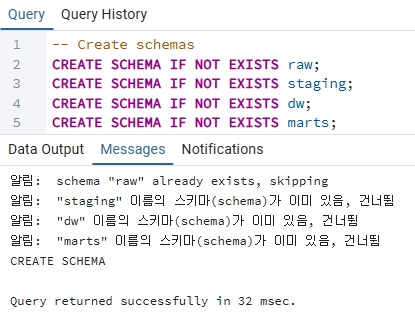
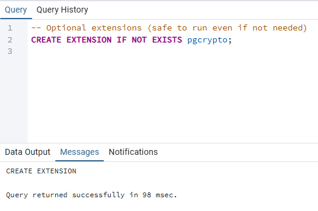
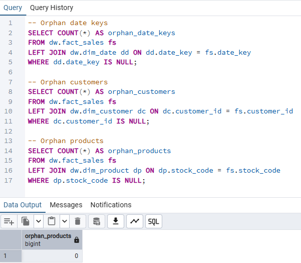
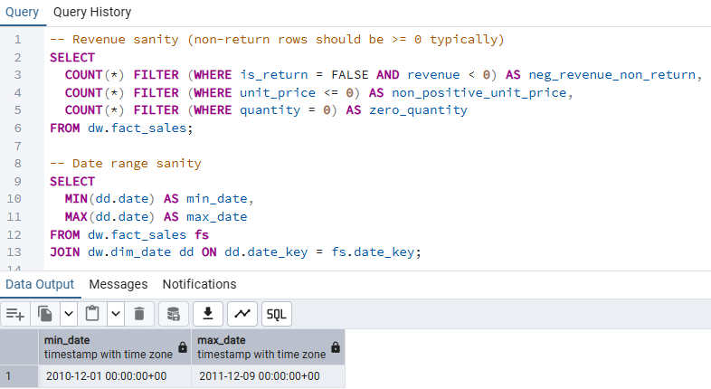
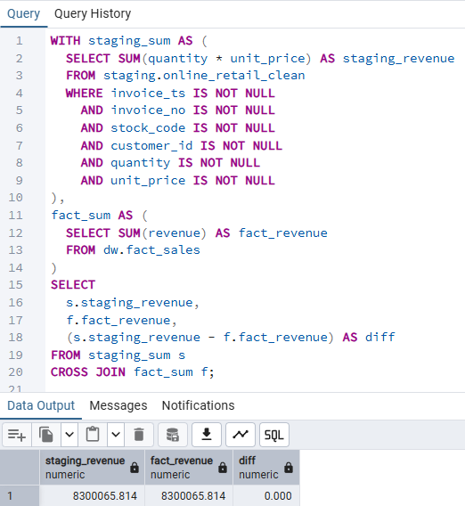

# Data Operations

**Operational SQL utilities and data quality validations that ensure the reliability,
consistency, and integrity of the end-to-end data warehouse pipeline.**

## Overview

The Data Operations layer supports the data warehouse by managing
schema setup, optional extensions, and systematic data quality validations.

This layer focuses on **operational stability, data correctness, and trust**,
ensuring that downstream analytics are built on a reliable foundation.

---

## Architecture Scope

This layer covers cross-cutting operational concerns that apply
across all data layers:

- **Environment setup (`00_admin`)** — Schema and extension management  
- **Data quality & validation (`90_tests`)** — Integrity, sanity, and reconciliation checks  

raw / staging / dw / marts
↑
data operations

---

## 1. Environment Setup (00_admin)

### Purpose
- Ensure required schemas exist before data processing
- Enable optional extensions safely
- Provide idempotent setup scripts that can be re-run without side effects

### Key Operations
- Schema creation for `raw`, `staging`, `dw`, and `marts`
- Optional PostgreSQL extensions

---

### Evidence – Environment Setup Execution

The following outputs illustrate environment setup steps
that prepare the warehouse for downstream processing.

**Schema creation**

> All required schemas were created or already existed.

**Optional extensions**

> Optional PostgreSQL extensions applied safely using `IF NOT EXISTS`.

---

## 2. Data Quality & Validation (90_tests)

### Purpose
- Detect integrity violations early
- Validate business logic assumptions
- Ensure analytical consistency between layers

This validation layer is designed to be **lightweight, repeatable, and explainable**.

---

### Integrity Checks

**Orphan key detection**

> Verified that all foreign keys in `fact_sales`
> reference valid dimension records.

---

### Sanity Checks

**Fact-level sanity validation**

> Confirmed no negative revenue for non-return transactions  
> Verified valid date ranges and quantity/price constraints.

---

### Reconciliation Checks

**Staging vs. fact revenue reconciliation**

> Total revenue in `staging` matches `fact_sales` exactly  
> (difference = **0**).

---

## Why Data Operations Matters

Operational validation ensures that:

- Data errors are caught before analysis
- Facts and dimensions remain consistent
- KPI outputs can be trusted by stakeholders
- The warehouse remains auditable and maintainable

> Reliable analytics begin with reliable operations.

---

## Coverage Summary

| Validation Type | Scope |
|-----------------|------|
| Schema setup | raw / staging / dw / marts |
| Orphan keys | fact → dimension relationships |
| Business sanity | revenue, quantity, date ranges |
| Reconciliation | staging ↔ warehouse consistency |

---

## Related Documentation

- [Data Foundation](../data_foundation/README.md)
- [Data Modeling](../data_modeling/README.md)

---

## Next Steps

- Automate validation checks as scheduled jobs
- Expand reconciliation coverage to additional marts
- Add alerting or dashboards for failed data quality checks
- Log validation results for audit and monitoring purposes
