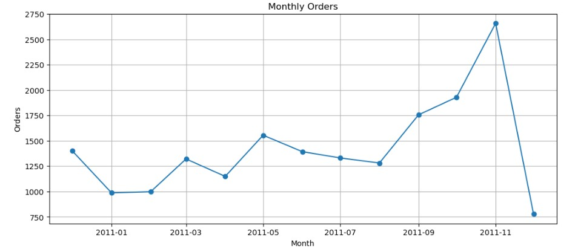
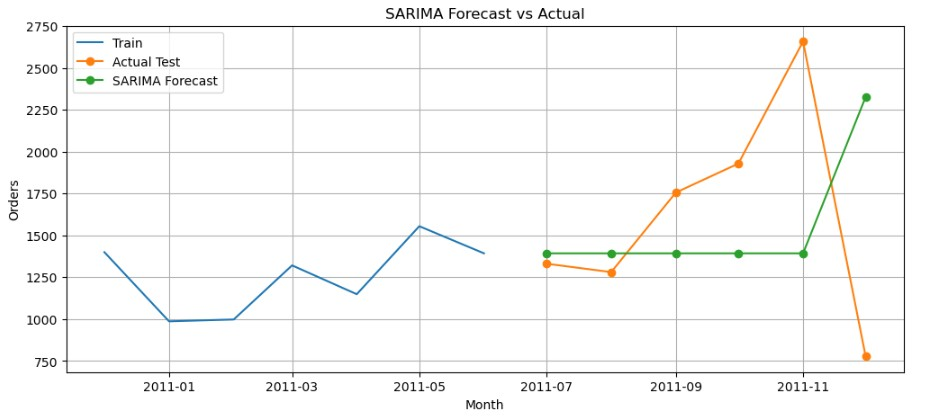

# 📈 Orders Forecasting (Time Series Analysis)

## Overview

This module builds a forecasting pipeline to predict monthly order volume using time series models.

The goal is to extend descriptive analytics into forward-looking insights, enabling better planning and decision-making.

This forecasting module includes both order forecasting and downstream revenue scenario analysis.

---

## Data Flow

This module follows an end-to-end workflow from warehouse-level data to business scenario modeling.

`dw.v_sales_enriched`
→ SQL (`01_monthly_orders.sql`, `02_monthly_orders_timeseries.sql`, `03_monthly_kpi.sql`)  
→ CSV (`orders_monthly.csv`, `monthly_kpi.csv`)  
→ Order Forecasting  
→ Revenue Scenario Analysis

---

## Executive Summary

This project demonstrates how historical order data can be transformed into actionable forecasts using baseline and statistical time series models.

Two approaches are compared:

* Moving Average (baseline)
* SARIMA (time series model)

The focus is not only on prediction accuracy, but on business applicability.

The forecasting outputs are further extended into revenue scenario modeling using a separate notebook (`03_revenue_scenario.ipynb`).

---

## Module Structure

This forecasting module consists of two connected components:

### 1. Order Forecasting
- Predicts monthly order volume using time series models
- Compares Moving Average and SARIMA
- Produces forecast outputs for planning

### 2. Revenue Scenario Analysis
- Converts forecasted orders into revenue estimates
- Uses AOV-based assumptions
- Implemented in `03_revenue_scenario.ipynb`

---

## Business Context

Forecasting order volume is critical for:

* Revenue planning
* Inventory and supply chain optimization
* Identifying future demand trends

This model supports data-driven operational and financial decisions.

---

## Dataset

### 1. Order Forecasting Dataset

* Source: `data/orders_monthly.csv`
* Granularity: Monthly
* Target variable: orders

| Column | Description        |
| ------ | ------------------ |
| month  | Month (time index) |
| orders | Number of orders   |

---

### 2. Revenue Scenario Dataset

* Source: `data/monthly_kpi.csv`
* Granularity: Monthly
* Purpose: Revenue scenario analysis

| Column  | Description |
| ------- | ----------- |
| month   | Month |
| revenue | Total monthly revenue |
| orders  | Number of orders |
| aov     | Average order value |

---

## Outputs

The forecasting workflow produces datasets that can be reused in downstream business analysis.

| File | Description |
| ---- | ----------- |
| `orders_forecast.csv` | Forecasted monthly orders generated from the forecasting notebook |
| `monthly_kpi.csv` | Monthly KPI input dataset used in revenue scenario analysis |

---

## Exploratory Analysis

Initial inspection of the monthly order series suggested:

* A visible change in order volume over time
* Limited seasonal evidence due to short historical coverage
* The need for a simple and interpretable baseline model

---

## Methodology

### 1. Data Preparation

* Converted month to datetime format
* Sorted data chronologically
* Split into training and test sets (last 6 months as test)

---

### 2. Baseline Model: Moving Average

A simple model using recent historical averages.

Purpose:

* Establish a benchmark
* Provide stable and interpretable forecasts

---

### 3. SARIMA Model

A statistical time series model designed to capture:

* Trend
* Seasonality
* Temporal dependencies

Configuration:

* order = (1,1,1)
* seasonal_order = (1,1,1,12)

---

## Model Evaluation

| Model | MAPE | Interpretation |
|------|------|----------------|
| Moving Average | ~30% | Stable and reliable baseline |
| SARIMA | ~51% | Limited by short time series |

---

## Results & Insights

* Moving Average provides a stable baseline under limited data conditions
* SARIMA attempts to capture trend and seasonality, but performance is constrained by the short time series length
* Model performance is influenced heavily by data availability and historical depth

This highlights that more complex models do not necessarily perform better,
especially when data is limited, reinforcing the importance of simple baselines.

---

## SQL-Based Baseline (Additional Validation)

A SQL-based Moving Average forecast was also implemented to create a transparent baseline.

Approach:

* Aggregate monthly orders
* Compute average of last 3 months
* Use as baseline estimate

SQL Example:

```
WITH monthly_orders AS (
    SELECT
        date_trunc('month', to_date(date_key::text, 'YYYYMMDD'))::date AS month,
        COUNT(DISTINCT invoice_no) AS orders
    FROM dw.v_sales_enriched
    WHERE is_return = false
    GROUP BY 1
),
last_3_avg AS (
    SELECT AVG(orders) AS avg_orders
    FROM (
        SELECT orders
        FROM monthly_orders
        ORDER BY month DESC
        LIMIT 3
    ) t
)
SELECT avg_orders FROM last_3_avg;
```

This SQL baseline provides a simple and explainable benchmark for validating model-based forecasts.

---

## 📊 Forecast Visualization

This visualization directly motivated the forecasting step,
as order volume showed both variability and an upward trend over time.

### Monthly Orders Trend



Orders show variability over time with a noticeable upward trend in later months,
indicating potential seasonality and motivating the need for forecasting.

---

### Forecast vs Actual (SARIMA)



The SARIMA model struggled to capture recent spikes in order volume,
highlighting the limitations of complex models under limited data conditions.

---

### Forecast vs Actual (Moving Average)


The moving average model provides stable forecasts and better aligns with overall demand patterns,
making it a more reliable baseline under limited data conditions.

---

### Revenue Scenario Analysis


Revenue projections indicate that maintaining order volume is critical,
as AOV remains relatively stable and does not offset demand fluctuations.

Scenario analysis suggests that stabilizing order volume could significantly reduce
projected revenue decline.

---

## Business Interpretation

Forecasted orders can be used to:

* Estimate future revenue (Orders × AOV)
* Plan inventory levels
* Optimize marketing and promotions

This forecasting output is extended into revenue scenario analysis using:

➡️ `03_revenue_scenario.ipynb`

---

## Revenue Scenario Extension

In the downstream module, forecasted orders are combined with Average Order Value (AOV) to estimate future revenue.

Approach:

* Forecast Orders (from this module)
* Multiply by recent or scenario-based AOV
* Generate revenue projections under different assumptions

This bridges forecasting with financial planning and business decision-making.

---

## Downstream Module

The forecasting output is consumed by `03_revenue_scenario.ipynb`,
which translates predicted orders into downside, base, and upside revenue scenarios.

This extends the forecasting pipeline into business-oriented decision support.

---

## Limitations

* Limited historical data reduces model reliability
* SARIMA requires longer time series to capture seasonality effectively
* External factors (promotions, holidays) are not included

---

## Future Improvements

* Extend dataset to 24–36 months
* Incorporate external variables
* Implement advanced models (Prophet, ML-based models)
* Improve AOV modeling and revenue forecasting

---

## Summary

Built a time series forecasting pipeline using baseline and SARIMA models to transform historical order data into actionable business insights.

Extended the analysis into revenue scenario modeling to support planning and decision-making.

Rather than focusing on prediction accuracy alone,
this module emphasizes translating forecasts into actionable business insights.
