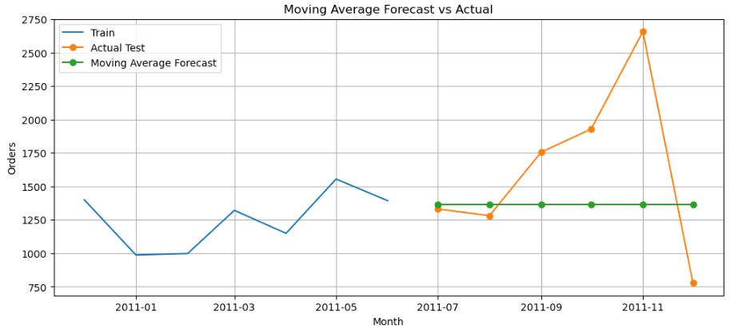
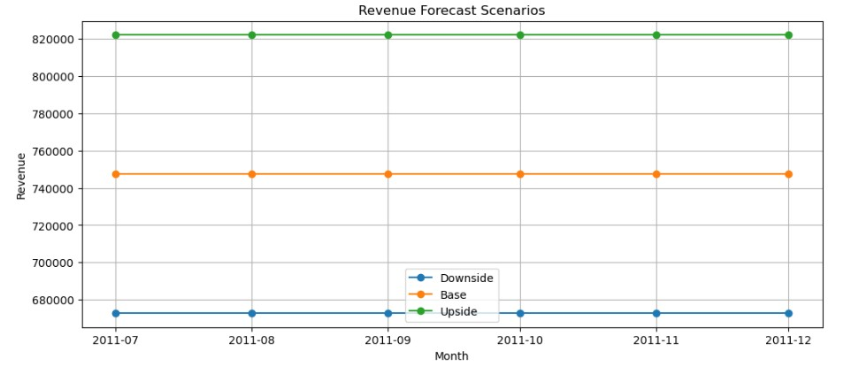
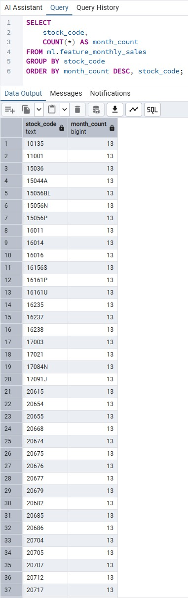
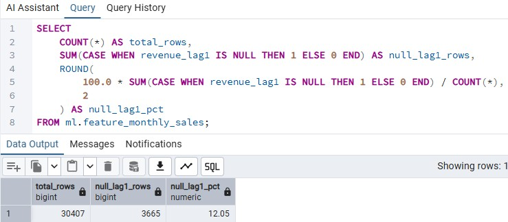
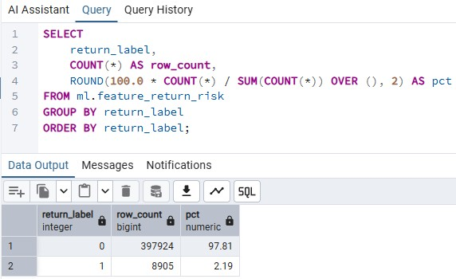
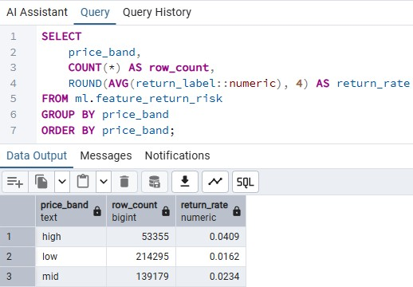
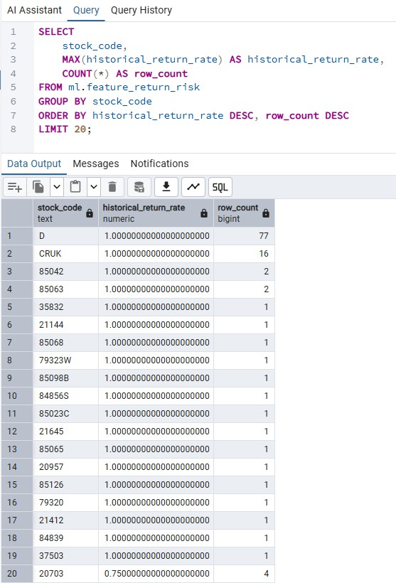
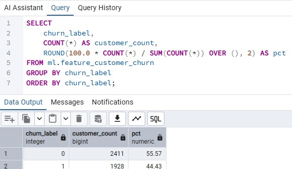

# 📈 Orders Forecasting (Time Series Analysis)

## Overview

This module builds a complete **end-to-end forecasting pipeline** to predict monthly order volume and support revenue scenario planning.

The goal is to extend descriptive analytics into forward-looking insights, enabling better business planning and decision-making.

This module integrates:

- SQL-based feature engineering
- Time series forecasting (Moving Average, SARIMA)
- Business-oriented revenue scenario analysis

---

## 🧱 End-to-End Pipeline

The forecasting system is built as a structured pipeline:

```
dw.v_sales_enriched
↓
SQL Feature Engineering (01–06)
↓
Training Dataset (10–12)
↓
Data Validation (20–23)
↓
Analysis / Insights (30–34)
↓
Prediction Output (40–42)
↓
Python Forecasting Models
↓
Revenue Scenario Analysis
```


---

## 🧱 SQL Pipeline

The pipeline is implemented using layered SQL design:

### 1️⃣ Feature Engineering (01–06)

- Build monthly aggregates (orders, revenue, AOV)
- Create time-series features (lag, rolling average)
- Generate churn and return risk features

### 2️⃣ Training Dataset (10–12)

- Filter valid records
- Ensure sufficient historical data
- Prepare ML-ready datasets

### 3️⃣ Data Validation (20–23)

- Check time-series coverage
- Validate lag features
- Inspect distribution consistency

### 4️⃣ Analysis (30–34)

- Identify return risk drivers
- Analyze churn patterns
- Extract business insights

### 5️⃣ Prediction (40–42)

- Store model outputs
- Compare actual vs predicted values

---

## 📊 Dataset

### Order Forecasting Dataset

- Source: `data/orders_monthly.csv`
- Target: `orders`

| Column | Description |
|------|------------|
| month | Time index |
| orders | Monthly order count |

---

### Revenue Scenario Dataset

- Source: `data/monthly_kpi.csv`

| Column | Description |
|-------|------------|
| month | Time index |
| revenue | Total revenue |
| orders | Number of orders |
| aov | Average order value |

---

## ⚙️ Methodology

### Data Preparation

- Converted month to datetime
- Sorted chronologically
- Train/test split (last 6 months)

---

### Models

#### 1️⃣ Moving Average (Baseline)

- Simple and interpretable
- Stable under limited data

#### 2️⃣ SARIMA

- Captures trend and seasonality
- Performance limited by short time series

---

## 📊 Model Evaluation

| Model | MAPE | Insight |
|------|------|--------|
| Moving Average | ~30% | Stable baseline |
| SARIMA | ~51% | Overfitting risk with limited data |

---

## 📸 Results & Visualizations

### 📈 Monthly Orders Trend


Order volume shows variability and an upward trend, motivating forecasting.

---

### 📊 Forecast vs Actual (SARIMA)


SARIMA struggles to capture recent spikes due to limited historical data.

---

### 📊 Forecast vs Actual (Moving Average)



Moving Average provides more stable and reliable forecasts.

---

### 💰 Revenue Scenario Analysis



Revenue projections highlight that **order volume is the primary driver**, while AOV remains relatively stable.

---

## 📊 SQL Validation & Feature Outputs

### Data Coverage



---

### Lag Feature Validation



---

### Return Distribution



---

## 📊 Business Insights

### Return Risk by Price Band



---

### High Risk Products



---

### Customer Churn Distribution



---

## 💡 Key Insights

- Simple models outperform complex models under limited data
- Order volume is the primary revenue driver
- Return behavior varies significantly by product segment
- Customer recency strongly correlates with churn

---

## 💼 Business Impact

This pipeline enables:

- Demand forecasting for inventory planning
- Revenue projection using AOV assumptions
- Identification of high-risk products and customers
- Data-driven decision-making

---

## 🔄 Data Flow Summary

```
Warehouse → SQL → Features → ML → Forecast → Business Insights
```


---

## ⚠️ Limitations

- Limited historical data
- No external variables (seasonality, promotions)
- SARIMA underperforms with short series

---

## 🚀 Future Improvements

- Extend data to 24–36 months
- Add external features (holiday, promotions)
- Apply ML models (XGBoost, Prophet)
- Improve revenue modeling

---

## 🧾 Summary

Built a complete **end-to-end forecasting pipeline** combining SQL, time series modeling, and business scenario analysis.

The project focuses not only on prediction accuracy,
but on transforming forecasts into actionable business insights.
